# Do Large Language Models Excel in Complex Logical Reasoning with Formal Language?  

Jin Jiang1,2t, Jianing $\mathbf { W a n g ^ { 2 \dagger } }$ , Yuchen $\mathbf { Y a n } ^ { 2 , 3 }$ , Yang ${ { \bf { L i u } } ^ { 2 } }$ 6 Jianhua $\mathbf { Z h u ^ { 1 } }$ , Mengdi Zhang?, Xunliang $\mathbf { C a i } ^ { 2 }$ , Liangcai Gao',  

1Peking University, 2Meituan Group, Zhejiang University, Correspondence: jiangjin $@$ stu.pku.edu.cn, gaoliangcai@pku.edu.cn  

# Abstract  

Large Language Models (LLMs) have been shown to achieve breakthrough performance on complex logical reasoning tasks. Nevertheless, most existing research focuses on employing formal language to guide LLMs to derive reliable reasoning paths, while systematic evaluations of these capabilities are still limited. In this paper, we aim to conduct a comprehensive evaluation of LLMs across various logical reasoning problems utilizing formal languages. From the perspective of three dimensions, i.e., spectrum of LLMs, taxonomy of tasks, and format of trajectories, our key findings are: 1) Thinking models significantly outperform Instruct models, especially when formal language is employed; 2) All LLMs exhibit limitations in inductive reasoning capability, irrespective of whether they use a formal language; 3) Data with PoT format achieves the best generalization performance across other languages. Additionally, we also curate the formal-relative training data to further enhance the small language models, and the experimental results indicate that a simple rejected finetuning method can better enable LLMs to generalize across formal languages and achieve the best overall performance. Our codes and reports are available at https: //github. com/ jiangjin1999/FormalEval.  

# 1 Introduction  

Logical reasoning, i.e., deductive, inductive, and abductive, is one of the imperative natural language processing (NLP) tasks and plays a significant role in artificial intelligence (AI) to perform human-like decision-making, task-solving, and deep-thinking (Zhang et al., 2021; Yang et al., 2023b; Yu et al., 2024; Xu et al., 2025). Different from conventional natural language understanding and generation, logical reasoning requires the AI systems to explicitly provide meticulous elucidation of thoughts and verifiable derivation chains, which is crucial and challenging (Cummins et al., 1991). Early works have developed multiple formal languages with symbol solvers to make the reasoning steps computable and structured (RANISE, 2003; Bulatov et al., 2005; Bjgrner et al., 2015).  

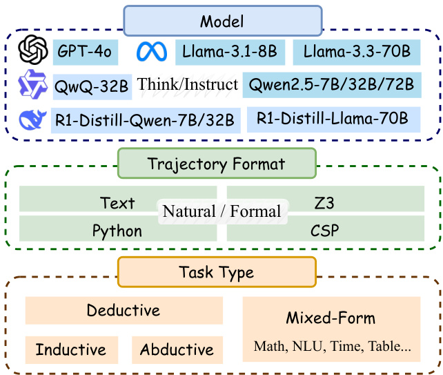  
Figure 1: Evaluation framework with three specific dimensions: spectrum of LLMs, taxonomy of logical reasoning tasks, and format of trajectories.  

Recently, the emergence of reasoning capabilities in large language models (LLMs) has incentivized significant progress in complex reasoning tasks, such as mathematics, commonsense, and symbol (Achiam et al., 2023; Bi et al., 2024). Current studies ' have found that LLMs can achieve remarkable performance with the aid of formal language and symbol solvers, especially when integrating well-designed task-specific instructs (Lyu et al., 2023; Pan et al., 2023), chain-of-thought (CoT) reasoning patterns (Wei et al., 2022; Ye et al., 2023), and valuable solvers' feedback (He-Yueya et al., 2023; Gao et al., 2023; Wang et al., 2024). Such approaches aim to formalize the given logical problem and constantly adjust the results lean on the solver's feedback. Despite substantial efforts exhibiting exceptional performance, there are still relatively limited systematic and comprehensive evaluations. Thus, a natural question remains open: whether the LLM really excels in complex logical reasoning problems with formal language?  

To bridge the gap, this paper endeavors to perform a comprehensive evaluation of LLMs utilizing various formal languages to tackle diverse logical reasoning problems. At first, we develop the evaluation architecture to clearly express the entire assessment view (As illustrated in Section 2), with the framework shown in Figure 1. Specifically, we divide the entire assessment into three distinct dimensions, including the spectrum of LLMs, the taxonomy of logical reasoning tasks, and the format of trajectories. For the family of LLMs, we further consider different reasoning patterns which has been injected into the model training, such as short thinking (e.g., GPT-4o (Achiam et al., 2023), Qwen1.5/2/2.5 (Bai et al., 2023), LLaMA3/3.1/3.3 (Grattafiori et al., 2024)) and long thinking (e.g., DeepSeek-R1-Dsitill-Qwen (Guo et al., 2025)). For the logical reasoning, we adhere to the classic definitions (Flach and Kakas, 2000), categorizing tasks into deductive, inductive, and abductive reasoning. Additionally, we account for tasks that may integrate multiple reasoning types by introducing a new category referred to as mixedform reasoning. Regarding the format of trajectories, we consider three main formal languages ("Python", "Z3", "CSP") with a default natural language format as "Text".  

Secondly, we perform a thorough evaluation across these three dimensions (as detailed in Section 3). Many contemporary benchmarks purely emphasize informal text patterns and lack comprehensive integration of different formal languages and logical reasoning tasks (Lei et al., 2024; Xu et al., 2025; Xia et al., 2025). For instance, it is widely recognized that Python is superior to plain text when addressing mathematical problems (Friedman, 2023; Gao et al., 2023), but it remains unclear whether Python is equally effective in resolving BBH (Suzgun et al., 2022) and bbeh (Kazemi et al., 2025) problems. To fill this blank, this part aims to investigate whether current LLMs can solve a variety of logical reasoning tasks utilizing different formal languages. From this study, we derive several intriguing observations: 1) Thinking models significantly outperform Instruct models, especially when formal language is employed; 2) All LLMs exhibit limitations in inductive reasoning capability, irrespective of whether they use a formal language; 3) LLMs typically produce inferior performance on difficult tasks. These findings prompt a new inquiry Do large models possess generalization capabilities when employ ing formal languages?  

Thirdly, we further investigate the generalization across different reasoning tasks and formal languages (As illustrated in Section 4). To reach this goal, we collect a few training data from the training set of current evaluation tasks, which is classified into three types: deductive, inductive, and abductive. For each task type, we also provide different trajectories according to the usages of (in)formal languages. To make a fair comparison, we only use data from a single language type for SFT training, and the training data has the same scale size. From the experiments, we observe that the LLM can obtain significant in-domain performance on multiple logical reasoning tasks. In addition, we also discovered an elusive phenomenon that CSP is hard to generalize to other formal and informal languages, but it is easy to generalize from other languages to CSP. Therefore, we speculate that the poor performance of LLM on some formal languages can be blamed on the lack of pertinent knowledge and potential for stimulated reasoning.  

Lastly, based on the previous exploration, we aim to amplify the capabilities of weaker models in using formal languages to solve reasoning problems. Concretely, we propose a simple but effective rejected fine-tuning (RFT) approach to curate different formal-relative training data. After the enrichment, the overall accuracy of using informal and formal languages for complex logical tasks can be improved by more than $10 \%$ .  

In summary, the main contributions are as follows:  

. In light of the insufficient evaluations of existing works, we aim to collect 66 tasks with multiple widely used formal languages, and provide a comprehensive evaluation for current LLMs across three dimensions, including the spectrum of LLMs, the taxonomy of tasks, and the format of trajectories. : Considering that different formal languages have different expressions for reasoning, we explore the generalization across various formal languages.  

: To further enhance the capability of LLMs in utilizing formal languages to solve complex logic reasoning, we introduce a simple but effective rejected fine-tuning method with curated formal-relative data. The experimental results indicate the effectiveness of considering the generalization of formal language across various logical tasks.  

# 2 Preliminary  

As illustrated in Figure 1, our evaluation framework is structured along three dimensions: Model, Trajectory Format, and Task Type. In this section, we introduce the two key points of complex reasoning task categorization (Section 2.1) and trajectory format design (Section 2.2).  

# 2.1 Taxonomy of Complex Logical Reasoning  

Inspired by Xu et al. (2025), we present a unified taxonomy that categorizes a wide range of complex reasoning tasks into four major types: Deductive, Inductive, Abductive, and Mixed-Form. To elaborate, the categorization is based on the nature of reasoning required in human-like thinking in the real world: 1) Deductive reasoning is the forward reasoning process with rules that starts from the given premises to the conclusion (Goel, 2007; Johnson-Laird, 1999). Formally, we can denote the rule   
process as premise-->conclusion. 2) Inductive reasoning is the process that infers specific rules based on multiple premises and conclusions. It can be represented as (premise, conclusion) $\ r \to r u l e$ . 3) Abductive reasoning is the backward process of deductive which aims to obtain the premise based on conclusion, and the process can be viewed rule   
as conclusion-\*>premise. 4) Mix-Form Reasoning involves at least two of the above three types of reasoning. In real-life scenarios, most complex problems involve mixed reasoning, including but not limited to temporal-spatial reasoning, NLU, knowledge reasoning, and mathematical reasoning.  

In pursuit of specific benchmarks based on these categories, we meticulously collect 66 subsets of data, and the detailed information can be found in Table 2. The details of the specific datasets are shown in Appendix B.  

# 2.2 Trajectory Format  

As shown in Figure 1, we categorize trajectory formats into two main types: informal language (natural language) and formal language. Informal language can be expressed as free-form text, while formal languages include programming languages (e.g., Python) and logic-based languages (e.g., Z3 and CSP). They can be modeled as:  

$$
\mathcal { L L M } ( Q ) = \langle s _ { 1 } , s _ { 2 } , \ldots , s _ { n } \rangle \xrightarrow { \mathrm { E x e c } } A
$$  

where $Q$ is the input question, and ${ \mathcal { L L M } } ( Q )$ represents the trajectory generated by LLM. Each step $s _ { i } \in \mathcal { L } _ { \mathrm { L L M } }$ corresponds to a structured unit (e.g., code or logic expression), and the trajectory is executed by an external engine to produce the final answer $A$  

For $\mathbf { P o T }$ , we use Python 3.12 and its standard library as the execution environment. Each step $s _ { i } \in \mathcal { L } \mathcal { L } \mathcal { M } _ { \mathrm { P o T } }$ is a valid Python statement. For Z3, we adopt the Z3 theorem prover as the executor and Z3 trajectories are composed of declarative symbolic steps $s _ { i } \in \mathcal { L } \mathcal { L } \mathcal { M } _ { \mathrm { Z 3 } }$ . For CSP, we use the python-constraint library as the trajectory executor. Each CSP trajectory $s _ { i } \in \mathcal { L L M } _ { \mathrm { C S P } }$ consists of variable declarations, domain assignments, and constraint definitions.  

In addition, we chose Z3 over Prover9 because Z3 not only supports first-order logic (Prover9- FOL) but also natively supports rich theories such as integers and arrays. More detailed description can be found in section C.  

# 3 PART I: Evaluation across LLMs, Tasks, Trajectories  

In PART I, we present a comprehensive evaluation across three dimensions: Models, Trajectory Formats, and Reasoning Task Types. Specifically, we evaluate both Instruct and Thinking models, ranging from 7B to 72B (see Figure 1). For reasoning tasks, we follow the taxonomy introduced in Section 2.1. For trajectory formats, we evaluate three formal languages and natural language, as detailed in Section 2.2. All evaluations are conducted in a zero-shot setting. For formal languages (PoT, Z3, CSP), we apply a three-step self-refinement process during code execution. Detailed evaluation settings are provided in Appendix D.1.  

# 3.1 Model Performance for Reasoning Tasks and Trajectory Formats  

As shown in Figure 2, the radar chart (Overall+ Fine-grained) illustrates the model's performance under different task types and trajectory formats. The complete results can be found in Appendix E.  

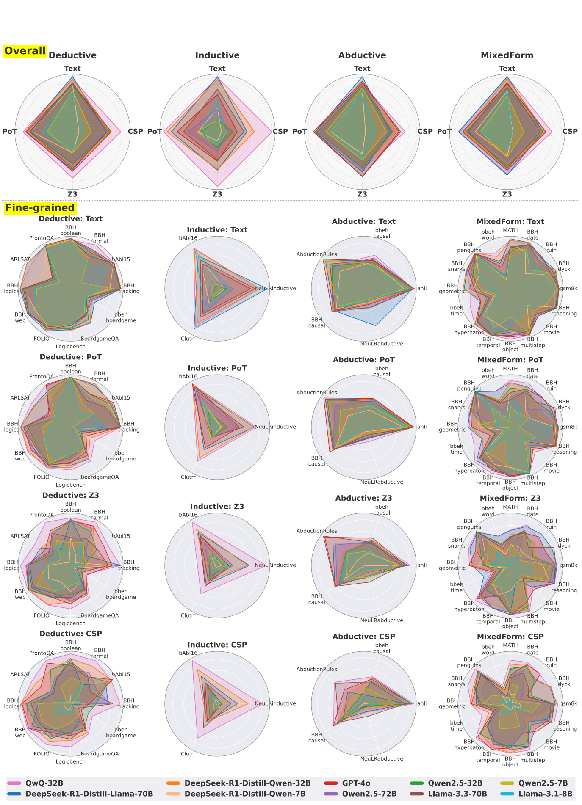  
Figure 2: Radar plots illustrating the performance $( \% )$ of multiple LLMs across different reasoning task types (Deductive, Inductive, Abductive, Mixed Form) and trajectory formats (Text, PoT, Z3, CSP). Overall (top $1 \times 4 )$ shows aggregated performance by reasoning type and format. Fine-grained (below $4 \times 4$ ) present fine-grained results on individual tasks  

Thinking model outperforms Instruct model From the overall part, we can observe that series of Thinking models (e.g., QwQ-32B, etc.) outperform the Instruct series in most tasks, especially in the Inductive and Mixed-Form tasks. The disparities between them reflect that the Thinking mode can better elicit the LLM to provide reliable trajectories for formal reasoning. Previous evaluations (Xu et al., 2025) have demonstrated a similar finding that Instruct models have achieved unsatisfactory results in inductive reasoning, but they do not provide the suggestion that the Thinking model can perform well.  

Text outperforms formal languages, except for QwQ-32BMost models outperform formal languages in the Text trajectory format. In the Finegrained section, as the trajectory format shifts from Text to CSP, the radar map coverage area gradually decreases, especially in the bbeh series of subtasks. However, QwQ-32B is the only model that stays ahead in all tasks and trajectories, maintaining a high level of performance in all formal languages.  

Formal language performance drops significantly on difficult tasks Models can achieve comparable or even better performance than Text with formal languages in simple tasks (e.g., Z3, CSP in Deducitve-BBH_web), but the performance of formal languages drops off substantially in complex tasks(e.g., Deductive-bbeh_boardgameQA). This phenomenon again suggests that current large models are better at using non-formal languages when expressing complex logic. Possible reasons include: 1) the model training process is dominated by natural language, with a scarcity of formal language samples; and 2) the model lacks augmentation for difficult and complex problems. The performance of text formatting is average, while formal language significantly decreases. It is worth noting that GPT-4o's performance in this area is relatively stable, possibly due to its optimization in data.  

Small models perform poorly on formal language  Both Instruct and Thinking small models have acceptable overall performance under Text, but when dealing with formal languages, the performance drops rapidly. Taking R1-Distill-Qwen7B as an example, its performance under the CSP trajectory is even significantly lower than similar Instruct models, indicating that the Thinking mechanism is difficult to effectively support formal language reasoning at low parameter scales. In addition, in high complexity tasks such as bbeh-time, bbeh-shuffle, etc., the small model is almost completely ineffective in structured trajectories such as Z3 and CSP, and it is difficult to complete the basic logical steps, which shows its serious lack of ability to deal with formal reasoning problems.  

Overall, all models except QwQ-32B show a continuous performance degradation in the trajec. tory format change from Text to formal language (PoT, Z3, CSP). This phenomenon suggests that the current mainstream LLMs are more adept at handling natural language tasks, while they are still deficient in formal language reasoning.  

# 3.2 Different Reasoning Tasks Prefer Different Trajectory Format  

In this section, we use the GPT-4o result as an anchor point to conduct a detailed analysis of how different tasks exhibit varying preferences for trajectory formats. As shown in Figure 3, GPT-4o exhibits diverse preferences across trajectory formats. Below, we summarize the main observations.  

Text performs better in language comprehension and open-ended tasks First, in tasks such as BBH_snarks, bbeh_linguini, bbeh_nycc, Text is closer to the nature of the task in humor comprehension, linguistic style recognition, and fuzzy semantic parsing, and is superior to formal language. Secondly, in induction and abduction tasks such as AbductionRules, NeuLRabductive, NeuL Rinductive, and Clutrr, where reasoning relies on linguistic expressions, the Text format is more advantageous. In addition, LogicQA, although categorized as a logic task, is more akin to a general knowledge quiz. It originates from the Chinese Civil Service Exam, where textual ability plays a dominant role in performance. (Cases in Figure 6)  

Well-structured tasks prefer PoT PoT format is particularly effective in tasks with strong structural characteristics, such as numerical computation and symbolic reasoning tasks like BBH_dyck_languages and BBH_word_sorting. In these settings, PoT enables efficient computation and facilitates the handling of rules involving nesting and ordering. Additionally, in tasks that involve temporal sequences, object tracking, and spatial reasoning, such as bAbI16, bbeh_shuffled_objects, and bbeh_spatial_reasoning, PoT demonstrates strong performance by leveraging programmatic trajectories to clearly express intermediate states and transformation processes. (Case in Figure 7)  

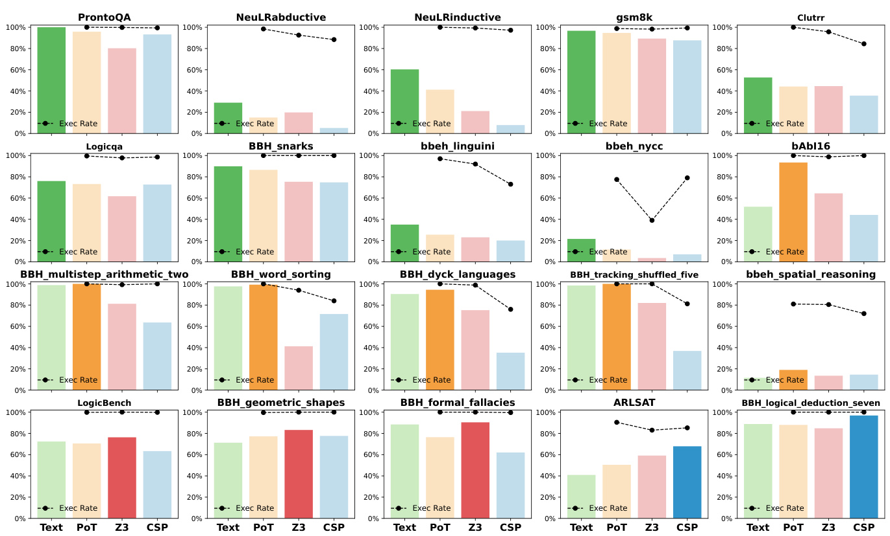  
Figure 3: Preferred reasoning task performance across different trajectory formats (Text, PoT, Z3, CSP) in GPT-40 results. Each subplot shows task accuracy under different formats, with execution rate (Exec Rate) plotted as a black line. The highlighted bars represent the most preferred trajectory format for each task.  

Z3 handles formal and FOL reasoning well. Z3 format shows a good adaptation to formal logic tasks, especially in tasks with strict logical rules:LogicBench, BBH_formal_fallacies, BBH_logical_deduction. This type of task is essentially convertible to first-order logical expres sions, so using an SMT solver (e.g., Z3) as the trajectory language is more suitable. In addition, BBH_geometric_shapes involves spatial reasoning, where the boolean logical expressiveness of Z3 is more advantageous. (Case in Figure 9)  

CSP shows advantages in complex constraints CSP format shows advantages in some structured logic tasks, such as BBH_logical_deduction, a result consistent with the findings of Logic-LM (Pan et al., 2023). More interestingly, in ARLSAT, a task derived from the Law School Admission Test, CSP also achieves the optimal result, which contrasts with the previous (Pan et al., 2023) literature's conclusion that Z3 is better suited for this task. This difference may stem from the characteristics of the tasks themselves; in ARLSAT, the stems of the questions typically contain constraints, which are more consistent in form with the way CSPs are expressed. (Case in Figure 9)  

Beyond the four dimensions mentioned above, we can observe that execution success rate (Exec Rate) is also a key factor underlying the differences among various forms of language. Moreover, gsm8k achieves its best performance under the Text format, which is inconsistent with findings from previous studies (e.g., Ye et al. (2023); He-Yueya et al. (2023)). This discrepancy may be attributed to two factors: 1) Prior work often in volves task-specific optimization for mathematical reasoning; 2) Current large language models are trained on substantial amounts of mathematical natural language reasoning data, which enhances their generalization ability in Text formats.  

Overall, task trajectory alignment plays a critical role. Different tasks exhibit preferences for specific trajectory formats-some tasks are inherently better suited to certain formal representations, and using inappropriate formats may even hinder model performance. Therefore, when constructing multi-trajectory training or evaluation frameworks, it is important to carefully consider the alignment among task structure, target language, and model capabilities.  

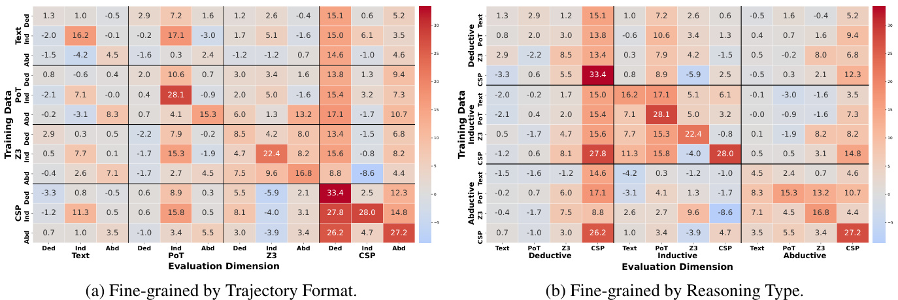  
Figure 4: Generalization performance across fine-grained (task type $\times$ format) configurations. Each cell shows the performance gain $( \Delta )$ from training on the row configuration and evaluating on the column configuration  

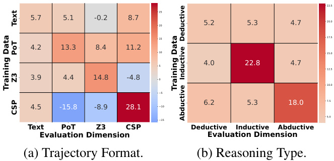  
Figure 5: Generalization performance across reasoning types and trajectory formats (coarse-grained analysis). Each cell reports the performance gain $( \Delta )$ when training on the row group and evaluating on the column group.  

# 4 PART II: Generalization Analysis across Reasoning Tasks and Trajectory Formats  

# 4.1 Setup and Visualization Overview  

We collected the training split of the evaluation dataset, categorized into three reasoning types: Deductive, Inductive, and Abductive (excluding Mixed-Form due to variable control challenges). Each training instance is represented in four trajec. tory formats: Text, PoT, Z3, and CSP. Details are provided in Section 5.1.  

Based on the above data, we conduct two sets of analytical experiments: coarse-grained and finegrained.1): Coarse-grained experiments, as shown in Figure 5, involve training on 7 groups of data (3 reasoning types $+ 4$ trajectory formats), each mixed with general-domain data, and evaluating on the same 3 reasoning types and 4 formats. 2): Fine-grained experiments, as shown in Figure 4, involve training on 12 groups of data (3 reasoning types $\times 4$ trajectory formats), each mixed with general-domain data, and evaluating across all 12 combinations of reasoning types and formats. Each heatmap cell shows the performance gain $( \Delta )$ when training on the configuration in the row and evaluating on the configuration in the column. The performance gain reflects the improvement introduced by our constructed data when mixed with the general-domain data (Trained on Qwen-2.5-7B).  

# 4.2 Coarse-Grained Generalization Analysis  

Significant in-domain improvement The strongest performance gains are observed along the diagonal, indicating that the model benefits most when the training and evaluation data come from the same group. Notably, the improvements for CSP (T) $\mathrm { { [ a i n )  C S P } }$ (Eval) and Inductive (Train) $$ Inductive (Eval) reach 28.1 and 22.8, respectively. Combined with observations from Part-I, this can be partially attributed to the relatively low baseline performance of the Qwen2.5-7B model on the CSP and Inductive dimensions, meaning that even a small amount of in-domain data leads to significant improvement.  

PoT transfers well, while CSP transfers poorly Outside the diagonal, in figure 5a, PoT migrates well in Text, Z3, and CSP. This might be related to the fact that there is a lot of code data in the pre-training data. CSP, on the other hand, has an effect only on Text and CSP, with significant negative effects on PoT (-15.8) and Z3 (-8.9). This suggests that there may be structural differences among formal languages.  

Reasoning types: all exhibit positive transfer The overall transfer effect is relatively balanced between the different reasoning types (Fig.5b). The relatively small improvement on Deductive itself may be related to the higher base level of the model on Deductive.  

Table 1: Performance of LLM on different trajectory formats before and after formal data enhancement. Accuracy (Acc) and execution rate (Exec Rate) are reported for text, PoT, Z3, and CSP formats. Qwen2.5-7B-Baseline denotes the baseline model trained with general data only; Qwen2.5-7B-Base w.Formal denotes the augmented model trained with a mixture of formal language data. Improvements after augmentation are shown in green.   

<html><body><table><tr><td rowspan="2">Model</td><td>Text</td><td colspan="2">PoT</td><td colspan="2">Z3</td><td colspan="2">CSP</td><td colspan="2">Avg</td></tr><tr><td>Acc</td><td>Acc</td><td>Exec Rate</td><td>Acc</td><td>Exec Rate</td><td>Acc</td><td>Exec Rate</td><td>Acc</td><td>Exec Rate</td></tr><tr><td>GPT-40</td><td>66.7</td><td>64.0</td><td>91.5</td><td>54.5</td><td>87.4</td><td>53.0</td><td>83.98</td><td>59.0</td><td>87.6</td></tr><tr><td>Qwen2.5-7B-Instruct</td><td>52.3</td><td>37.0</td><td>78.6</td><td>33.0</td><td>70.0</td><td>25.0</td><td>52.1</td><td>37.0</td><td>66.9</td></tr><tr><td>Qwen2.5-72B-Instruct</td><td>63.4</td><td>54.0</td><td>85.1</td><td>42.5</td><td>79.6</td><td>43.0</td><td>75.2</td><td>51.0</td><td>80.0</td></tr><tr><td>Qwen2.5-7B-Baseline</td><td>49.7</td><td>40.0</td><td>75.4</td><td>27.1</td><td>68.2</td><td>20.0</td><td>52.2.</td><td>34.0</td><td>65.3.</td></tr><tr><td>Qwen2.5-7B-Base w.Formal</td><td>52.7+3.0</td><td>44.0+4.0</td><td>83.5+8.1</td><td>34.8+7.7</td><td>76.5+8.3</td><td>37.0+17.0</td><td>68.1+15.9</td><td>42.0+8.0</td><td>76.0+10.7</td></tr></table></body></html>  

# 4.3 Fine-Grained Generalization Analysis  

Deductive-CSP is most easily generalized In Figure 4, all entries in the Deductive-CSP column show improvements. The inclusion of any data contributes positively to its performance. This is mainly because CSP has a relatively low baseline, and the Deductive category contains some relatively simple tasks (BBH_logical_deduction_three from $40 \%$ to $92 \%$ ). As a result, adding similar data leads to performance gains.  

CSP and Z3 transfer well across reasoning types In Figure 4a, all entries (Ded/Ind/Abd) within the CSP and Z3 blocks show positive gains, indicating that regardless of reasoning type, CSP and Z3 formats can be effectively transferred.  

Abductive transfers well across trajectory formats In Figure 4b, all entries (Text/PoT/CSP/Z3) within the Abductive block show improvements, suggesting that regardless of trajectory format, Abductive reasoning can be effectively transferred and improved.  

# 5 PART III: Enhancing LLMs with Formal Data  

# 5.1 Formal Data Construction via RFT  

To enhance model capability in formal languages, we collect the portions of current evaluation datasets that overlap with training data as part of our training set. All dataset details are provided in Table 2. Similarly, the training data is categorized into three types: Deductive, Inductive, and Abductive, and four trajectory formats: Text, PoT, Z3, and CSP.  

First, we extract up to 3,000 samples from all training data. Then, GPT-4o was chosen as the output for teacher model construction. In order to obtain high quality response data, we used Rejection sampling Fine-Tuning (RFT). We used GPT-4o to sample the questions several times and then filtered out those samples whose code was executable and whose final answers are verified to be correct. The statistics of the filtered data are shown in Table 3. The number in parentheses after each model name indicates the amount of added data.  

# 5.2 Main Result  

As shown in Table 1, the enhanced model improves accuracy by $3 . 0 \%$ on Text, $7 . 7 \%$ on $Z 3$ (with an $8 . 3 \%$ gain in execution rate), and $1 7 . 0 \%$ on CSP (from $2 0 . 0 \%$ to $3 7 . 0 \%$ , with a $1 5 . 9 \%$ increase in execution rate). Overall, average accuracy rises from $34 . 0 \%$ to $4 2 . 0 \%$ , and execution rate from $6 5 . 3 \%$ to $7 6 . 0 \%$  

Beyond outperforming the baseline, our formaldata-enhanced model also surpasses the opensource model Qwen2.5-7B-Instruct across all formats. Qwen2.5-7B-Base w.Formal has a smaller parameter size than Qwen2.5-72B, but the performance gap is narrowed by formal data fine-tuning. This suggests that formal data augmentation can effectively improve the competitiveness of small models in formal reasoning tasks.  

# 6 Conclusion  

In this paper, we provide a comprehensive evaluation of LLMs utilizing various formal languages to solve different categories of logical reasoning tasks. We first develop a systematic evaluation architecture and decompose it into three dimensions. Then, we perform a thorough evaluation across these three dimensions to show whether the current LLMs can excel in formal language utilization. Furthermore, we explore the generalization across multiple formal languages and provide a simple but effective method on the capability enhancement for small language models.  

For future directions, on the one hand, we should strive to enhance the model's reasoning capabilities in a balanced manner across different trajectory formats and task types, especially for Instruct models. At the same time, it may be valuable to construct formal language reasoning datasets in a "thinking" style. On the other hand, we can leverage the taskspecific preferences for trajectory formats to further expand the capability boundaries of the model. One approach is to incorporate reasoning results from different trajectory formats as individual voters in a majority voting scheme. Another approach is to introduce multiple symbolic solvers for different reasoning trajectories during the thinking stage of the think model.  

# Limitations  

This work provides a step toward evaluating and enhancing LLMs through formal reasoning formats, but several limitations remain. First, the landscape of LLMs is evolving rapidly. Our experiments focus on a limited set of models available at the time, and newer models may change performance trends. Second, while we include various reasoning types and benchmark datasets, the overall dataset coverage is limited. Our formal data augmentation is applied to a subset of tasks and may not generalize to other domains. Third, we focus on three formal formats, "PoT, Z3, and CSP," due to their executability and popularity. However, this excludes other symbolic systems such as Lean, Prolog, Coq, or SMTLIB, which future work could explore. Finally, our formal data construction is based on the Instruct model (GPT-4o). With the rise of stronger Thinking models, generating think-style formal data may become more feasible and diverse in the future.  

# References  

Josh Achiam, Steven Adler, Sandhini Agarwal, Lama Ahmad, Ilge Akkaya, Florencia Leoni Aleman, Diogo Almeida, Janko Altenschmidt, Sam Altman, Shyamal Anadkat, and 1 others. 2023. Gpt-4 technical report. arXiv preprint arXiv:2303.08774.   
Jinze Bai, Shuai Bai, Yunfei Chu, Zeyu Cui, Kai Dang, Xiaodong Deng, Yang Fan, Wenbin Ge, Yu Han, Fei Huang, and 1 others. 2023. Qwen technical report. arXiv preprint arXiv:2309.16609.   
Rama Krishna Sai Bhagavatula, Ronan Le Bras, Chaitanya Malaviya, Yejin Choi, and Noah A Smith. 2020. Abductionrules: Training transformers to explain unexpected inputs. In Proceedings of the 58th Annual Meeting of the Association for Computational Linguistics, pages 4246-4258.   
Xiao Bi, Deli Chen, Guanting Chen, Shanhuang Chen, Damai Dai, Chengqi Deng, Honghui Ding, Kai Dong, Qiushi Du, Zhe Fu, and 1 others. 2024. Deepseek llm: Scaling open-source language models with longtermism. arXiv preprint arXiv:2401.02954.   
Nikolaj Bjorner, Anh-Dung Phan, and Lars Fleckenstein. 2015. vz-an optimizing smt solver. In Tools and Algorithms for the Construction and Analysis of Systems: 21st International Conference, TACAS 2015, Held as Part of the European Joint Conferences on Theory and Practice of Software, ETAPS 2015, London, UK, April 11-18, 2015, Proceedings 21, pages 194199. Springer.   
Andrei Bulatov, Peter Jeavons, and Andrei Krokhin. 2005. Classifying the complexity of constraints using finite algebras. SIAM journal on computing, 34(3):720-742.  

Benjamin Callewaert, Simon Vandevelde, and Joost Vennekens. 2025. Verus-lm: a versatile framework for combining llms with symbolic reasoning. arXiv preprint arXiv:2501.14540.  

Karl Cobbe, Vineet Kosaraju, Mohammad Bavarian, Mark Chen, Heewoo Jun, Lukasz Kaiser, Matthias Plappert, Jerry Tworek, Jacob Hilton, Reiichiro Nakano, and 1 others. 2021. Training verifiers to solve math word problems. In null.  

Denise D Cummins, Todd Lubart, Olaf Alksnis, and Robert Rist. 1991. Conditional reasoning and causation. Memory & cognition, 19:274-282.  

Peter A Flach and Antonis C Kakas. 200o. Abduction and Induction: Essays on their relation and integration, volume 18. Springer Science & Business Media.  

Robert Friedman. 2023. Large language models and logical reasoning. Encyclopedia, 3(2):687-697.  

Luyu Gao, Aman Madaan, Shuyan Zhou, Uri Alon, Pengfei Liu, Yiming Yang, Jamie Callan, and Graham Neubig. 2023. Pal: Program-aided language models. In International Conference on Machine Learning, pages 10764-10799. PMLR.  

Vinod Goel. 2007. Anatomy of deductive reasoning. Trends in cognitive sciences, 11(10):435-441.  

Aaron Grattafiori, Abhimanyu Dubey, Abhinav Jauhri, Abhinav Pandey, Abhishek Kadian, Ahmad AlDahle, Aiesha Letman, Akhil Mathur, Alan Schelten, Alex Vaughan, and 1 others. 2024. The llama 3 herd of models. arXiv e-prints, pages arXiv-2407.  

Daya Guo, Dejian Yang, Haowei Zhang, Junxiao Song, Ruoyu Zhang, Runxin Xu, Qihao Zhu, Shirong Ma, Peiyi Wang, Xiao Bi, and 1 others. 2025. Deepseek-r1: Incentivizing reasoning capability in llms via reinforcement learning. arXiv preprint arXiv:2501.12948.  

Simeng Han, Hailey Schoelkopf, Yilun Zhao, Zhenting Qi, Martin Riddell, Wenfei Zhou, James Coady, David Peng, Yujie Qiao, Luke Benson, and 1 others. 2024. Folio: Natural language reasoning with first-order logic. In Proceedings of the 2024 Conference on Empirical Methods in Natural Language Processing, pages 22017-22031.  

Joy He- Yueya, Gabriel Poesia, Rose Wang, and Noah Goodman. 2023. Solving math word problems by combining language models with symbolic solvers. In The 3rd Workshop on Mathematical Reasoning and AI at NeurIPS'23.  

Dan Hendrycks, Collin Burns, Saurav Kadavath, Akul Arora, Steven Basart, Eric Tang, Dawn Song, and Jacob Steinhardt. 2021. Measuring mathematical problem solving with the math dataset. Sort, 2(4):0-- 6.  

Philip N Johnson-Laird. 1999. Deductive reasoning. Annual review of psychology, 50(1):109-135.  

Mehran Kazemi, Bahare Fatemi, Hritik Bansal, John Palowitch, Chrysovalantis Anastasiou, Sanket Vaibhav Mehta, Lalit K Jain, Virginia Aglietti, Disha Jindal, Peter Chen, and 1 others. 2025. Big-bench extra hard. arXiv preprint arXiv:2502.19187.  

Mehran Kazemi, Quan Yuan, Deepti Bhatia, Najoung Kim, Xin Xu, Vaiva Imbrasaite, and Deepak Ramachandran. 2023. Boardgameqa: A dataset for natural language reasoning with contradictory information. Advances in Neural Information Processing Systems, 36:39052-39074.  

Woosuk Kwon, Zhuohan Li, Siyuan Zhuang, Ying Sheng, Lianmin Zheng, Cody Hao Yu, Joseph E. Gonzalez, Hao Zhang, and Ion Stoica. 2023. Efficient memory management for large language model serving with pagedattention. In Proceedings of the ACM SIGOPS 29th Symposium on Operating Systems Principles.  

Fangyu Lei, Qian Liu, Yiming Huang, Shizhu He, Jun Zhao, and Kang Liu. 2024. S3eval: A synthetic, scalable, systematic evaluation suite for large language model. In Proceedings of the 2024 Conference of the North American Chapter of the Association for Computational Linguistics: Human Language Technologies (Volume 1: Long Papers), pages 1259-1286.  

Jian Liu, Leyang Cui, Hanmeng Liu, Dandan Huang, Yile Wang, and Yue Zhang. 2021. Logiqa: a challenge dataset for machine reading comprehension with logical reasoning. In Proceedings of the Twenty-Ninth International Conference on Interna tional Joint Conferences on Artificial Intelligence, pages 3622-3628.  

Qiyuan Liu, Ming Yan, Yiyang Liu, Pan Lu, Siwei Wang, and Songfang Huang. 2020. Logiqa: A challenge dataset for machine reading comprehension with logical reasoning. In Proceedings of the 2020 Conference on Empirical Methods in Natural Language Processing (EMNLP), pages 1866-1877.  

Qing Lyu, Shreya Havaldar, Adam Stein, Li Zhang, Delip Rao, Eric Wong, Marianna Apidianaki, and Chris Callison-Burch. 2023. Faithful chain-ofthought reasoning. In The 13th International Joint Conference on Natural Language Processing and the 3rd Conference of the Asia-Pacific Chapter of the Association for Computational Linguistics (IJCNLPAACL 2023).  

Theo X Olausson, Alex Gu, Benjamin Lipkin, Cedegao E Zhang, Armando Solar-Lezama, Joshua B Tenenbaum, and Roger Levy. 2023. Linc: A neurosymbolic approach for logical reasoning by combining language models with first-order logic provers. In Proceedings of the 2023 Conference on Empirical Methods in Natural Language Processing, pages 5153-5176.  

Liangming Pan, Alon Albalak, Xinyi Wang, and William Yang Wang. 2023. Logic-lm: Empowering large language models with symbolic solvers for faithful logical reasoning. In Findings of the Association for Computational Linguistics: EMNLP 2023, pages 3806-3824.  

Gaurav Parmar, Shikhar Murari, and Mohit Bansal. 2023. Logicbench: A challenging benchmark for logical reasoning with large language models. In Findings of the Association for Computational Linguistics: EMNLP 2023, pages 148-168.  

S RANISE. 2003. The smt-lib format: An initial proposal. 1st PDPAR, 2003.  

Abulhair Saparov and He He. 2023. Language models are greedy reasoners: A systematic formal analysis of chain-of-thought. In The Eleventh International Conference on Learning Representations.  

Koustuv Sinha, Shagun Sodhani, Jin Dong, Joelle Pineau, and William L Hamilton. 2019. Clutrr: A diagnostic benchmark for inductive reasoning from text. In Proceedings of the 2019 Conference on Empirical Methods in Natural Language Processing and the 9th International Joint Conference on Natural Language Processing (EMNLP-IJCNLP), pages 4506-4515.  

Mirac Suzgun, Nathan Scales, Nathanael Scharli, Sebastian Gehrmann, Yi Tay, Hyung Won Chung, Michael Petrov, Vincent Y Zhao, Ryan Murphy, Adam Roberts, and 1 others. 2022. Challenging big. bench tasks and whether chain-of-thought can solve them. arXiv preprint arXiv:2210.09261.  

Fumiya Uchiyama, Takeshi Kojima, Andrew Gambardella, Qi Cao, Yusuke Iwasawa, and Yutaka Matsuo. 2023. Which programming language and what features at pre-training stage affect downstream logical inference performance? Findings of the Association for Computational Linguistics: EMNLP 2023, pages 1008-1021.  

Marco Valentino, Mokanarangan Thayaparan, and Andre Freitas. 2022. Case-based abductive natural language inference. In Proceedings of the 29th International Conference on Computational Linguistics, pages 1556-1568.  

Xinyi Wang, Liangming Pan, and William Yang Wang. 2024. Logic- $\cdot \ln + +$ : Multi-step refinement for symbolic formulations. In The Twelfth International Conference on Learning Representations.  

Jason Wei, Xuezhi Wang, Dale Schuurmans, Maarten Bosma, Fei Xia, Ed Chi, Quoc V Le, Denny Zhou, and 1 others. 2022. Chain-of-thought prompting elicits reasoning in large language models. Advances in neural information processing systems, 35:24824 24837.  

Jason Weston, Antoine Bordes, Sumit Chopra, Tomas Mikolov, and Alexander Rush. 2015. Towards aicomplete question answering: A set of prerequisite toy tasks. In null.  

Jason Weston, Antoine Bordes, Sumit Chopra, Alexander M Rush, Bart Van Merrienboer, Armand Joulin, and Tomas Mikolov. 2016. Towards ai-complete question answering: A set of prerequisite toy tasks. In 4th International Conference on Learning Repre sentations, ICLR 2016.  

Yuan Xia, Akanksha Atrey, Fadoua Khmaissia, and Kedar S Namjoshi. 2025. Can large language models learn formal logic? a data-driven training and evaluation framework. arXiv preprint arXiv:2504.20213.  

Siheng Xiong, Yuan Yang, Ali Payani, Ehsan Shareghi, and Faramarz Fekri. 2024. Strategies for improving nl-to-fol translation with llms: Data generation, incremental fine-tuning, and verification. arXiv preprint arXiv:2409.16461.  

Fangzhi Xu, Qika Lin, Jiawei Han, Tianzhe Zhao, Jun Liu, and Erik Cambria. 2025. Are large language models really good logical reasoners? a comprehensive evaluation and beyond. IEEE Transactions on Knowledge & Data Engineering, pages 1-15.  

Yuan Yang, Siheng Xiong, Ali Payani, Ehsan Shareghi, and Faramarz Fekri. 2023a. Harnessing the power of large language models for natural language to first-order logic translation. arXiv preprint arXiv:2305.15541.  

Zonglin Yang, Xinya Du, Rui Mao, Jinjie Ni, and Erik Cambria. 2023b. Logical reasoning over natural language as knowledge representation: A survey. In The 61st Annual Meeting Of The Association For Computational Linguistics.  

Xi Ye, Qiaochu Chen, Isil Dillig, and Greg Durrett. 2023. Satlm: Satisfiability-aided language models using declarative prompting. In Proceedings of NeurIPS.  

Nathan Young, Qiming Bao, Joshua Bensemann, and Michael J Witbrock. 2022. Abductionrules: Training transformers to explain unexpected inputs. In Findings of the Association for Computational Linguistics: ACL 2022, pages 218-227.  

Fei Yu, Hongbo Zhang, Prayag Tiwari, and Benyou Wang. 2024. Natural language reasoning, a survey. ACM Computing Surveys, 56(12):1-39.  

Jing Zhang, Bo Chen, Lingxi Zhang, Xirui Ke, and Haipeng Ding. 2021. Neural, symbolic and neuralsymbolic reasoning on knowledge graphs. AI Open, 2:14-35.  

Yixin Zhao, Adina Williams, Emily Dinan, Mohit Bansal, Mark Yatskar, and Yejin Choi. 2021. Adversarial nli: A new benchmark for natural language understanding. In null.  

Victor Zhong, Chandra Bhagavatula, Ronan Le Bras, Yejin Choi, and Noah A Smith. 2022. Analytical reasoning of text: Unifying machine reading and logical reasoning. In Findings of the Association for Computational Linguistics: NAACL 2022, pages 23072323.  

Wanjun Zhong, Siyuan Wang, Duyu Tang, Zenan Xu, Daya Guo, Jiahai Wang, Jian Yin, Ming Zhou, and Nan Duan. 2021. Ar-lsat: Investigating analytical reasoning of text. arXiv e-prints, pages arXiv-2104.  

# A Related Work  

# A.1 Symbolic Solver Enhances LLM Reasoning  

The integration of symbolic solvers with large language models (LLMs) has emerged as a promising approach to enhance logical reasoning. Early efforts focused on translating natural language to firstorder logic (FOL), exemplified by the creation of the MALLS dataset and the LogicLLaMA model, which demonstrated improved NL-to-FOL translation (Yang et al., 2023a). The Logic-LM framework further explored this direction by employing different formal languages and solvers tailored to specific reasoning tasks, such as FOL with Prover9, CSP solvers for constraint satisfaction, and Z3 for SMT problems (Pan et al., 2023). SATLM introduced declarative prompting to generate task specifications in logical formulas for SAT solvers (Ye et al., 2023), while LINC utilized LLMs for semantic parsing into FOL, offloading inference to theorem provers (Olausson et al., 2023). Subsequent research investigated strategies for improving NL-to-FOL translation through data generation and fine-tuning (Xiong et al., 2024), multi-step refinement of symbolic formulations (Wang et al., 2024), and the impact of pre-training data, including programming languages, on logical inference (Uchiyama et al., 2023). Frameworks like VERUSLM aimed for versatility by supporting various reasoning tasks with a clear separation of knowledge and queries (Callewaert et al., 2025).  

# A.2 Complex Logical Reasoning Tasks  

Evaluating the logical reasoning capabilities of LLMs necessitates challenging and diverse datasets that probe various aspects of inference. FOLIO, annotated with first-order logic, focuses on complex logical reasoning in natural language (Han et al., 2024). ProntoQA utilizes logic programming and emphasizes chain-of-thought reasoning (Saparov and He, 2023), while LogicBench covers propositional, first-order, and non-monotonic logic with a focus on single inference rules (Parmar et al., 2023). BOARDGAMEQA assesses reasoning with contradictory information and preferences (Kazemi et al., 2023), and AR-LSAT tests analytical reasoning skills using logic constraints (Zhong et al., 2022). The BIG-Bench Hard (BBH) benchmark includes a wide array of challenging tasks like Boolean Expressions (Suzgun et al., 2022), formal fallacies (Suzgun et al., 2022), logical deduction (Suzgun et al., 2022), shuffled objects (Suzgun et al., 2022), and web of lies (Suzgun et al., 2022). Other datasets like bAbI (Weston et al., 2015), CLUTRR (Sinha et al., 2019), $\alpha$ -NLI (Zhao et al., 2021), AbductiveRules (Bhagavatula et al., 2020), LogiQA (Liu et al., 2020), and gsm8k (Cobbe et al., 2021) target specific reasoning types such as deductive, inductive, abductive, temporal, spatial, and mathematical reasoning. The variety in these datasets and their annotations highlights the multifaceted nature of complex reasoning and the ongoing efforts to evaluate and enhance LLMs in this domain.  

# B Details of Datasets  

Table 2 provides a comprehensive overview of all datasets used in our study. Each dataset is annotated with its reasoning type (Deductive, Inductive, Abductive, or Mixed-Form), along with the number of evaluation and training examples. We also include the original source for each dataset.  

The classification follows our taxonomy introduced in Section 2.1. In particular:  

: Deductive datasets include tasks that require formal logical reasoning based on explicit rules or premises. : Inductive datasets focus on pattern discovery and generalization from limited examples. : Abductive datasets involve generating plausible explanations under uncertainty. . Mixed-Form includes tasks with hybrid or ambiguous reasoning types, further grouped into subcategories such as Temporal, NLU, Symbolic, Spatial, Knowledge, and Math.  

Some datasets (e.g., BBH and bbeh) are split into finer task categories, each treated independently during evaluation. For large-scale datasets like GSM8K and MATH, we use a subset of examples (denoted by $*$ ) to maintain balance across task types.  

This dataset collection forms the foundation for our evaluation across models, trajectory formats, and reasoning types.  

# C Detail of Trajectory Format  

We extend the unified trajectory formulation to three specific formal languages: Python (PoT), Z3, and CSP. Each trajectory consists of a sequence of  

symbolic steps, which are executed by an external engine to compute the final answer.  

We denote the model-generated trajectory as:  

$$
\mathcal { L L M } ( Q ) = \langle s _ { 1 } , s _ { 2 } , \ldots , s _ { n } \rangle \quad \xrightarrow { \mathrm { E x e c } } \quad A
$$  

Where $Q$ is the input query, each $s _ { i }$ is a step in a domain-specific language, and $A$ is the final answer produced by executing the trajectory.  

# Python (PoT) Trajectory  

In the Python format, each step $s _ { i }$ is a syntactically valid Python statement. The trajectory consists of variable assignments, arithmetic operations, control logic, and ends with a print (A) statement.  

The Python trajectory is formalized as:  

$$
\begin{array} { r l } & { \mathcal { L L M } _ { \mathrm { P y t h o n } } ( Q ) = } \\ & { \quad \langle s \mathrm { t m t } _ { 1 } , s \mathrm { t m t } _ { 2 } , \ldots , s \mathrm { t m t } _ { n } , } \\ & { \quad \mathrm { p r i n t } ( A ) \rangle \quad \xrightarrow [ ] { \mathrm { P y t h o n } 3 . 1 2 } \quad \mathcal { L } } \end{array}
$$  

This trajectory is interpreted and executed sequentially using a Python 3.12 interpreter.  

# Z3 Trajectory  

Inspired by Logic-LM (Pan et al., 2023), for Z3, the reasoning trajectory is constructed using the Z3 theorem prover. A typical trajectory includes symbolic variable declarations such a $\mathfrak { w } \times \mathbf { \sigma } = \mathrm { I n t } ( \mathbf { \sigma } ^ { \prime } \mathbf { x } ^ { \prime } )$ 6 followed by logical assertions like s . add $( \mathsf { x } > \mathsf { 1 }$ 3 $x < 5 )$ , and ends with solver calls s. check() and s.mode1() to extract a result.  

We represent the Z3 trajectory as:  

$$
\begin{array} { r } { \begin{array} { r } { \mathcal { L L M } _ { \mathrm { Z 3 } } ( Q ) = \qquad } \\ { \langle \mathsf { D e c l a r e } , \mathsf { A s s e r t 1 } , \mathsf { \ldots } , \mathsf { A s s e r t } _ { k } , \qquad } \\ { \mathsf { C h e c k S a t , p r i n t } ( \mathsf { A } ) \rangle \qquad \frac { \mathrm { Z 3 ~ S o l v e r } } { \mathsf { . } } \quad \mathrm { . } } \end{array} } \end{array}
$$  

Z3 supports a wide range of built-in logical theories, such as integer arithmetic, arrays, and bitvectors.  

# CSP Trajectory  

Constraint Satisfaction Problems (CSPs) are defined by a triple $( X , D , C )$ ,where $\begin{array} { r l r } { X } & { { } \ = \ } & { \left\{ x _ { 1 } , . . . , x _ { n } \right\} } \end{array}$ denotes variables, $\begin{array} { r l r } { D } & { { } = } & { \left\{ D _ { 1 } , \ldots , D _ { n } \right\} } \end{array}$ their domains, and $\begin{array} { r c l } { C } & { = } & { \{ C _ { 1 } , \ldots , C _ { m } \} } \end{array}$ the set of constraints. Each constraint $C _ { j } = \langle t _ { j } , R _ { j } \rangle$ is defined over a subset of variables and a relation on their domains.  

Table 2: Complex Logical Reasoning data categorization, data statistics, and sources.   

<html><body><table><tr><td colspan="2">Type Dataset</td><td colspan="2">Eval Train</td><td>Original Source</td></tr><tr><td rowspan="18">Deductive</td><td>FOLIO</td><td>134</td><td>674</td><td>Han et al. (2024)</td></tr><tr><td>ProntoQA</td><td>500</td><td>50818</td><td>Han et al. (2024)</td></tr><tr><td>LogicBench </td><td> 500</td><td>12908</td><td>Parmar et al. (2023)</td></tr><tr><td>BOARDGAMEQA</td><td>14K</td><td>750K</td><td>Kazemi et al. (2023)</td></tr><tr><td>AR-LSAT</td><td>230</td><td>1629</td><td>Zhong et al. (2021)</td></tr><tr><td> BBH (Boolean Expression)</td><td>250</td><td></td><td>Suzgun et al. (2022)</td></tr><tr><td></td><td>200</td><td></td><td>Kazemi et al. (2025)</td></tr><tr><td>bbeh (Boolean Expressions)</td><td>250</td><td></td><td>Suzgun et al. (2022)</td></tr><tr><td>BBH (formal_fallacies) bbeh (Zebra Puzzles)</td><td>200</td><td></td><td>Kazemi et al. (2025)</td></tr><tr><td>BBH (logical_deductive_five_objects)</td><td>250</td><td></td><td>Suzgun et al. (2022)</td></tr><tr><td>BBH (logical_deductive_seven_objects)</td><td>250</td><td></td><td>Suzgun et al. (2022)</td></tr><tr><td>BBH (logical_deductive_three_objects)</td><td>250</td><td></td><td>Suzgun et al. (2022)</td></tr><tr><td> bbeh (Boardgame QA)</td><td>200</td><td></td><td>Kazemi et al. (2025)</td></tr><tr><td>BBH (tracking_shuffled_objects_five_objects)</td><td>250</td><td></td><td>Suzgun et al. (2022)</td></tr><tr><td>BBH (tracking_shuffled_objects_seven_objects)</td><td>250</td><td></td><td>Suzgun et al. (2022)</td></tr><tr><td>BBH (tracking_shuffled_objects_three_objects)</td><td>250</td><td></td><td>Suzgun et al. (2022)</td></tr><tr><td>bbeh (Shuffled Objects)</td><td>200</td><td></td><td>Kazemi et al. (2025)</td></tr><tr><td>BBH (web_of_lies)</td><td>250</td><td></td><td>Suzgun et al. (2022)</td></tr><tr><td>bbeh (Web of Lies)</td><td></td><td>200</td><td>Kazemi et al. (2025)</td></tr><tr><td>bAbI-15</td><td>1000</td><td>900</td><td>Weston et al. (2016)</td></tr><tr><td>NeuLR-deductive</td><td>7001</td><td></td><td>Xu et al. (2025)</td></tr><tr><td>CLUTRR</td><td></td><td></td><td></td></tr><tr><td>bAbI-16</td><td>1042</td><td>2452 900</td><td>Sinha et al. (2019) Weston et al. (2016)</td></tr><tr><td>Inductive</td><td>NeuLR-inductive</td><td>1000 7001</td><td>- Xu et al. (2025)</td></tr><tr><td rowspan="5">Abductive</td><td>-NLI</td><td>3059</td><td>169k</td><td>Valentino et al. (2022)</td></tr><tr><td>AbductiveRules</td><td>2536</td><td>8848</td><td>Young et al. (2022)</td></tr><tr><td></td><td></td><td></td><td></td></tr><tr><td> BBH (causal_judgement)</td><td>250</td><td></td><td>Suzgun et al. (2022)</td></tr><tr><td>bbeh (Causal Understanding)</td><td>200</td><td></td><td>Kazemi et al. (2025)</td></tr><tr><td></td><td>NeuLR-abductive</td><td> 6001</td><td></td><td>Xu et al. (2025)</td></tr><tr><td>Mixed-Form</td><td></td><td></td><td></td><td></td></tr><tr><td>Logical Temporal</td><td>LogiQA</td><td>1572</td><td></td><td>Liu et al. (2021) </td></tr><tr><td></td><td>BBH (date_understanding) bbeh (Time Arithmetic)</td><td> 250</td><td></td><td>Suzgun et al. (2022)</td></tr><tr><td>NLU</td><td></td><td>200</td><td></td><td>Kazemi et al. (2025)</td></tr><tr><td rowspan="14">Symbolic</td><td>BBH (temporal_sequences)</td><td>250</td><td></td><td>Suzgun et al. (2022)</td></tr><tr><td>bbeh (Temporal Sequences)</td><td>200</td><td></td><td>Kazemi et al. (2025)</td></tr><tr><td>BBH (disambiguation_qa)</td><td>250</td><td></td><td> Suzgun et al. (2022)</td></tr><tr><td> bbeh (Disambiguation QA)</td><td>200</td><td></td><td>Kazemi et al. (2025)</td></tr><tr><td> BBH (hyperbaton)</td><td>250</td><td></td><td>Suzgun et al. (2022)</td></tr><tr><td>bbeh (Hyperbaton)</td><td>200</td><td></td><td>Kazemi et al. (2025)</td></tr><tr><td>BBH (ruin_names)</td><td>250</td><td></td><td>Suzgun et al. (2022)</td></tr><tr><td> bbeh (New Yorker Cartoon Caption)</td><td>200</td><td></td><td>Kazemi et al. (2025)</td></tr><tr><td>BBH (salient_translation_error_detection) bbeh (Linguini)</td><td>250</td><td></td><td>Suzgun et al. (2022)</td></tr><tr><td></td><td></td><td>200</td><td>Kazemi et al. (2025)</td></tr><tr><td>BBH (snarks)</td><td>250</td><td></td><td>Suzgun et al. (2022)</td></tr><tr><td>bbeh (SARC Triples)</td><td>200</td><td></td><td>Kazemi et al. (2025) </td></tr><tr><td>BBH (dyck_languages)</td><td>250</td><td></td><td>Suzgun et al. (2022)</td></tr><tr><td>bbeh (Dyck Language) BBH (word_sorting)</td><td>200</td><td></td><td>Kazemi et al. (2025)</td></tr><tr><td></td><td></td><td>250</td><td>Suzgun et al. (2022)</td></tr><tr><td>Space</td><td>bbeh (Word Sorting)</td><td>200_</td><td>Kazemi et al. (2025)</td></tr><tr><td></td><td>BBH (geometric_shapes) bbeh (Geometric Shapes)</td><td>250 200</td><td>Suzgun et al. (2022)</td></tr><tr><td>BBH (navigate)</td><td></td><td></td><td>Kazemi et al. (2025)</td></tr><tr><td>bbeh (Spatial Reasoning)</td><td></td><td>250</td><td>Suzgun et al. (2022)</td></tr><tr><td>Table</td><td></td><td>200</td><td>Kazemi et al. (2025)</td></tr><tr><td>Knowledge</td><td>BBH (penguins_in_a_table)</td><td> 250</td><td>Suzgun et al. (2022)</td></tr><tr><td></td><td>bbeh (Buggy Tables) BBH (moive_recommendation)</td><td>200</td><td>Kazemi et al. (2025) </td></tr><tr><td></td><td> bbeh (Movie Recommendation)</td><td>250 200</td><td>Suzgun et al. (2022)</td></tr><tr><td></td><td>BBH (sports_understanding)</td><td>250</td><td>Kazemi et al. (2025)</td></tr><tr><td>MATH</td><td>bbeh (SportQA)</td><td>200</td><td>Suzgun et al. (2022)</td></tr><tr><td></td><td></td><td></td><td>Kazemi et al. (2025)</td></tr><tr><td>GSM8K</td><td></td><td>1319 *8790</td><td>Cobbe et al. (2021)</td></tr><tr><td>MATH</td><td></td><td>5000 *7500</td><td>Hendrycks et al. (2021)</td></tr><tr><td>BBH (multistep_arithmetaic_two)</td><td></td><td>250</td><td>Suzgun et al. (2022)</td></tr><tr><td>bbeh (Multi-step Arithmetic)</td><td></td><td>200</td><td>Kazemi et al. (2025)</td></tr><tr><td>BBH (object_counting)</td><td></td><td>250</td><td>Suzgun et al. (2022)</td></tr><tr><td>bbeh (Object Counting)</td><td></td><td>200</td><td>Kazemi et al. (2025)</td></tr><tr><td></td><td></td><td></td><td></td></tr><tr><td>BBH (reasoning_about_colored_objects) bbeh (Object Properties)</td><td></td><td>250 250</td><td>Suzgun et al. (2022) Suzgun et al. (2022)</td></tr></table></body></html>  

The CSP trajectory is modeled as:  

$$
{ \mathcal { L L M } } _ { \mathrm { C S P } } ( Q ) =
$$  

The execution uses the python-constraint solver. Variables are added through addVariable(), constraints through addConstraint(), and solutions are obtained via getSolution() or getSolutions(). The solver applies standard algorithms such as backtracking and constraint propagation.  

While Prover9-FOL supports classical first-order logic, we choose Z3 for its broader practical applicability. Z3 not only supports FOL reasoning but also natively handles richer theories such as integers, arrays, and linear arithmetic. This allows it to express a wider range of constraints found in real-world reasoning tasks.  

# D Implementation Setups  

# D.1 Evaluations Details  

In the inference phase, we use the vLLM (Kwon et al., 2023) framework for deployment. The inference configuration adopts greedy decoding strategy and sets the maximum generation length to 16K tokens. For the evaluation of model output, we adopt Qwen-2.5-72B-Instruct as the model evaluator to score.  

# D.2 Training Details  

In terms of training implementation, we use Megatron-LM as the training framework with the following configurations: a cosine learning rate schedule is adopted with an initial learning rate of 1e-5, a warmup ratio of 0.03, and the learning rate decays to O; the maximum sequence length is set to 8192, with a global batch size of 128, and the number of training epochs is set to 3. All experiments are completed with Supervised Fine-tuning (SFT) on a computing cluster consisting of 32 NVIDIA A100 GPUs.  

# E Complete results for different models  

As shown in Table 3, we evaluated a total of 31 models across the three parts of this paper. Due to space constraints, we present the results of several representative models here: QwQ-32B (Table 4), GPT-4o (Table 5), Qwen2.5-7B (Table 6), and Qwen2.5-7B-Base w. Formal (Table 7). The complete results are provided in the supplementary files in Excel format.  

# F Case Study  

# F.1 Case for PART I  

We give cases where Text (Fig 6), PoT(Fig 7), $Z 3 ( \mathrm { F i g } 8 )$ and CSP(Fig 9) specialize in each case to show their strengths.  

# F.2 From Logic-LM Few-Shot Eval to Zero-Shot  

Logic-LM uses few-shots setting and rule extraction to build "task-specific executable code" for "a particular formal language" and "a particular task". We use zero-shot directly for evaluation. As shown in the case study in Figure 10, both approaches behave similarly and can evaluate the model's formal language reasoning ability. Meanwhile, the zero-shot setting has better generalization, and this paper considers a subset of 66 datasets based on it.  

# G Prompts  

For text, we use questions directly as input to the rubric. For formal languages, we use zero-shot reviews. Prompts are as follows: PoT in Figure 11; Z3 in Figure 12; CSP in Figure 13. The Prompt for evaluating models is in Figure 14.  

Table 3: Comprehensive Overview of Model Evaluation Experiments in the Entire Paper (Models in Bold Are Presented with Full Results Later). Parentheses after the model in PART-II indicate the corresponding amount of data. All data are based on the $1 5 \mathrm { k \Omega }$ generic data of Qwen2.5-7B-Baseline\*, plus $( + )$ the corresponding amount of our synthetic data.   

<html><body><table><tr><td>Section</td><td>Number</td><td>Model</td></tr><tr><td rowspan="2">PART-I</td><td></td><td>QwQ-32B DeepSeek-R1-Distill-Llama-70B DeepSeek-R1-Distill-Qwen-32B</td></tr><tr><td>4 Thinking-Model + 6 Instruct-Model =10</td><td>DeepSeek-R1-Distill-Qwen-7B GPT-40 Qwen2.5-72B</td></tr><tr><td></td><td>3 (Deductive, Inductive, Abductive) + 4 (Text, PoT, Z3, CSP) =7</td><td>Qwen2.5-7B Llama-3.1-8B Qwen2.5-7B-Base.w. Deductive (+5653) Qwen2.5-7B-Base.w. Inductive (+4947) Qwen2.5-7B-Base.w. Abductive (+6557) Qwen2.5-7B-Base.w. Text (+7384) Qwen2.5-7B-Base.w. PoT (+7448) Qwen2.5-7B-Base.w. Z3 (+6882) Qwen2.5-7B-Base.w. CSP (+6346)</td></tr><tr><td>PART-II</td><td>3 (Deductive, Inductive, Abductive) x 4 (Text, PoT, Z3, CSP) =12</td><td>Qwen2.5-7B-Base.w. Deductive_Text (1376) Qwen2.5-7B-Base.w. Deductive_PoT (+1393) Qwen2.5-7B-Base.w. Deductive_Z3 (+1374) Qwen2.5-7B-Base.w. Deductive_CSP (+1510) Qwen2.5-7B-Base.w. Inductive_Text (+1263) Qwen2.5-7B-Base.w. Inductive_PoT (+1476) Qwen2.5-7B-Base.w. Inductive_Z3 (+1166)</td></tr><tr><td>PART-III</td><td>1 Baseline-Model+</td><td>Qwen2.5-7B-Base.w. Abductive_PoT (+1775) Qwen2.5-7B-Base.w. Abductive_Z3 (+1667) Qwen2.5-7B-Base.w. Abductive_CSP (+1295) Qwen2.5-7B-Baseline* (15k)</td></tr><tr><td>ALL</td><td>1 Formal Data Enhanced Model =2 31</td><td>Qwen2.5-7B-Base.w. Formal (+28060)</td></tr></table></body></html>  

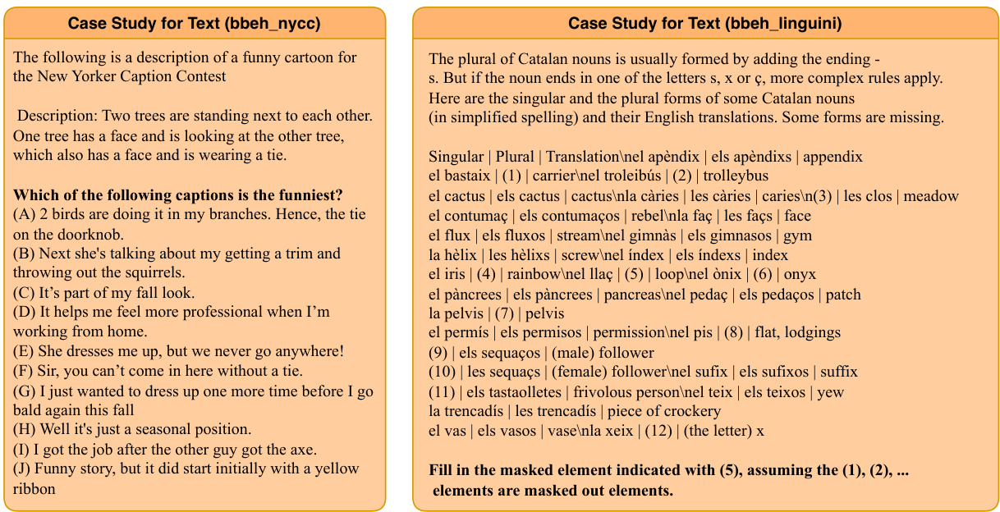  
Figure 6: Case for Text. 3.2. These issues are closely related to semantic understanding. They are bettr suited for textual representation and are difficult to address using formalized languages. Return to section 3.2.  

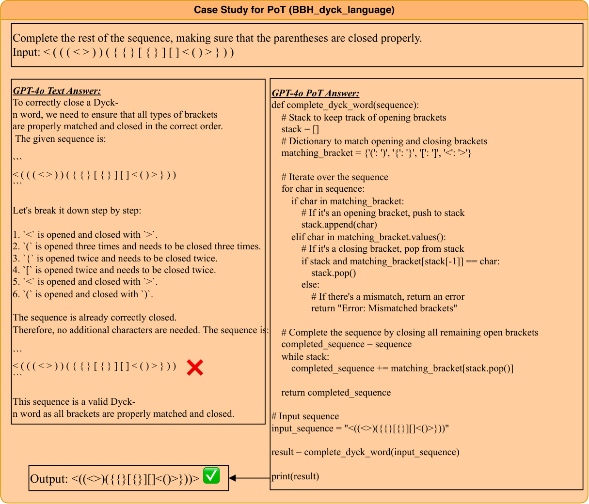  
Figure 7: Case for PoT. Symbolic reasoning tasks are inherently well-suited to programming languages, and such problems may in fact originate from coding algorithm questions. Return to section 3.2  

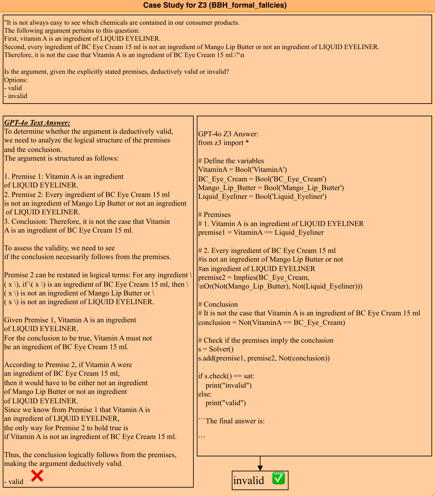  
Figure 8: Case for Z3. Z3 (which, in this context, incorporates the first-order logic reasoning capabilities of Prover9) excels at solving formal first-order logic problems. Return to section 3.2  

# Case Study for CSP (AR-LSAT)  

# Context:  

|On each of exactly seven consecutive days (day 1 though day 7), a pet shop features exactly one of three breeds of kitten   
Himalayan, Manx, Siamese--and exactly one of three breeds of puppy   
Greyhound, Newfoundland, Rottweiler. The following conditions must apply: Greyhounds are featured on day 1.   
No breed is featured on any two consecutive days. Any breed featured on day 1 is not featured on day 7.   
Himalays are  on xy th days, t nt on dy 1. Roweier r o f n day7 r on any day h t Hiaayans  

# |Question:  

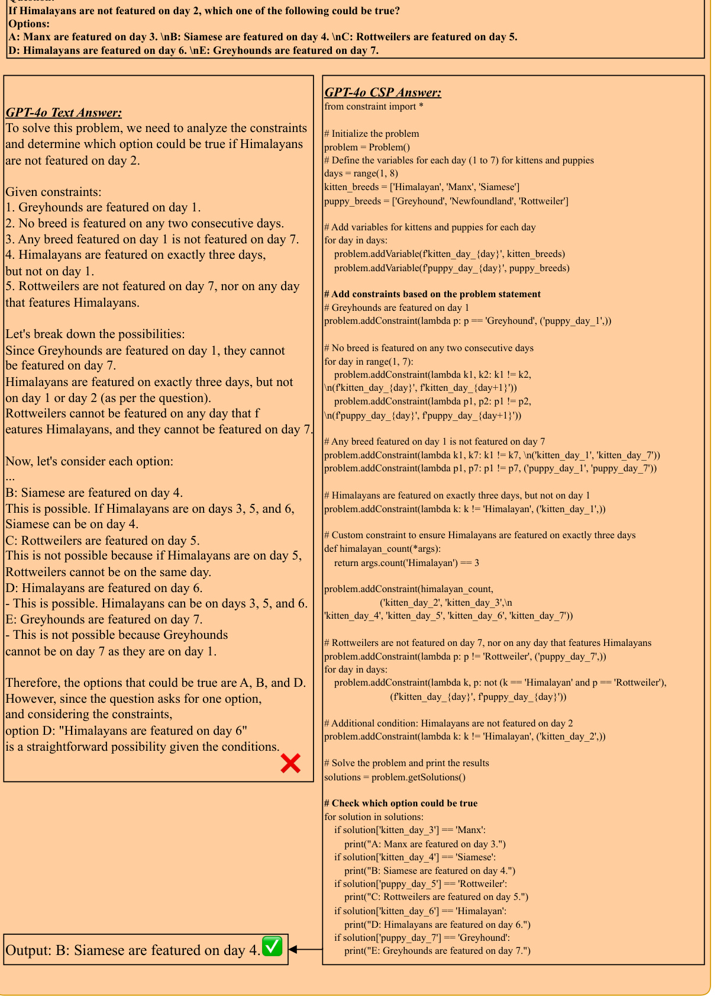  
Figure 9: Case for CSP. The problems in ARLSAT involve numerous conditional constraints, which closely resembl the modeling approach used in Constraint Satisfaction Problems (CSPs). Return to section 3.2  

# Case Study for Few-Shot Formal-Eval in Logic-LM-->Our Zero-Shot Evaluation (AR-LSAT)  

# |Context:  

On each of exactly seven consecutive days (day 1 though day 7), a pet shop features exactly one of three breeds of kittenHimalayan, Manx, Siamese--and exactly one of three breeds of puppy  

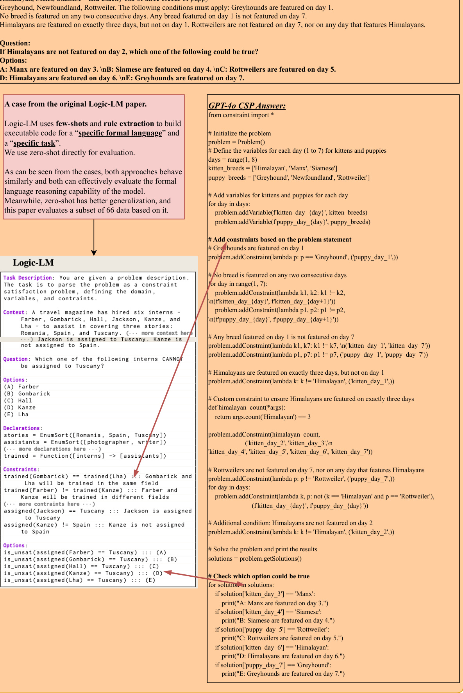  
Figure 10: Case Study for Few-Shot Formal-Eval in Logic-LM-- $\_ >$ Our Zero-Shot Evaluation (AR-LSAT). Logic-LM uses few-shots and rule extraction to build executable code for a "specific formal language" and a "specific task". We use zero-shot directly for evaluation. As can be seen from the cases, both approaches behave similarly and both can effectively evaluate the formal language reasoning capability of the model. Meanwhile, zero-shot has better generalization, and this paper evaluates a subset of 66 data based on it.  

<html><body><table><tr><td rowspan="2">Dataset</td><td rowspan="2">Text</td><td colspan="3">PoT</td><td rowspan="2">Z3</td><td colspan="3">CSP</td><td rowspan="2"></td><td rowspan="2">AVG Exec_Rate</td></tr><tr><td>ACC ACC</td><td>Exec_Rate</td><td></td><td>ACC</td><td>Exec_Rate ACC</td><td>Exec_Rate</td></tr><tr><td>Average</td><td>75.0</td><td>68.6</td><td></td><td>85.1 61.9</td><td></td><td>79.4</td><td>65.1</td><td>82.2</td><td>ACC 67.6</td><td>82.2</td></tr><tr><td>FOLIO.</td><td>94.0</td><td>94.0</td><td>100.0</td><td>91.0</td><td></td><td>99.3</td><td>94.0</td><td>100.0</td><td>93.3</td><td>99.8</td></tr><tr><td> ProntoQA</td><td>99.6</td><td>97.8</td><td></td><td>100.0</td><td>99.4</td><td>100.0</td><td>98.8</td><td>100.0</td><td>98.9</td><td>100.0</td></tr><tr><td></td><td>82.9</td><td>85.6</td><td>100.0</td><td></td><td>86.4</td><td>100.0</td><td>85.3</td><td>100.0</td><td>85.1</td><td>100.0</td></tr><tr><td>logicbenchBQA</td><td>78.5</td><td>79.3</td><td></td><td>.99.9 75.1</td><td></td><td>100.0</td><td>69.6</td><td>100.0</td><td>75.6</td><td>100.0</td></tr><tr><td>BoardgameQA ARLSAT</td><td>92.2</td><td>91.3</td><td></td><td>100.0</td><td>83.0</td><td>97.0</td><td>89.1</td><td>100.0</td><td>88.9</td><td>99.0</td></tr><tr><td>BBH_boolean_expressions</td><td>96.4</td><td>98.8</td><td>100.0</td><td>94.8</td><td></td><td>100.0</td><td>99.2</td><td>100.0</td><td>97.3</td><td>100.0</td></tr><tr><td>bbeh_boolean_expressions</td><td>57.0</td><td>41.5</td><td>53.5</td><td>30.0</td><td></td><td>36.0</td><td>42.5</td><td>58.5</td><td>42.8</td><td>49.3</td></tr><tr><td></td><td>100.0</td><td>99.2</td><td>100.0</td><td>99.6</td><td></td><td>99.6</td><td>98.8</td><td>100.0</td><td>99.4</td><td>99.9</td></tr><tr><td>BBH_formal_fallacies</td><td>44.5</td><td>15.5</td><td></td><td>35.5</td><td>2.5</td><td>5.5</td><td>8.9</td><td>11.4</td><td>17.9</td><td>17.5</td></tr><tr><td>bbeh_zebra_puzzles</td><td>100.0</td><td>100.0</td><td>100.0</td><td></td><td>99.6</td><td>100.0</td><td>98.0</td><td>100.0</td><td>99.4</td><td>100.0</td></tr><tr><td>BBH_logical_deduction_five_objects</td><td>.99.2</td><td>.99.6</td><td>100.0</td><td></td><td>100.0</td><td>100.0</td><td>100.0</td><td>100.0</td><td>99.7</td><td>100.0</td></tr><tr><td>BBH_logical_deduction_seven_objects BBH_logical_deduction_three_objects</td><td>100.0</td><td>100.0</td><td>100.0</td><td></td><td>99.2</td><td>99.6</td><td>99.2</td><td>100.0</td><td>99.6</td><td>99.9</td></tr><tr><td>bbeh_boardgame_qa</td><td> 54.5</td><td> 55.0</td><td></td><td>.99.0</td><td>35.0</td><td>73.0</td><td>49.5</td><td>87.5</td><td>48.5</td><td>86.5</td></tr><tr><td>BBH_tracking_shuffled_objects_five_objects</td><td>100.0</td><td>100.0</td><td>100.0</td><td></td><td>98.8</td><td>99.6</td><td>98.0</td><td>100.0</td><td>99.2</td><td>99.9</td></tr><tr><td>BBH_tracking_shuffled_objects_seven_objects</td><td>100.0</td><td>100.0</td><td>100.0</td><td></td><td>96.8</td><td>100.0</td><td>99.2</td><td>100.0</td><td>99.0</td><td>100.0</td></tr><tr><td>BBH_tracking_shuffled_objects_three_objects</td><td>100.0</td><td>100.0</td><td>100.0</td><td></td><td>100.0</td><td>100.0</td><td>99.2</td><td>100.0</td><td>99.8</td><td>100.0</td></tr><tr><td>bbeh_shuffled_objects</td><td>41.5</td><td>0.5</td><td></td><td>2.0</td><td>3.5</td><td>10.0</td><td>3.0</td><td>.9.5</td><td>12.1</td><td>7.2</td></tr><tr><td>BBH_web_of_lies bbeh_web_of_lies</td><td>92.8</td><td>98.8</td><td></td><td>100.0</td><td>98.0</td><td>99.6</td><td>99.2</td><td>100.0</td><td>97.2</td><td>99.9</td></tr><tr><td>bAbI15</td><td>58.0</td><td>37.5</td><td></td><td> 43.5</td><td>12.0</td><td>17.0</td><td>21.5</td><td>24.5</td><td>32.3</td><td>28.3</td></tr><tr><td></td><td>99.3</td><td>92.8</td><td></td><td>100.0</td><td>84.1</td><td>98.1</td><td>92.6</td><td>99.9</td><td>92.2</td><td>99.3</td></tr><tr><td>NeuLRdeductive</td><td>99.9</td><td>97.3</td><td></td><td>100.0</td><td>80.9</td><td>98.2</td><td>95.8</td><td>100.0</td><td>93.5</td><td>99.4</td></tr><tr><td>clutrr</td><td>78.8</td><td>73.3</td><td></td><td>100.0</td><td>60.1</td><td>94.2</td><td>71.0</td><td>98.7</td><td>70.8</td><td>97.6</td></tr><tr><td>bAbI16</td><td>85.5</td><td>91.8</td><td></td><td>100.0</td><td>92.1</td><td>100.0</td><td>89.7</td><td>100.0</td><td>89.8</td><td>100.0</td></tr><tr><td>NeuLRinductive</td><td>76.3</td><td>73.3</td><td></td><td>99.9</td><td>90.1</td><td>99.6</td><td>80.7</td><td>99.8</td><td>80.1</td><td>99.8</td></tr><tr><td>anli</td><td>86.8</td><td>86.9</td><td></td><td>100.0</td><td>81.3</td><td>99.9</td><td>85.9</td><td>99.9</td><td>85.2</td><td>99.9</td></tr><tr><td>AbductionRules</td><td>68.8</td><td>71.5</td><td></td><td>100.0</td><td>45.5</td><td>98.8</td><td>62.8</td><td>.94.0</td><td>62.2</td><td>.97.6</td></tr><tr><td>BBH_causal_judgement</td><td>64.2</td><td>64.7</td><td></td><td>100.0</td><td>59.4</td><td>100.0</td><td>64.2</td><td>100.0</td><td>63.1</td><td>100.0</td></tr><tr><td>bbeh_causal_understanding</td><td>62.0</td><td>53.5</td><td></td><td>99.5</td><td>46.5</td><td>90.5</td><td>49.0</td><td>94.5</td><td>52.8</td><td>94.8</td></tr><tr><td>NeuL Rabductive</td><td>26.0</td><td>26.9</td><td></td><td>99.9</td><td>9.9</td><td>95.7</td><td>15.1</td><td>94.1</td><td>19.5</td><td>96.6</td></tr><tr><td> logicqa</td><td>86.5</td><td>82.9</td><td></td><td>100.0</td><td>77.9</td><td>99.6</td><td>80.5</td><td>.99.9</td><td>82.0</td><td>99.8</td></tr><tr><td>BBH_date_understanding</td><td>96.8</td><td>94.8</td><td></td><td>100.0</td><td>88.0</td><td>98.8</td><td>89.6</td><td>100.0</td><td>92.3</td><td>99.6</td></tr><tr><td>bbeh_time_arithmetic</td><td> 86.5</td><td>79.5</td><td></td><td>87.5</td><td>42.5</td><td>50.5</td><td>61.5</td><td>72.5</td><td>67.5</td><td>70.2</td></tr><tr><td>BBH_temporal_sequences bbeh_temporal_sequence</td><td>100.0</td><td>99.6</td><td></td><td>100.0</td><td>91.6</td><td>99.2</td><td>97.2</td><td>99.2</td><td>97.1</td><td>99.5</td></tr><tr><td></td><td>52.5</td><td>0.0</td><td></td><td>0.5</td><td>0.0</td><td>0.0</td><td>1.0</td><td>1.5</td><td>13.4</td><td>0.7 100.0</td></tr><tr><td>BBH_disambiguation_qa bbeh_disambiguation_qa BBH_hyperbaton</td><td>48.0 58.3</td><td>54.0</td><td>50.8</td><td>100.0 40.8</td><td>38.8</td><td>100.0 46.4 51.7</td></table></body></html>

Table 4: QwQ-32B Full Result.  

<html><body><table><tr><td rowspan="2">Dataset</td><td colspan="2">Text PoT</td><td colspan="2">Z3</td><td colspan="2">CSP</td><td colspan="2">AVG</td></tr><tr><td>ACC</td><td>ACC</td><td>Exec_Rate</td><td>ACC</td><td>Exec_Rate</td><td>ACC Exec_Rate</td><td>ACC</td><td>Exec_Rate</td></tr><tr><td>Average</td><td>66.7</td><td>63.5</td><td>91.5</td><td>54.5</td><td>87.4</td><td>52.8</td><td>84.0 59.4</td><td>87.6</td></tr><tr><td>FOLIO</td><td>.92.5</td><td>88.1</td><td>100.0</td><td>73.9</td><td>88.8 67.2</td><td>98.5</td><td>80.4</td><td>95.8</td></tr><tr><td> ProntoQA</td><td>100.0</td><td>95.8</td><td>100.0</td><td>80.2</td><td>99.8 93.2</td><td>99.4</td><td>92.3</td><td>99.7</td></tr><tr><td> logicbenchBQA</td><td>72.3</td><td>70.5</td><td>99.8</td><td>76.3</td><td>100.0 63.3</td><td>99.8</td><td>70.6</td><td>99.9</td></tr><tr><td> BoardgameQA</td><td>59.7</td><td>66.0</td><td>100.0</td><td>63.5</td><td>97.9 60.2</td><td>98.1</td><td>62.4</td><td>98.7</td></tr><tr><td>ARLSAT</td><td>40.9</td><td>50.4</td><td>90.4</td><td>59.1</td><td>83.0 67.8</td><td>85.2</td><td>54.6</td><td>86.2</td></tr><tr><td>BBH_boolean_expressions</td><td>99.6</td><td>100.0</td><td>100.0</td><td>89.2</td><td>100.0 76.4</td><td>96.4</td><td>91.3</td><td>98.8</td></tr><tr><td>bbeh_boolean_expressions</td><td>59.5</td><td>51.5</td><td>55.0</td><td>1.5</td><td>2.0 56.5</td><td>60.0</td><td>42.3</td><td>39.0</td></tr><tr><td>BBH_formal_fallacies</td><td>88.4</td><td>76.4</td><td>100.0</td><td>90.4</td><td>100.0 62.0</td><td>99.6</td><td>79.3</td><td>99.9</td></tr><tr><td>bbeh_zebra_puzzles</td><td>38.0</td><td>6.5</td><td>19.0</td><td>8.5</td><td>49.0 3.0</td><td></td><td>4.0 14.0</td><td>24.0</td></tr><tr><td>BBH_logical_deduction_five_objects</td><td>93.2</td><td>94.0</td><td>99.6</td><td>87.6</td><td>99.6 96.4</td><td>100.0</td><td>92.8</td><td>99.7</td></tr><tr><td>BBH_logical_deduction_seven_objects</td><td>88.8</td><td>88.0</td><td>100.0</td><td>84.8</td><td>100.0 96.8</td><td>100.0</td><td>89.6</td><td>100.0</td></tr><tr><td>BBH_logical_deduction_three_objects</td><td>99.2</td><td>95.2</td><td>100.0</td><td>92.8</td><td>99.2 99.6</td><td>100.0</td><td>96.7</td><td>99.7</td></tr><tr><td>bbeh_boardgame_qa</td><td>37.0</td><td>35.5</td><td>90.5</td><td>37.5</td><td>90.0 24.5</td><td>65.0</td><td>33.6</td><td>81.8</td></tr><tr><td>BBH_tracking_shuffled_objects_five_objects</td><td>98.4</td><td>100.0</td><td>100.0</td><td>82.0</td><td>100.0 36.8</td><td>81.2</td><td>79.3</td><td>93.7</td></tr><tr><td>BBH_tracking_shuffled_objects_seven_objects</td><td>100.0</td><td>99.6</td><td>100.0</td><td>82.4</td><td>100.0 41.6</td><td>75.2</td><td>80.9</td><td>91.7</td></tr><tr><td>BBH_tracking_shuffled_objects_three_objects</td><td>100.0</td><td>100.0</td><td>100.0</td><td>55.6</td><td>100.0 53.6</td><td>74.4</td><td>77.3</td><td>91.5</td></tr><tr><td>bbeh_shuffled_objects</td><td>29.5</td><td>59.0</td><td>83.5</td><td>36.0</td><td>77.5 23.5</td><td>49.0</td><td>37.0</td><td>70.0</td></tr><tr><td>BBH_web_of_lies</td><td>96.4</td><td>91.2</td><td>100.0</td><td>96.4</td><td>100.0 96.4</td><td>100.0</td><td>95.1</td><td>100.0</td></tr><tr><td>bbeh_web_of_lies</td><td>33.5</td><td>11.0</td><td>51.5</td><td>11.0</td><td>20.5 11.5</td><td>14.5</td><td>16.8</td><td>28.8</td></tr><tr><td>bAbI15</td><td>99.6</td><td>98.7</td><td>100.0</td><td>76.2</td><td>97.9 95.9</td><td>99.8</td><td>92.6</td><td>99.2</td></tr><tr><td>NeuLRdeductive</td><td>99.8</td><td>97.0</td><td>100.0</td><td>55.2</td><td>93.9 87.2</td><td>97.8</td><td>84.8</td><td>97.2</td></tr><tr><td>clutrr</td><td>52.7</td><td>44.2</td><td>100.0</td><td>44.6</td><td>95.7 35.6</td><td>84.4</td><td>44.3</td><td>93.4</td></tr><tr><td>bAbI16</td><td>51.8</td><td>93.4</td><td>100.0</td><td>64.4</td><td>98.8 44.1</td><td>100.0</td><td>63.4</td><td>99.6</td></tr><tr><td>NeuL Rinductive</td><td>60.3</td><td>41.2</td><td>100.0</td><td>21.1</td><td>99.3 7.9</td><td>97.2</td><td>32.6</td><td>98.8</td></tr><tr><td>anli</td><td>88.8</td><td>87.6</td><td>100.0</td><td>73.4</td><td>99.9 81.6</td><td>100.0</td><td>82.9</td><td>100.0</td></tr><tr><td>AbductionRules</td><td>88.5</td><td>86.6</td><td>100.0</td><td>84.3</td><td>100.0 41.2</td><td>63.8</td><td>75.2</td><td>87.9</td></tr><tr><td>BBH_causal_judgement</td><td>69.0</td><td>73.8</td><td>100.0</td><td>61.0</td><td>100.0 64.7</td><td>100.0</td><td>67.1</td><td>100.0</td></tr><tr><td>bbeh_causal_understanding</td><td>52.0</td><td>52.5</td><td>100.0</td><td>50.0</td><td>99.0 44.5</td><td>96.5</td><td>49.8</td><td>98.5</td></tr><tr><td>NeuL Rabductive</td><td>29.0</td><td>15.0</td><td>98.4</td><td>19.8</td><td>92.6 5.2</td><td>88.4</td><td>17.3</td><td>93.1</td></tr><tr><td> logicqa</td><td>76.0</td><td>73.2</td><td>99.6</td><td>61.7</td><td>97.8 72.7</td><td>.98.6</td><td>70.9</td><td>98.7</td></tr><tr><td>BBH_date_understanding</td><td>94.0</td><td>82.0</td><td>100.0</td><td>70.4</td><td>98.8 84.4</td><td>100.0</td><td>82.7</td><td>99.6</td></tr><tr><td>bbeh_time_arithmetic</td><td>63.5</td><td>43.5</td><td>74.0</td><td>36.0</td><td>66.0 35.0</td><td>73.5</td><td>44.5</td><td>71.2</td></tr><tr><td>BBH_temporal_sequences bbeh_temporal_sequence</td><td>99.6</td><td>89.2</td><td>99.6</td><td>64.4</td><td>98.0 98.0</td><td>99.6</td><td>87.8</td><td>99.1</td></tr><tr><td>BBH_disambiguation_qa</td><td>5.5</td><td>2.0</td><td>87.5</td><td>1.0</td><td>52.0 2.5</td><td>81.5</td><td>2.8</td><td>73.7</td></tr><tr><td>bbeh_disambiguation_qa</td><td>53.6</td><td>50.0</td><td>100.0</td><td>38.0</td><td>100.0 36.8</td><td>100.0</td><td>44.6</td><td>100.0</td></tr><tr><td></td><td>63.3</td><td>54.2</td><td>98.3</td><td>44.2</td><td>96.7 70.8</td><td>93.3</td><td>58.1</td><td>96.1</td></tr><tr><td>BBH_hyperbaton</td><td>92.8</td><td>88.4</td><td>100.0</td><td>94.8</td><td>99.6 92.0</td><td>99.2</td><td>92.0</td><td>99.6</td></tr><tr><td>bbeh_hyperbaton</td><td>30.5</td><td>13.0</td><td>87.0</td><td>28.0</td><td>90.0 17.0</td><td>42.5</td><td>22.1</td><td>73.2</td></tr><tr><td>BBH_ruin_names</td><td>86.4</td><td>86.0</td><td>100.0</td><td>80.8</td><td>98.4 84.4</td><td>99.2</td><td>84.4</td><td>99.2</td></tr><tr><td>bbeh_nycc</td><td>21.5</td><td>11.5</td><td>77.5</td><td>3.5</td><td>39.0 7.0</td><td>79.0</td><td>10.9</td><td> 65.2</td></tr><tr><td>BBH_salient_translation_error_detection</td><td>73.2</td><td>80.0</td><td>100.0</td><td>84.4</td><td>100.0 76.8</td><td>100.0 73.0</td><td>78.6 25.9</td><td>100.0 87.3</td></tr><tr><td>bbeh_linguini BBH_snarks</td><td>35.0 89.9</td><td>25.5 86.5</td><td>.97.0 100.0</td><td>23.0 75.3</td><td>92.0 20.0 100.0 74.7</td></table></body></html>  

Table 5: GPT-4o Full Result.  

<html><body><table><tr><td rowspan="2">Dataset</td><td colspan="2">Text</td><td colspan="2">PoT</td><td colspan="2">Z3 CSP</td><td colspan="2">AVG</td></tr><tr><td>ACC</td><td>ACC</td><td>Exec_Rate ACC</td><td></td><td>Exec_Rate ACC</td><td></td><td>Exec_Rate ACC Exec_Rate</td><td></td></tr><tr><td>Average</td><td>52.3</td><td>36.9</td><td>78.6</td><td>33.0</td><td>70.0</td><td>24.8</td><td>52.1 36.7</td><td>66.9</td></tr><tr><td>FOLIO</td><td>88.8</td><td>85.1</td><td>100.0</td><td>59.7</td><td>87.3 59.0</td><td>84.3</td><td>73.1</td><td>90.5</td></tr><tr><td>ProntoQA</td><td>99.4</td><td>83.4</td><td>98.6</td><td>57.2</td><td>87.6 38.4</td><td>54.8</td><td>69.6</td><td>80.3</td></tr><tr><td> logicbenchBQA</td><td>71.6</td><td>52.1</td><td>100.0</td><td>39.4</td><td>98.5 37.8</td><td>79.8</td><td>50.2</td><td>92.8</td></tr><tr><td> BoardgameQA</td><td>54.3</td><td>52.8</td><td>99.1</td><td>38.2</td><td>89.5 29.2</td><td>73.8</td><td>43.6</td><td>87.5</td></tr><tr><td>ARLSAT</td><td>25.2</td><td>36.5</td><td>93.9</td><td>22.2</td><td>51.3 8.7</td><td>22.6</td><td>23.2</td><td>55.9</td></tr><tr><td>BBH_boolean_expressions</td><td>97.6</td><td>99.6</td><td>100.0</td><td>45.2</td><td>71.6 50.8</td><td>95.2</td><td>73.3</td><td>88.9</td></tr><tr><td>bbeh_boolean_expressions</td><td>70.5</td><td>1.5</td><td>1.5</td><td>0.5</td><td>0.5 10.0</td><td>10.5</td><td>20.6</td><td>4.2</td></tr><tr><td>BBH_formal_fallacies</td><td>69.6</td><td>50.8</td><td>100.0</td><td>52.8</td><td>91.6 50.0</td><td>88.4</td><td>55.8</td><td>93.3</td></tr><tr><td>bbeh_zebra_puzzles</td><td>34.5</td><td>0.5</td><td>3.5</td><td>5.0</td><td>20.5 0.0</td><td>0.0</td><td>10.0</td><td>8.0</td></tr><tr><td>BBH_logical_deduction_five_objects</td><td>66.8</td><td>56.0</td><td>100.0</td><td>46.8</td><td>69.2 64.8</td><td>95.2</td><td>58.6</td><td>88.1</td></tr><tr><td>BBH_logical_deduction_seven_objects</td><td>66.0</td><td> 55.2</td><td>100.0</td><td>47.2</td><td>67.6 70.8</td><td>94.8</td><td>59.8</td><td>87.5</td></tr><tr><td>BBH_logical_deduction_three_objects</td><td>89.6</td><td>74.4</td><td>100.0</td><td>48.8</td><td>73.2 72.4</td><td>92.4</td><td>71.3</td><td>88.5</td></tr><tr><td>bbeh_boardgame_qa</td><td>33.0</td><td>18.5</td><td> 46.5</td><td>7.0</td><td>20.5 0.5</td><td>5.0</td><td>14.8</td><td>24.0</td></tr><tr><td>BBH_tracking_shuffled_objects_five_objects</td><td>84.8</td><td>3.6</td><td>100.0</td><td>34.8</td><td>82.0 16.8</td><td>63.6</td><td>35.0</td><td>81.9</td></tr><tr><td>BBH_tracking_shuffiled_objects_seven_objects</td><td>85.2</td><td>5.2</td><td>100.0</td><td>43.2</td><td>82.0 15.6</td><td>68.4</td><td>37.3</td><td>83.5</td></tr><tr><td>BBH_tracking_shuffled_objects_three_objects</td><td>89.2</td><td>0.4</td><td>100.0</td><td>35.6</td><td>76.4 22.0</td><td>58.4</td><td>36.8</td><td>78.3</td></tr><tr><td>bbeh_shuffled_objects</td><td>59.5</td><td>4.0</td><td>26.5</td><td>2.0</td><td>12.5 1.5</td><td>4.0</td><td>16.8</td><td>14.3</td></tr><tr><td>BBH_web_of_lies</td><td>81.2</td><td>59.2</td><td>100.0</td><td>78.4</td><td>94.4 66.8</td><td>74.8</td><td>71.4</td><td>89.7</td></tr><tr><td>bbeh_web_of_lies</td><td>9.0</td><td>4.0</td><td>13.0</td><td>1.0</td><td>5.0 0.5</td><td>3.5</td><td>3.6</td><td>7.2</td></tr><tr><td>bAbI15</td><td>23.7</td><td>54.3</td><td>99.9</td><td>29.1</td><td>90.7 16.0</td><td>64.2</td><td>30.8</td><td>84.9</td></tr><tr><td>NeuLRdeductive</td><td>91.9</td><td>60.4</td><td>96.5</td><td>20.4</td><td>77.0 7.7</td><td>41.8</td><td>45.1</td><td>71.8</td></tr><tr><td>clutrr</td><td>17.7</td><td>26.4</td><td>99.9</td><td>14.2</td><td>82.8 12.1</td><td>60.0</td><td>17.6</td><td>80.9</td></tr><tr><td>bAbI16</td><td>23.7</td><td>55.8</td><td>99.9</td><td>31.3</td><td>91.6 14.8</td><td>63.5</td><td>31.4</td><td>85.0</td></tr><tr><td>NeuLRinductive</td><td>7.4</td><td>8.8</td><td>96.5</td><td>16.1</td><td>91.1 14.4</td><td>53.3</td><td>11.7</td><td>80.3</td></tr><tr><td>anli</td><td>77.7</td><td>78.8</td><td>99.8</td><td>59.8</td><td>95.1 55.6</td><td>83.7</td><td>68.0</td><td>92.9</td></tr><tr><td>AbductionRules</td><td>88.3</td><td>50.6</td><td>81.4</td><td>34.8</td><td>41.8 23.9</td><td>37.0</td><td>49.4</td><td>53.4</td></tr><tr><td>BBH_causal_judgement</td><td>51.9</td><td>54.0</td><td>100.0</td><td>37.4</td><td>92.5 40.6</td><td>85.6</td><td>46.0</td><td>92.7</td></tr><tr><td>bbeh_causal_understanding</td><td>45.0</td><td>39.0</td><td>98.0</td><td>26.5</td><td>82.0 26.5</td><td>69.0</td><td>34.3</td><td>83.0</td></tr><tr><td>NeuLRabductive</td><td>20.8</td><td>12.9</td><td>83.5</td><td>22.0</td><td>52.5 8.2</td><td>21.6</td><td>16.0</td><td>52.5</td></tr><tr><td>logicqa</td><td>68.2</td><td>64.8</td><td>98.2</td><td>54.9</td><td>95.9 40.8</td><td>82.5</td><td>57.2</td><td>92.2</td></tr><tr><td>BBH_date_understanding</td><td>84.8</td><td>32.0</td><td>100.0</td><td>33.6</td><td>73.6 38.4</td><td>84.8</td><td>47.2</td><td>86.1</td></tr><tr><td>bbeh_time_arithmetic</td><td>30.5</td><td>3.0</td><td> 32.0</td><td>9.0</td><td>52.5 10.5</td><td>46.0</td><td>13.3</td><td>43.5</td></tr><tr><td>BBH_temporal_sequences bbeh_temporal_sequence</td><td>83.6</td><td>67.2</td><td>100.0</td><td>48.4</td><td>85.6 54.0</td><td>72.8</td><td>63.3</td><td>86.1</td></tr><tr><td></td><td>5.0</td><td>0.0</td><td>34.5</td><td> 0.0</td><td>41.5 0.0</td><td> 5.0</td><td>1.3</td><td>27.0</td></tr><tr><td>BBH_disambiguation_qa</td><td>41.2</td><td>59.2</td><td>100.0</td><td>37.2</td><td>93.6 37.2</td><td>88.0 44.2</td><td>43.7</td><td>93.9</td></tr><tr><td> bbeh_disambiguation_qa</td><td>45.8</td><td>29.2</td><td>90.0</td><td>35.8</td><td>81.7 15.8</td><td></td><td>31.7</td><td>71.9</td></tr><tr><td>BBH_hyperbaton</td><td>68.0</td><td>70.0</td><td>100.0</td><td>53.6</td><td>94.4 32.4</td><td>57.6</td><td>56.0</td><td>84.0</td></tr><tr><td>bbeh_hyperbaton</td><td>0.5</td><td>1.5</td><td>22.0</td><td>1.0</td><td>27.0 0.0</td><td>0.5</td><td>0.8</td><td>16.5</td></tr><tr><td>BBH_ruin_names</td><td>53.2</td><td>36.0</td><td>100.0</td><td>28.4</td><td>82.8 10.4</td><td>39.2</td><td>32.0</td><td>74.0</td></tr><tr><td>bbeh_nycc</td><td>10.5</td><td>8.5</td><td>94.0</td><td>7.0</td><td>59.0 4.5</td><td>41.5</td><td>7.6</td><td>64.8</td></tr><tr><td>BBH_salient_translation_error_detection</td><td>47.2</td><td>10.0</td><td>100.0</td><td>30.4</td><td>58.0 21.6</td><td>60.0 52.0</td><td>27.3 11.1</td><td>72.7 69.0</td></tr><tr><td>bbeh_linguini BBH_snarks</td><td>18.0 77.5</td><td>16.0 31.5</td><td>81.5 100.0</td><td>6.0 49.4</td><td>73.5 4.5 97.2 41.0</td></table></body></html>

Table 6: Qwen2.5-7B Full Result.  

<html><body><table><tr><td rowspan="2">Dataset</td><td colspan="2">Text PoT</td><td colspan="2">Z3</td><td colspan="2">CSP</td><td colspan="2">AVG</td></tr><tr><td>ACC</td><td>ACC</td><td>Exec_Rate</td><td>ACC</td><td>Exec_Rate</td><td>ACC Exec_Rate</td><td>ACC</td><td>Exec_Rate</td></tr><tr><td>Average</td><td>52.7</td><td>43.9</td><td>83.5</td><td>34.8</td><td>76.5</td><td>37.0</td><td>68.1</td><td>42.1 76.0</td></tr><tr><td>FOLIO.</td><td>83.6</td><td>78.4</td><td>99.3</td><td>71.6</td><td>100.0 61.2</td><td>97.8</td><td>73.7</td><td>99.0</td></tr><tr><td>ProntoQA</td><td>99.0</td><td>84.8</td><td>99.4</td><td>54.6</td><td>90.2 81.2</td><td>93.8</td><td>79.9</td><td>94.5</td></tr><tr><td>logicbenchBQA</td><td>80.1</td><td>70.4</td><td>100.0</td><td>72.3</td><td>99.1 64.2</td><td>99.6</td><td>71.8</td><td>99.6</td></tr><tr><td> BoardgameQA</td><td>68.8</td><td>50.0</td><td>94.9</td><td>50.9</td><td>97.8 46.5</td><td>92.3</td><td>54.1</td><td>95.0</td></tr><tr><td>ARLSAT</td><td>23.9</td><td>31.7</td><td>85.7</td><td>30.9</td><td>68.7 30.0</td><td>61.3</td><td>29.1</td><td>71.9</td></tr><tr><td>BBH_boolean_expressions</td><td>96.8</td><td>98.8</td><td>100.0</td><td>42.0</td><td>74.8 64.4</td><td>99.2</td><td>75.5</td><td>91.3</td></tr><tr><td>bbeh_boolean_expressions</td><td>70.0</td><td>0.0</td><td>53.0</td><td>3.0</td><td>4.0 22.5</td><td>33.0</td><td>23.9</td><td>30.0</td></tr><tr><td>BBH_formal_fallacies</td><td>68.0</td><td>58.4</td><td>100.0</td><td>61.2</td><td>100.0 54.8</td><td>98.0</td><td>60.6</td><td>99.3</td></tr><tr><td>bbeh_zebra_puzzles</td><td>39.0</td><td>12.5</td><td>46.5</td><td>13.5</td><td>39.5</td><td>8.0 22.0</td><td>18.3</td><td>36.0</td></tr><tr><td>BBH_logical_deduction_five_objects</td><td>61.6</td><td>57.6</td><td>100.0</td><td>62.8</td><td>94.0 77.6</td><td>96.8</td><td>64.9</td><td>96.9</td></tr><tr><td>BBH_logical_deduction_seven_objects</td><td>50.4</td><td>44.0</td><td>100.0</td><td>57.2</td><td>99.6 70.0</td><td>83.6</td><td>55.4</td><td>94.4</td></tr><tr><td>BBH_logical_deduction_three_objects</td><td>84.8</td><td>75.6</td><td>100.0</td><td>74.8</td><td>91.2 92.0</td><td>94.8</td><td>81.8</td><td>95.3</td></tr><tr><td>bbeh_boardgame_qa</td><td>31.5</td><td>0.0</td><td>84.5</td><td>12.5</td><td>37.0 18.0</td><td>46.0</td><td>15.5</td><td>55.8</td></tr><tr><td>BBH_tracking_shuffled_objects_five_objects</td><td>78.8</td><td>100.0</td><td>100.0</td><td>2.4</td><td>99.2</td><td>4.4</td><td>28.0 46.4</td><td>75.7</td></tr><tr><td>BBH_tracking_shuffiled_objects_seven_objects</td><td>71.2</td><td>100.0</td><td>100.0</td><td>2.4</td><td>100.0</td><td>2.4 22.8</td><td>44.0</td><td>74.3</td></tr><tr><td>BBH_tracking_shuffled_objects_three_objects</td><td>80.8</td><td>99.6</td><td>100.0</td><td>8.0</td><td>100.0</td><td>5.2 16.8</td><td>48.4</td><td>72.3</td></tr><tr><td>bbeh_shuffled_objects</td><td>42.0</td><td>6.0</td><td>19.5</td><td>9.5</td><td>23.0 10.5</td><td>23.0</td><td>17.0</td><td>21.8</td></tr><tr><td>BBH_web_of _lies</td><td>85.6</td><td>63.2</td><td>100.0</td><td>77.2</td><td>100.0 58.0</td><td>64.0</td><td>71.0</td><td>88.0</td></tr><tr><td>bbeh_web_of_lies</td><td>12.5</td><td>13.0</td><td>51.5</td><td>1.0</td><td>9.5</td><td>2.5</td><td>7.0 7.3</td><td>22.7</td></tr><tr><td>bAbI15</td><td>99.1</td><td>96.1</td><td>97.3</td><td>89.6</td><td>99.1 89.2</td><td>98.5</td><td>93.5</td><td>98.3</td></tr><tr><td>NeuLRdeductive</td><td>92.1</td><td>85.7</td><td>99.0</td><td>37.1</td><td>84.9 49.8</td><td>86.7</td><td>66.2</td><td>90.2</td></tr><tr><td>clutrr </td><td>46.8</td><td>30.3</td><td>99.9</td><td>34.4</td><td>99.5 46.0</td><td>99.8</td><td>39.4</td><td>99.7</td></tr><tr><td>bAbI16</td><td>93.0</td><td>96.7</td><td>100.0</td><td>78.4</td><td>99.6 83.9</td><td>100.0</td><td>88.0</td><td>99.9</td></tr><tr><td>NeuLRinductive</td><td>8.2</td><td>8.6</td><td>100.0</td><td>18.0</td><td>98.6 14.1</td><td>93.8</td><td>12.2</td><td>97.5</td></tr><tr><td>anli</td><td>84.1</td><td>76.7</td><td>100.0</td><td>69.7</td><td>100.0 80.3</td><td>99.9</td><td>77.7</td><td>100.0</td></tr><tr><td>AbductionRules</td><td>91.0</td><td>85.7</td><td>99.8</td><td>47.7.</td><td>95.0 48.3</td><td>81.1</td><td>68.2</td><td>92.0</td></tr><tr><td>BBH_causal_judgement</td><td> 55.1</td><td>61.5</td><td>100.0</td><td>55.6</td><td>100.0 49.7</td><td>100.0</td><td>55.5</td><td>100.0</td></tr><tr><td>bbeh_causal_understanding</td><td>42.5</td><td>0.0</td><td>87.0</td><td>43.0</td><td>96.5 40.0</td><td>95.5</td><td>31.4</td><td>93.0</td></tr><tr><td>NeuLRabductive</td><td>12.0</td><td>15.4</td><td>93.8</td><td>17.3</td><td>84.3 1.0</td><td>27.4</td><td>11.4</td><td>68.5</td></tr><tr><td> logicqa</td><td>63.8</td><td>53.8</td><td>99.5</td><td>42.4</td><td>98.9 45.1</td><td>97.1</td><td>51.3</td><td>98.5</td></tr><tr><td>BBH_date_understanding</td><td>74.0</td><td>54.4</td><td>100.0</td><td>40.4</td><td>97.2 55.6</td><td>96.8</td><td>56.1</td><td>98.0</td></tr><tr><td>bbeh_time_arithmetic</td><td>32.0</td><td>10.5</td><td>59.5</td><td>7.5</td><td>43.5 10.5</td><td>45.5</td><td>15.1</td><td>49.5</td></tr><tr><td>BBH_temporal_sequences</td><td>30.0</td><td>42.8</td><td>98.8</td><td>33.6</td><td>98.4 36.0</td><td>76.0</td><td>35.6</td><td>91.1</td></tr><tr><td>bbeh_temporal_sequence</td><td>9.0</td><td>0.0</td><td>42.5</td><td>0.0</td><td>20.0 0.0</td><td>30.5</td><td>2.3</td><td>31.0</td></tr><tr><td>BBH_disambiguation_qa</td><td>35.6</td><td>46.0</td><td>100.0</td><td>41.2</td><td>99.2 64.0</td><td>99.2</td><td>46.7</td><td>99.5</td></tr><tr><td>bbeh_disambiguation_qa</td><td>42.5</td><td>0.0</td><td>43.3</td><td>34.2</td><td>90.0 61.7</td><td>100.0</td><td>34.6</td><td>77.8</td></tr><tr><td>BBH_hyperbaton</td><td>72.0</td><td>66.8</td><td>91.2</td><td>66.4</td><td>100.0 82.0</td><td>96.8</td><td>71.8</td><td>96.0</td></tr><tr><td>bbeh_hyperbaton</td><td>1.0</td><td>0.0</td><td> 64.0</td><td>3.0</td><td>33.5 2.0</td><td>18.0</td><td>1.5</td><td>38.5</td></tr><tr><td>BBH_ruin_names</td><td>37.2</td><td>32.4</td><td>100.0</td><td>28.0</td><td>98.8 39.6</td><td>94.4</td><td>34.3</td><td>97.7</td></tr><tr><td>bbeh_nycc</td><td>8.0</td><td>0.0</td><td>62.5</td><td>1.5</td><td>95.5 5.0</td><td>72.5</td><td>3.6</td><td>76.8</td></tr><tr><td>BBH_salient_translation_error_detection</td><td>44.4</td><td>27.6</td><td>100.0</td><td>38.4</td><td>99.6 26.8</td><td>100.0 63.0</td><td>34.3 7.8</td><td>99.9</td></tr><tr><td>bbeh_linguini BBH_snarks</td><td>18.0 73.6</td><td>0.0 50.6</td><td>53.5 100.0</td><td>2.5 51.1</td><td>79.0 10.5 98.9 41.6</td></table></body></html>

Table 7: Qwen2.5-7B-Base.w.Formal Full result.  

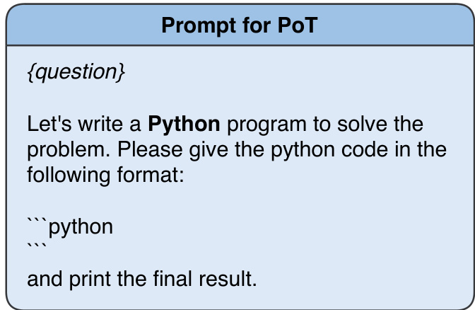  
Figure 11: Prompt for PoT  

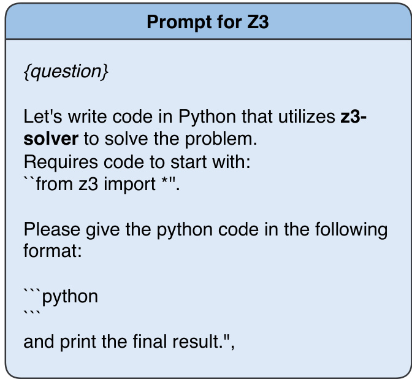  
Figure 12: Prompt for Z3  

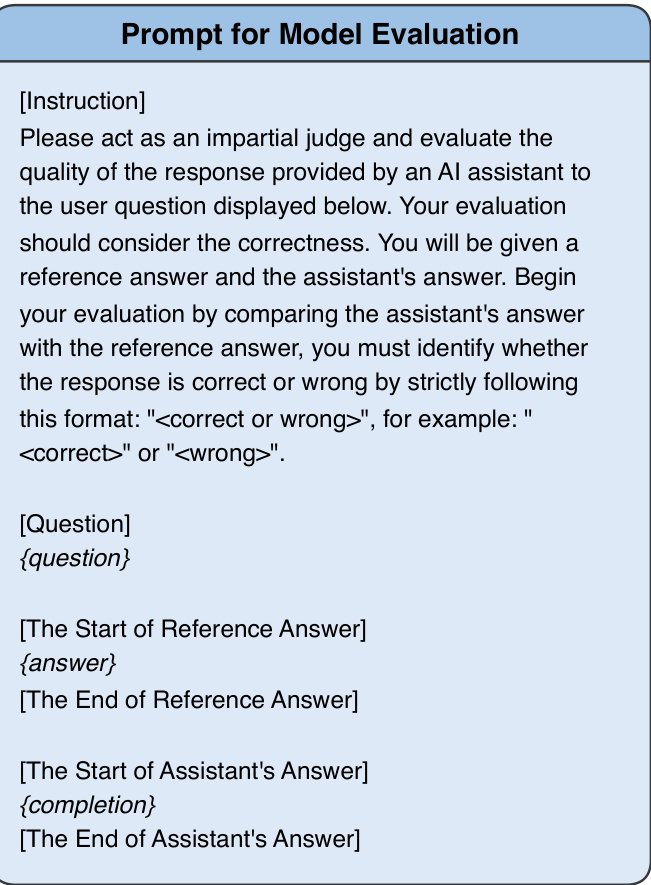  
Figure 14: Prompt for Model Eval  

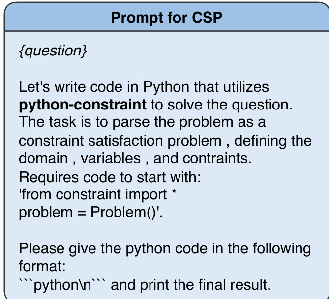  
Figure 13: Prompt for CSP  