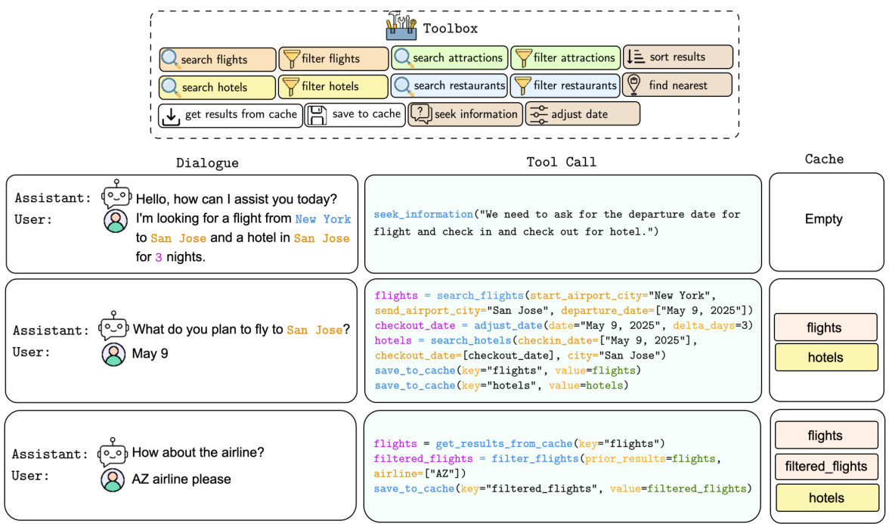
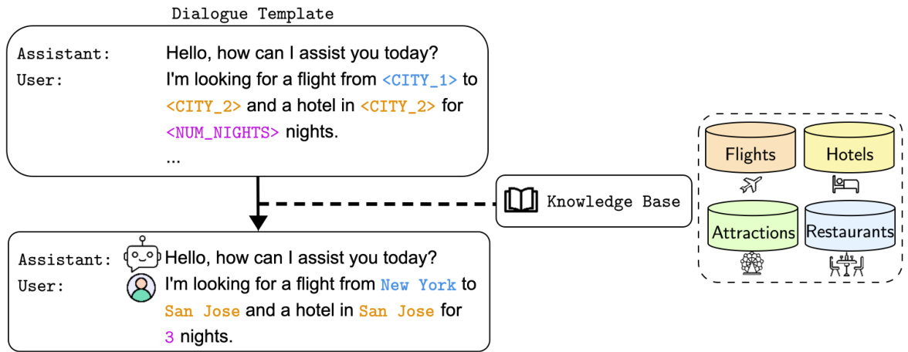
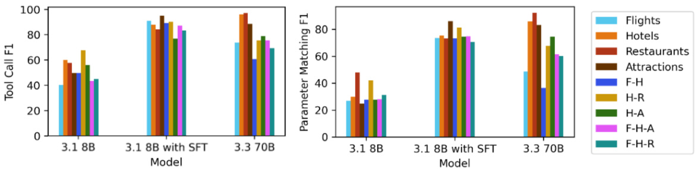
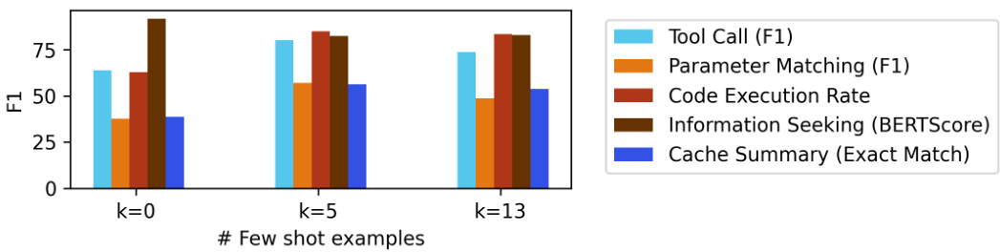
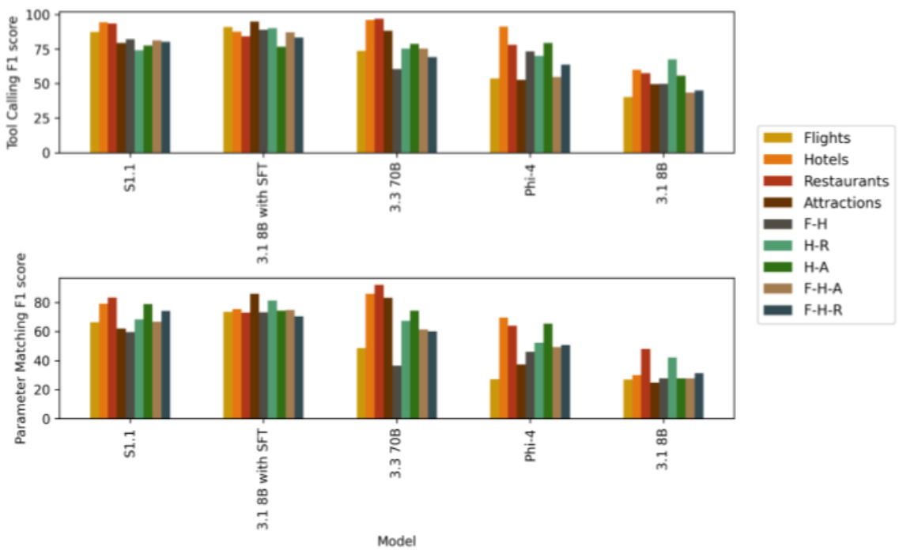

# T1: A Tool-Oriented Conversational Dataset for Multi-Turn Agentic Planning  

Amartya Chakraborty\*, Paresh Dashore\*, Nadia Bathaee\*, Anmol Jain\*,   
Anirban Das, Shi-Xiong Zhang, Sambit Sahu, Milind Naphade, Genta Indra Winata\* Capital One   
{amartya.chakraborty, paresh.dashore, nadia.bathaee}@capitalone.com {anmol.jain, genta.winata}@capitalone.com  

# Abstract  

Large Language Models (LLMs) have demonstrated impressive capabilities as intelligent agents capable of solving complex problems. However, effective planning in scenarios involving dependencies between API or tool calls-particularly in multi-turn conversations-remains a significant challenge. To address this, we introduce T1, a tool-augmented, multi-domain, multi-turn conversational dataset specifically designed to capture and manage inter-tool dependencies across diverse domains. T1 enables rigorous evaluation of agents' ability to coordinate tool use across nine distinct domains (4 single domain and 5 multi-domain) with the help of an integrated caching mechanism for both short- and long-term memory, while supporting dynamic replanning-such as deciding whether to recompute or reuse cached results. Beyond facilitating research on tool use and planning, T1 also serves as a benchmark for evaluating the performance of open-source language models. We present results powered by T1-AGENT, highlighting their ability to plan and reason in complex, tool-dependent scenarios.  

# 1 Introduction  

Leveraging external tools using Large Language Models (LLMs) to solve diverse conversational tasks has emerged as a promising direction in the development of intelligent agents [15]. Despite recent advances, task oriented llm based dialogue systems perform poorly over long conversational context [3], and there remains a lack of comprehensive resources for training and evaluating multiturn, multi-domain conversational agents that emphasizes on complex user needs. Existing datasets primarily focus on single-turn conversations for planning tasks-such as executing APIs or code [12, 20]--and do not capture realistic multi-turn scenarios that require reasoning over long contexts, coordination across multiple tools, and adherence to complex constraints. Tool calling in realistic scenarios often involves interdependent tools, where the correctness and efficiency of task completion depend heavily on the order and context in which tools are invoked. An effective agent must therefore understand when, which, and in what sequence to call tools in order to successfully complete complex tasks.  

To address this gap, we introduce T1, a new dataset and evaluation framework for assessing agent performance in multi-turn dialogues, with a particular focus on tool usage and reasoning about inter-tool dependencies. The dataset spans multiple domains and features complex, goal-oriented interactions between users and a travel assistant. Alongside the dataset, we propose T1-AGENT, an agent designed to interpret nuanced user intents and generate executable code using a predefined set of tools. T1 is specifically designed to evaluate the ability of LLM-based agents to plan tool use  

  
Figure 1: Illustrative example from the T1 dataset. This example showcases a multi-domain scenario involving both flights and hotels, where the user is planning a trip and attempting to book relevant services. The dialogue is constructed by retrieving entities from a knowledge base, and tool calls are executed using a predefined toolbox, simulating realistic, tool-augmented agent behavior.  

effectively and leverage a caching mechanism to efficiently reuse previously retrieved information.   
To support this, we incorporate dedicated tools for accessing and managing the cache.  

Our contributions can be summarized as follows:  

: We introduce T1, a comprehensive multi-turn dataset consisting of $1 3 . 5 \mathrm { k }$ dialogues designed to evaluate tool-using, LLM-based agents across nine key domains-comprising four singledomain and five multi-domain settings. The dataset covers a wide range of interaction scenarios, including single-domain, mixed-domain, and fully multi-domain conversations. It incorporates 14 distinct tools, enabling realistic and fine-grained assessment of agent capabilities in complex, tool-driven dialogue tasks.   
To enhance the complexity and realism of the evaluation, the dataset includes cross-domain tasks and interdependent tool calls, requiring agents to reason about tool selection and execution order within context. This evaluation framework assesses the ability of LLMbased agents to think critically, reason effectively, and make context-aware decisions.   
We evaluate our dataset using an LLM-based agent, T1-AGENT, a code-generation system built on open-source language models and equipped with a caching mechanism for improved performance. This architecture enables scalable evaluation and provides a robust, efficient framework for tool-using agents.   
: We will publicly release our code and dataset to facilitate future research.  

# 2 T1 Dataset  

T1 is a dataset specifically designed to evaluate LLM-based agents on tool usage and complex planning tasks over multi-turn conversational context. This dataset simulates multi-turn conversations spanning both four single-domain and five multi-domain settings: flights, restaurants, hotels, attractions, flights-hotels, hotels-restaurants, hotels-attractions, flights-hotels-attractions, and flightshotels-restaurants. Planning tasks are formulated as code, where function calls to external tools are used to accomplish specific goals.  

  
Figure 2: T1 generates data by populating delexicalized entities with corresponding entries from the knowledge base.  

# 2.1 Tasks and Notations  

We define a dialogue $D$ as an alternating sequence of assistant and user turns:  

$$
D = \{ A _ { 1 } , U _ { 1 } , A _ { 2 } , U _ { 2 } , \ldots , A _ { n } \} ,
$$  

where each $A _ { i }$ represents an assistant turn and $U _ { i }$ a user turn. The dialogue always starts with an assistant turn and proceeds in a strictly alternating order. We provide a set of tools $\tau$ , where each tool $t \in \tau$ encapsulates logic to perform a specific function. These tools can be categorized as follows:  

: Domain-specific tools: Designed to handle operations tied to a particular application domain. : Interdependent tools: Used to identify or reason about dependencies across domains. : Generic tools: Domain-independent or auxiliary utilities applicable across tasks.  

Table 1: Comparison of datasets for the LLM-based agent systems.   

<html><body><table><tr><td>Dataset</td><td>Deployed Tools</td><td>Human Annotated Tool Planning</td><td>Execution Result Evaluation</td><td>Multi-turn Context Planning</td><td>Multi-Domain Tool Planning</td></tr><tr><td>APIBank [4]</td><td></td><td></td><td></td><td></td><td></td></tr><tr><td>APIBench [8]</td><td></td><td></td><td></td><td></td><td></td></tr><tr><td>GAIA [6]</td><td></td><td></td><td></td><td></td><td></td></tr><tr><td>GTA [18]</td><td></td><td></td><td></td><td></td><td></td></tr><tr><td>m&m's [5]</td><td></td><td></td><td></td><td></td><td></td></tr><tr><td>ToolBench [11]</td><td></td><td></td><td></td><td></td><td></td></tr><tr><td>Toolformer [12]</td><td></td><td></td><td></td><td></td><td></td></tr><tr><td>TravelPlanner [20]</td><td></td><td></td><td></td><td></td><td>J</td></tr><tr><td>T1</td><td></td><td></td><td>J</td><td></td><td></td></tr></table></body></html>  

# 2.2 Dataset Construction  

We construct our dataset by manually collecting data from Wikipedia to gather entities and metadata. For this task, we define four domains: flights, hotels, restaurants, and attractions. Additionally, we compile a list of 128 airports and 321 cities within the United States, along with up to 15 neighborhoods for each city. Some information-such as airline names, hotel names, and hotel star ratings-is synthesized to avoid inaccuracies and to prevent the LLMs from relying on its internal knowledge of real-world named entities.  

# 2.2.1 Ontology  

We have a total of 5 ontologies, one for each of the four defined domains and another one for city For each ontology, we curated a list of key attributes that would be relevant such as the airline or  

<html><body><table><tr><td></td><td colspan="4"> Single-domain</td><td colspan="2"> Multi-domain</td><td rowspan="2">Common</td><td rowspan="2">Total</td></tr><tr><td></td><td>Flights</td><td>Hotels</td><td> Restaurants</td><td>Attractions</td><td>2 Domains</td><td>3 Domains</td></tr><tr><td># Attributes</td><td>35</td><td>43</td><td>21</td><td>1</td><td>N/A</td><td>N/A</td><td>N/A</td><td>106</td></tr><tr><td># Tools</td><td>2.</td><td>2</td><td>2</td><td>2.</td><td>1</td><td>N/A</td><td>5</td><td>14</td></tr><tr><td># Dialogues</td><td>1.5k</td><td>1.5k</td><td>1.5k</td><td>1.5k</td><td>4.5k</td><td>3k</td><td>N/A</td><td>13.5k</td></tr><tr><td>Avg. # turns</td><td>8.2</td><td>8.0</td><td>9.0</td><td>6.0</td><td>11.3</td><td>9.7</td><td>N/A</td><td>N/A</td></tr></table></body></html>  

Table 2: Dataset statistics detailing the number of attributes, tools, dialogues, and the average number of turns, categorized by each individual domain, multi-domain, and common categories. "N/A" indicates that the metric is not applicable in the given context.  

number of layovers for a flight, the cuisine of a restaurant or the number of stars or customer rating for a hotel. For each of these attributes, we defined the possible values and then used the ontology to generate synthetic data for flights, hotels and restaurants which would subsequently be used by the tools we defined.  

Flights. The ontology includes the airline, flight class (economy, business and first), number of layovers ranging between 0-2 stops, the duration of a layover ranging from 1-6 hours and a list of the possible airports to depart from and arrive to. To see the full table, go to Table 15.  

Hotels. The ontology includes the number of stars ranging between 1 to 5 stars, the customer rating of the hotel ranging from 1.0 to 5.0, the cost of the hotel as well as whether or not the hotel includes a number of amenities such as the presence of a gym or pool. To see the full table, go to Table 16.  

Restaurants. The ontology includes the type of cuisine, the customer rating of the hotel ranging from 1.0 to 5.0, the price per person and whether or not the restaurant served any particular dietary options such as vegetarian, vegan, or halal. To see a full list of dietary restrictions, taken into consideration, go to Table 17.  

Attractions. The ontology includes the type of attraction which is one of the following: touristy, culinary, historical, scenic, social, art, cultural, guided, and sporting.  

Cities. The ontology includes a list of cities in the United States of America (US) that was collected through Wikipedia. For each city, we then extracted up to 15 neighborhoods as well as the approximate geographical coordinates of each neighborhood.  

# 2.2.2 Knowledge Bases  

Attractions. From the list of 321 cities, we collect up to 15 attractions for 85 cities through the usage of Llama-3.3 70B Instruct and conduct quality assurance by human annotators to ensure the data correctness. We also collect the city neighborhood for each attraction as well as the geographical coordinates. In total, there are 728 attractions that were collected from the 85 cities for this dataset.  

Flights. For flights, there are a total of 128 airports that are used to generate synthetic flight data. Each flight generated has an airline that was randomly selected from the ontology and the start and end airport are randomly selected from the list of airports in the ontology. Additionally, the departure time is randomly generated, however the arrival time is computed based on the geographical distance between the departure and arrival airports assuming the average speed of the flight to be 450 miles per hour. 480,410 synthetic flights were generated as part of this dataset  

Hotels. Hotels are generated for all 321 cities in the ontology. For a particular city, a neighborhood is assigned and additionally, synthetic latitude and longitude coordinates are generated for each hotel in a city as the coordinates would be used for distance computing purposes. Each hotel is also provided a star and a synthetic customer rating that would be correlated to the amenities offered by the establishment as well as the price per night. 47,589 hotels were generated as part of this dataset.  

Restaurants.  Restaurants are generated for all 321 cities in the ontology. Just like for hotels. in a particular city, a neighborhood is assigned to a restaurant and additionally, synthetic latitude and longitude coordinates are generated. Each restaurant also is given a user rating which was synthetically generated, a cuisine provided by the ontology as well as whether particular dietary options are supported and the average cost per person. 17,975 restaurants are generated as part of this dataset.  

# 2.2.3 Data Annotation and Quality Assurance  

To ensure high-quality and natural data, we employ five human annotators, with each data sample reviewed by both an annotator and a quality assurance (QA) reviewer. The annotators were selected to represent a diverse set of background and perspectives, while maintaining a high technical bar. All annotators have at least a Master's degree in Computer Science and demonstrated proficiency in Python, enabling them to handle complex annotation tasks requiring logical reasoning and scripting. The QA specialist also has a strong background in programming. Annotators are assigned a category of templates and are responsible for writing the appropriate code using the tools defined for this project. Afterward, the QA reviewer evaluates the annotated code and provides feedback, which is used to make necessary corrections and improvements.  

# 2.2.4 Dialogue Generation  

We create a total of nine data categories, as discussed in Section 4.1. The data construction follows a three-step process: first, we generate templates with placeholder values; second, we annotate the templates with code using the provided tools; and third, we programmatically fill in the placeholder values for each template.  

Generating Dialogue Templates. For each of the 9 dialogue categories, we generate 60 dialogue templates using Llama-3.3 70B Instruct. These templates are then reviewed and refined by human annotators to ensure accurate dialogue flow, as well as high coherence and fluency. The model is prompted to generate synthetic dialogues for both single and multi-domain. Each template consists of a conversation between the assistant and user. To learn more about the prompt used, go to Appendix I and J. Additionally, the templates consist of placeholders for attributes such as a city or neighborhood name, cuisine of a restaurant, rating of a hotel or the type of an attraction. As the dataset is related to the area of travel, some placeholder values are tied to a particular city such as the neighborhood (<CITY_x_NEIGHBORHOOD_ $. { \bf x } >$ , airport name $( \mathsf { \texttt { C C I T Y } _ { - } x _ { - } A I R P 0 R T _ { - } x } )$ , hotel name (<CITY_x_HOTEL_NAME_x>) and restaurant name (<CITY_x_RESTAURANT_NAME_x>).  

Template Lexicalization. Within each dialogue category, 25 dialogues are generated with the placeholder values filled with the actual values present within the ontology. In addition to the dialogues, the ground-truth code which is part of the annotation has the placeholder values replaced with actual values. The dataset is split into three partitions: training, validation and test. To limit data contamination among these three partitions, the cities that are to be used for filling in the placeholder are also assigned to a particular partition only to be used there. Hence, for example if the city of Boston is assigned to the training partition, it will never be present in any of the validation or test dialogue conversations. Additionally, for fields such as the check-in and checkout dates for hotels or departure and return flight dates, particular methods are taken to ensure that any dates or times follow chronological order and there is no instance where a check-in date at a hotel would be after the checkout date.  

Generated Dialogue and Ground Truth Validation.  Once the placeholders are filled for both the dialogues and ground truth code samples, each block of code is executed to identify any potential errors in annotation including an improper use of a placeholder or a syntax error. The validation assists the team in correcting any annotations and ensures that the resulting code is runnable and correct.  

# 3 T1-Agent  

We build an LLM powered T1-AGENT to evaluate and simulate our T1 agentic dataset and measure its performance across three tasks: information seeking, parameter extraction, and tool calling.  

# 3.1 Information Seeking  

Each tool has a mandatory set of parameters that must be provided before running the tool successfully Information seeking is the task of gathering this mandatory set of parameters for any of the respective tools. We want to evaluate the capability of the agent to understand both the intent of the user's query and which parameters to ask the user about as a follow-up. Figure 1 shows an example of how information seeking is used by the agent. When the user inquires about a flight from New York to San Jose and a hotel in San Jose, the agent understands that the user would like to search for flights but needs to provide the departure date of the flight and the check-in date of the hotel. Thus, the agent infers that in followup discussion, it needs to ask for these details from the user.  

# 3.2 Parameter Extraction  

After the agent understands the tools to call and the necessary parameters to collect, it works to extract those parameters from the user dialogue. From Figure 1, when the user mentions that they want a flight from New York to San Jose for 3 nights, the agent is able to extract the starting and ending airport city for the flight as well as the number of nights to stay at the hotel. However, neither search_f1ights or search_hotels can be called yet since the departure date of the flight and the check-in and check-out date of the hotel have not yet been provided.  

# 3.3 Tool Calling  

Once the agent understands the necessary tool(s) to call and is provided the necessary parameters for each tool, the agent will make calls to each tool. In Figure 1, once the user provides the departure date for the flight to San Jose, the agent calls the search_flights tool with the departure and arrival cities as well as the departure date. Next, before the agent can call the search_hote1s tool, it must first compute the check-out date for the hotel. The check-in date provided is May 9 and the user provided the context that the duration of the hotel stay is 3 nights. Hence, the adjust_date tool is called to compute the check-out date of the hotel. Once this is calculated, the agent will call the search_hote1s tool with the check-in and check-out dates as well as the city of the hotel. Additionally, both the flight and hotels that came up in the results will be saved to the cache, for further possible usage.  

# 3.4 Data Caching  

We introduce a data caching mechanism that enables T1-AgENT to reuse the outputs of earlier tool calls when handling subsequent user requests. This reduces redundant computation and improves response efficiency in multi-turn interactions. After each user turn, any search results retrieved by a tool are cached for potential reuse in later turns. The save_to_cache tool is used to store these results. As illustrated in Figure 1, after the user provides the departure date for a flight to San Jose, the agent calls both search_flights and search_hotels, and then stores the results using the save_to_cache tool. Later, when the user requests flights from a specific airline, the agent retrieves the cached flight results using the get_results_from_cache tool and filters them using the fi1ter_f1ights tool based on the user's airline preference. This caching approach helps avoid unnecessary API calls by reusing existing search results and applying filtering when appropriate.  

Example: Refining a Flight Search. Suppose a previous user query fetched flights from NYC to Boston, and the result was cached with the key "f1ights_nyc_bos". Later, the user asks to see only flights priced under $\$ 500$ . The LLM, using the cache summary, generates the following plan:  

flights $\mathbf { \tau } = \mathbf { \tau }$ get_results_from_cache(key $\ c =$ "flights_nyc_bos") affordable_flights $\mathbf { \tau } = \mathbf { \tau }$ filter_flights(prior_result $\ c =$ flights, budget $\scriptstyle = 5 0 0$ P  

This illustrates how the LLM composes new logic by combining previously retrieved results with downstream tools, without repeating expensive API operations. Our approach enables more efficient, coherent, and stateful plan generation in realistic, multi-turn assistant conversations.  

# 4 Experimental Setup  

# 4.1Datasets  

Each category contains 60 dialogue templates and a pool of 54 cities used to populate placeholder values. We split both the templates and cities into $2 5 \%$ for training, $9 \%$ for validation, and $66 \%$ for testing, resulting in 15 training templates, 5 validation templates, and 40 test templates per category. Similarly, 13 cities are allocated for training, 4 for validation, and 37 for testing. Dialogues are randomly sampled within each partition. After partitioning, a script fills all placeholders in each template using the corresponding cities from the assigned split, ensuring no data leakage or overlap of templates and entities between the training and test sets. Each template is instantiated into 25 unique dialogues after substituting the placeholders in the dialogue templates with entities defined in the ontology, yielding a total of 1,500 fully generated dialogues.  

# 4.2 Domain Adaptation using SFT  

We perform a simple instruction tuning with the train dataset in order to showcase that the performance on such complex conversational tool calling can be improved over zero or few shot prompting. We train a Llama 3.1 8B Instruct model for one epoch on the training dataset. The training dataset is structured as a list of (prompt, completions) pairs. The SFT thereafter follows standard next token prediction with cross-entropy loss. We use LoRA [2] on 8 A100 SXM gpus instead of full finetuning. For reproducibility, we use the widely adopted Huggingface TRL library [17] and include the exact command to replicate the training in Section P.  

# 4.3Inference Procedure  

During inference, for each user turn in a dialogue, the T1-AgENT generates executable Python code that fulfills the user request at that point in the conversation. Before generating any code, the agent will check an execution cache to determine if a similar request has been previously resolved. If a cached result is available, the agent will write code that fetches and reuses the cached object to prevent redundant computation and tool invocation.  

To do this, the agent constructs a prompt that includes the conversation history along with the current user turn. Instead of including the full execution cache--which can be large and token-intensive--the prompt incorporates a summary of the cached results. These summaries are generated using a deterministic, rule-based function that transforms each cached result into a concise representation. This approach significantly reduces the token load in the prompt, making it feasible to include relevant past results without exceeding model input limits.  

This design enables the agent to consider past outcomes and reuse relevant information during code generation. Even in cases where the user's current query differs slightly from earlier queries, the agent is able to fetch a prior result from the cache and use that as a starting point for the current user turn. By introducing summarization at the planning stage, we shift caching responsibilities from the tool-execution layer to the agent's decision-making process. Our approach allows the agent to selectively reuse and adapt cached outputs, leading to improved latency and broader generalization.  

The generated code is executed in a sandboxed environment, and the cache is updated with the new results on each user turn. Our dataset also includes the corresponding ground truth code and post-execution cache, which are used for performance evaluation.  

# 5 Results and Analysis  

In this section, we present the performance of various LLMs on both single-domain and multi-domain tasks. Single-domain tasks involve conversations focused exclusively on one domain--such as flights. hotels, restaurants, or attractions. In contrast, multi-domain tasks involve interactions spanning multiple domains, such as a user requesting both flight bookings and nearby hotel recommendations within the same dialogue.  

# 5.1Overall Results  

Table 3 presents the overall performance of L1ama 3.1 8B Instruct in a few-shot in-context learning setting. The model performs significantly worse on multi-domain tasks compared to singledomain ones. Additionally, much of the generated code--particularly in multi-domain scenarios--is not executable. Despite the inclusion of few-shot examples, the model struggles with accurate tool invocation. Parameter matching is even more challenging, as it requires the model not only to identify the correct tool but also to extract the appropriate parameter values from the user's utterance.  

# 5.2 Analysis  

The Impact of Domain Adaptation on Performance. Figure 3 presents the tool call F1 and parameter matching F1 scores. Overall, the SFT models outperform the base model and even surpass the performance of the 70B model by a substantial margin across all domains.  

  
Figure 3: Left: Tool Call F1 performance and Right: Parameter Matching F1 performance.  

Table 3: Overall results using Llama 3.1 8B Instruct with few-shot in-context learning.   

<html><body><table><tr><td>Domain</td><td colspan="4">Tool Call</td><td colspan="4">Parameter Matching</td><td rowspan="2">Code Exec. Rate Acc.</td><td colspan="2"> Information Seeking</td><td rowspan="2">Cache Summary EM</td></tr><tr><td></td><td>Acc.</td><td>Prec.</td><td>Rec.</td><td>F1</td><td>Acc.</td><td>Prec.</td><td>Rec.</td><td></td><td>SacreBLEU</td><td>BERTScore</td></tr><tr><td colspan="10">Single-Domain</td><td></td><td></td><td></td></tr><tr><td>Flights</td><td>25.12</td><td>30.90</td><td>57.34</td><td>40.16</td><td>15.57</td><td>17.34</td><td>60.30</td><td>26.94</td><td>26.24</td><td>14.41</td><td>82.36</td><td>36.63</td></tr><tr><td>Hotels</td><td>42.86</td><td>49.89</td><td>75.25</td><td>60.00</td><td>17.57</td><td>23.59</td><td>40.80</td><td>29.89</td><td>48.13</td><td>47.01</td><td>80.38</td><td>33.70</td></tr><tr><td>Restaurants</td><td>40.40</td><td>52.97</td><td>63.00</td><td>57.55</td><td>31.47</td><td>36.07</td><td>71.12</td><td>47.87</td><td>56.99</td><td>28.91</td><td>75.68</td><td>35.49</td></tr><tr><td>Attractions</td><td>33.03</td><td>48.49</td><td>50.90</td><td>49.66</td><td>14.11</td><td>25.11</td><td>24.36</td><td>24.73</td><td>40.40</td><td>N/A</td><td>N/A</td><td>43.87</td></tr><tr><td colspan="10">Multi-Domain. F: Flights, H: Hotels, R: Restaurants, A: Attractions</td><td></td><td></td><td></td></tr><tr><td>F-H</td><td>33.09</td><td>40.89</td><td>63.44</td><td>49.73</td><td>16.11</td><td>19.28</td><td>49.48</td><td>27.75</td><td>38.43</td><td>26.54</td><td>82.00</td><td>21.85</td></tr><tr><td>H-R</td><td>51.06</td><td>59.21</td><td>78.77</td><td>67.61</td><td>26.62</td><td>33.52</td><td>56.37</td><td>42.05</td><td>51.82</td><td>28.60</td><td>84.07</td><td>9.95</td></tr><tr><td>H-A</td><td>38.75</td><td>45.46</td><td>72.39</td><td>55.85</td><td>16.11</td><td>20.02</td><td>45.12</td><td>27.74</td><td>48.88</td><td>26.03</td><td>81.77</td><td>32.75</td></tr><tr><td>F-H-A</td><td>27.76</td><td>36.24</td><td>54.24</td><td>43.45</td><td>16.21</td><td>21.18</td><td>40.88</td><td>27.90</td><td>28.76</td><td>14.15</td><td>78.58</td><td>24.37</td></tr><tr><td>F-H-R</td><td>29.04</td><td>34.65</td><td>64.19</td><td>45.00</td><td>18.53</td><td>21.77</td><td>55.44</td><td>31.26</td><td>36.79</td><td>33.28</td><td>82.84</td><td>27.47</td></tr></table></body></html>  

Model Performance.  Our qualitative evaluation shows that the LLaMA 3.3 70B Instruct model consistently delivers the strongest performance across tasks. In contrast, the LLaMA 3.1 8B Instruct model, without any fine-tuning, struggles significantly. It often fails to utilize available cache effectively and generates an incorrect code.  

Impact of Fine-Tuning. While the 70B and the non-fine-tuned 8B models were prompted to generate answers with reasoning, a fine-tuned variant-despite not being instructed to provide reasoning--achieved performance comparable to the 70B Instruct model. This indicates the strong potential of task-specific fine-tuning in enhancing model performance.  

Few-Shot Evaluation. As shown in Figure 4, we evaluate model performance on the flights domain under 0-shot, 5-shot, and 13-shot setings. Performance is notably poor in the 0-shot setting, with improvements observed in 5-shot and 13-shot configurations-though the gains plateau beyond 5 shots. Qualitative analysis suggests that without sufficient context, models continue to struggle with generalization in complex, multi-domain scenarios.  

  
Figure 4: Few-shot performance on Flight domain.  

Need for Complex Evaluation. Even with the state-of-the-art model, LLaMA 3.3 70B Instruct, which performs well on standard code generation tasks, we observe that it continues to struggle in complex, multi-turn scenarios involving advanced planning. The T1 dataset is designed to fill this gap by serving as a benchmark for evaluating model performance in such challenging settings.  

# 6 Related Work  

# 6.1 Large Language Model Agents  

LLM-based agents have emerged as foundational components in AI systems, capable of performing complex, multi-step tasks through reasoning, memory integration, and tool use. These agents often combine a pre-trained LLM with structured modules such as long-term memory, tool calling capabilities, and self-reflective feedback loops. Frameworks such as AutoGPT [21], and AgentGPT allow LLMs to autonomously decompose user goals into subgoals and execute them sequentially using external APIs. More structured systems like HuggingGPT [13], CrewAI, and AutoGen [19] facilitate collaboration between multiple LLM agents, each specializing in roles such as planning, execution, or critique.  

Despite significant progress, planning within task-oriented dialogue systems--particularly over long horizons--remains a fundamental challenge. Previous paradigms such as plan-observe-execute (e.g., ReAct [22], ADaPT [10]) enable the model to interleave tool calls with reasoning steps. However, most frameworks focus on linear execution paths where each step invokes a single tool. These approaches often lack the ability to manage inter-tool dependencies, reuse intermediate results, or revise plans based on partial tool failures. Further, a lot of these systems performs single turn planning, i.e. the user of the system submits a request with all the information in the first turn. Multi-turn conversational planning is a nascent field. For example, in multi-turn workflows like conversational trip planning, agents need to collect information across multiple steps, then plan and coordinate across tools like flight search, visa information, and calendar APIs--something most current systems struggle to handle.  

# 6.2 Tool-Based Agents and Benchmarks  

Tool usage extends the scope of LLM capabilities beyond language modeling [16, 12] to real-world actionability, enabling interactions with APIs, web tools, and external software. To evaluate this ability, several benchmarks have been proposed, including APIBank [4], Tau-Bench [23], GAIA [6], ALFWorld [14], GTA [18], TravelPlanner [20], and ToolBench [11]. Although these benchmarks each emphasize different strengths, such as breadth of API coverage, realism, or reasoning complex. ity--they often treat tool use as a series of isolated atomic actions without requiring coordinated planning between multiple tools. Further, there  

In contrast, our work introduces T1, a tool-driven benchmark designed to evaluate LLM agents in multi-turn, multi-domain dialogue settings with inter-tool dependencies. T1 features an integrated caching mechanism that supports both short- and long-term memory of tool call results, allowing agents to make intelligent decisions about whether to replan or reuse cached outputs. Unlike prior benchmarks, it tests an agent's ability to perform dynamic replanning, handle branching workflows, and compose tools in a realistic, dialog-driven environment. Thus, T1 not only challenges existing tool-use agents but also provides a diagnostic sandbox for evaluating the reasoning capabilities of open-source LLMs under realistic constraints.  

# 7 Conclusion  

We introduce T1, a comprehensive dataset for evaluating planning, reasoning, and tool-usage in LLM-based agents through complex, multi-turn dialogues. By introducing inter-tool dependencies, dynamic replanning, and caching, it supports rigorous assessment across single- and multi-domain settings. Experiments with T1-AGENT highlight both the strengths and limitations of open-source LLMs: while the LLaMA 3.3 70B Instruct model performs best, the non-fine-tuned LLaMA 3.1 8B struggles with caching and code generation. A fine-tuned 8B variant matches 70B performance, emphasizing the value of task-specific tuning. Despite improvements with few-shot learning, models still face generalization challenges in multi-domain scenarios.  

# References  

[1] M. Abdin, S. Agarwal, A. Awadallah, V. Balachandran, H. Behl, L. Chen, G. de Rosa, S. Gunasekar, M. Javaheripi, N. Joshi, et al. Phi-4-reasoning technical report. arXiv preprint arXiv:2504.21318, 2025.   
[2] E. J. Hu, Y. Shen, P. Wallis, Z. Allen-Zhu, Y. Li, S. Wang, L. Wang, W. Chen, et al. Lora: Low-rank adaptation of large language models. ICLR, 1(2):3, 2022. [3] P. Laban, H. Hayashi, Y. Zhou, and J. Neville. Llms get lost in multi-turn conversation. arXiv preprint arXiv:2505.06120, 2025. [4] M. Li, Y. Zhao, B. Yu, F. Song, H. Li, H. Yu, Z. Li, F. Huang, and Y. Li. Api-bank: A comprehensive benchmark for tool-augmented lms. arXiv preprint arXiv:2304.08244, 2023. [5] Z. Ma, W. Huang, J. Zhang, T. Gupta, and R. Krishna. m & m's: A benchmark to evaluate tool-use for m ulti-step m ulti-modal tasks. In European Conference on Computer Vision, pages 18-34. Springer, 2024. [6] G. Mialon, C. Fourrier, T. Wolf, Y. LeCun, and T. Scialom. Gaia: a benchmark for general ai assistants. In The Twelfth International Conference on Learning Representations, 2023.   
[7] N. Muennighoff, Z. Yang, W. Shi, X. L. Li, L. Fei-Fei, H. Hajishirzi, L. Zetlemoyer, P. Liang, E. Candes, and T. Hashimoto. s1: Simple test-time scaling. arXiv preprint arXiv:2501.19393, 2025.   
[8] S. G. Patil, T. Zhang, X. Wang, and J. E. Gonzalez. Gorilla: Large language model connected with massive apis. Advances in Neural Information Processing Systems, 37:126544-126565, 2024.   
[9] M. Post. A call for clarity in reporting bleu scores. In Proceedings of the Third Conference on Machine Translation: Research Papers, pages 186-191, 2018.   
[10] A. Prasad, A. Koller, M. Hartmann, P. Clark, A. Sabharwal, M. Bansal, and T. Khot. Adapt: Asneeded decomposition and planning with language models. arXiv preprint arXiv:2311.05772, 2023.   
[11] Y. Qin, S. Liang, Y. Ye, K. Zhu, L. Yan, Y. Lu, Y. Lin, X. Cong, X. Tang, B. Qian, et al. Toollm: Facilitating large language models to master $1 6 0 0 0 +$ real-world apis. arXiv preprint arXiv:2307.16789, 2023.   
[12] T. Schick, J. Dwivedi-Yu, R. Dessi, R. Raileanu, M. Lomeli, E. Hambro, L. Zettlemoyer, N. Cancedda, and T. Scialom. Toolformer: Language models can teach themselves to use tools. Advances in Neural Information Processing Systems, 36:68539-68551, 2023.   
[13] Y. Shen, K. Song, X. Tan, D. Li, W. Lu, and Y. Zhuang. Hugginggpt: Solving ai tasks with chatgpt and its friends in hugging face. Advances in Neural Information Processing Systems, 36:38154-38180, 2023.   
[14] M. Shridhar, X. Yuan, M.-A. Cote, Y. Bisk, A. Trischler, and M. Hausknecht. Alfworld: Aligning text and embodied environments for interactive learning. arXiv preprint arXiv:2010.03768, 2020.   
[15] Q. Tang, Z. Deng, H. Lin, X. Han, Q. Liang, B. Cao, and L. Sun. Toolalpaca: Generalized tool learning for language models with 3000 simulated cases. arXiv preprint arXiv:2306.05301, 2023.   
[16] C. Team. Chameleon: Mixed-modal early-fusion foundation models. arXiv preprint arXiv:2405.09818, 2024.   
[17] L. von Werra, Y. Belkada, L. Tunstall, E. Beeching, T. Thrush, N. Lambert, S. Huang, K. Rasul, and Q. Gallouedec. Trl: Transformer reinforcement learning. https://github. com/ huggingface/trl, 2020.   
[18] J. Wang, M. Zerun, Y. Li, S. Zhang, C. Chen, K. Chen, and X. Le. GTA: A benchmark for general tool agents. In The Thirty-eight Conference on Neural Information Processing Systems Datasets and Benchmarks Track, 2024. URL https://openreview.net/forum?id $\ c =$ akEt8QAa6V.   
[19] Q. Wu, G. Bansal, J. Zhang, Y. Wu, B. Li, E. Zhu, L. Jiang, X. Zhang, S. Zhang, J. Liu, et al. Autogen: Enabling next-gen llm applications via multi-agent conversation. arXiv preprint arXiv:2308.08155, 2023.   
[20] J. Xie, K. Zhang, J. Chen, T. Zhu, R. Lou, Y. Tian, Y. Xiao, and Y. Su. Travelplanner: A benchmark for real-world planning with language agents. arXiv preprint arXiv:2402.01622, 2024.   
[21] H. Yang, S. Yue, and Y. He. Auto-gpt for online decision making: Benchmarks and additional opinions. arXiv preprint arXiv:2306.02224, 2023.   
[22] S. Yao, J. Zhao, D. Yu, N. Du, I. Shafran, K. Narasimhan, and Y. Cao. React: Synergizing reasoning and acting in language models. In International Conference on Learning Representations (ICLR), 2023.   
[23] S. Yao, N. Shinn, P. Razavi, and K. Narasimhan. tau-bench: A benchmark for tool-agent-user interaction in real-world domains. arXiv preprint arXiv:2406.12045, 2024.   
[24] T. Zhang, V. Kishore, F. Wu, K. Q. Weinberger, and Y. Artzi. Bertscore: Evaluating text generation with bert. arXiv preprint arXiv:1904.09675, 2019.  

# A Limitations  

In this work, we focus on constructing and introducing a new dataset as a benchmark for evaluating agentic workflows in multi-turn conversational dialogue settings, with an emphasis on tool calling for planning. Our evaluations are limited to open-source models, as proprietary models are not included due to resource constraints. We use Llama 3.1 8B Instruct, Llama $3 . 3 7 0 \mathrm { B }$ Instruct, S1.1 32B, and Phi4 Reasoning Plus. We willrelease T1 dataset publicly and hope it will encourage future research that includes evaluations on proprietary models as well.  

# B Additional Results  

# B.1Detailed Results for Llama 3.1 8B Instruct with SFT and Llama 3.3 70B Instruct  

Table 4 shows the results for Llama 3.1 8B Instruct with Domain Adaptation and Table 5 shows the results for Llama 3.3 70B Instruct.  

Table 4: Overall Results using Llama 3.1 8B Instruct after SFT.   

<html><body><table><tr><td>Domain</td><td colspan="4">Tool Call</td><td colspan="4"> Parameter Matching</td><td colspan="2">Code Exec. Rate</td><td colspan="2">Information Seekingd Cache Summary</td></tr><tr><td></td><td>Acc.</td><td>Prec.</td><td>Rec.</td><td>F1</td><td>Acc.</td><td>Prec.</td><td>Rec.</td><td>F1</td><td>Acc.</td><td>SacreBLEU</td><td>BERTScore</td><td>EM</td></tr><tr><td colspan="9">Single-Domain</td><td></td><td></td><td></td></tr><tr><td>Flights</td><td>83.51</td><td>89.98</td><td>92.08</td><td>91.02</td><td>58.02</td><td>66.38</td><td>82.18</td><td>73.44</td><td>85.26</td><td>39.19</td><td>86.44</td><td>62.07</td></tr><tr><td>Hotels</td><td>78.18</td><td>84.87</td><td>90.84</td><td>87.75</td><td>60.40</td><td>67.29</td><td>85.53</td><td>75.32</td><td>72.13</td><td>48.30</td><td>80.91</td><td>71.35</td></tr><tr><td>Restaurants Attractions</td><td>72.76 90.50</td><td>80.40 97.87</td><td>88.44 92.33</td><td>84:23 95.02</td><td>57.49 75.54</td><td>66.69 91.34</td><td>80.64 81.37</td><td>73.00 86.07</td><td>95.16 98.15</td><td>95.14 N/A</td><td>98.63 N/A</td><td>65.32 83.00</td></tr><tr><td colspan="9"></td><td></td><td></td><td></td></tr><tr><td colspan="9">Multi-Domain. F: Flights, H: Hotels, R: Restaurants, A: Attractions</td><td></td><td></td><td></td></tr><tr><td>F-H</td><td>80.27</td><td>91.31</td><td>86.91</td><td>89.05</td><td>57.76</td><td>74.51</td><td>71.99</td><td>73.23</td><td>89.25</td><td>24.04</td><td>80.63</td><td>57.01</td></tr><tr><td>H-R</td><td>82.02</td><td>91.03</td><td>89.23</td><td>90.12</td><td>68.44</td><td>77.95</td><td>84.86</td><td>81.26</td><td>83.67</td><td>29.12</td><td>87.58</td><td>64.42</td></tr><tr><td>H-A</td><td>62.30</td><td>72.67</td><td>81.35</td><td>76.77</td><td>59.22</td><td>68.73</td><td>81.05</td><td>74.39</td><td>71.41</td><td>27.87</td><td>82.80</td><td>65.70</td></tr><tr><td>F-H-A</td><td>77.19</td><td>87.50</td><td>86.76</td><td>87.13</td><td>59.63</td><td>74.16</td><td>75.27</td><td>74:71</td><td>81.15</td><td>22.65</td><td>83.45</td><td>52.76</td></tr><tr><td>F-H-R</td><td>71.53</td><td>86.05</td><td>80.91</td><td>83.40</td><td>54.39</td><td>71.99</td><td>68.99</td><td>70.45</td><td>82.47</td><td>46.32</td><td>84.40</td><td>53.88</td></tr></table></body></html>  

Table 5: Overall Results using Llama 3.3 70B Instruct.   

<html><body><table><tr><td rowspan="2">Domain</td><td colspan="4">Tool Call.</td><td colspan="4"> Parameter Matching</td><td rowspan="2">Code Exec. Rate Acc.</td><td colspan="2">Information Seeking SacreBLEU</td><td rowspan="2">Cache Summary EM</td></tr><tr><td>Acc.</td><td>Prec.</td><td>Rec.</td><td>F1</td><td>Acc.</td><td>Prec.</td><td>Rec.</td><td>F1</td><td></td><td>BERTScore</td></tr><tr><td colspan="10">Single-Domain</td><td></td><td></td><td></td></tr><tr><td>Flights</td><td>58.42</td><td>78.26</td><td>69.75</td><td>73.76</td><td>32.11</td><td>40.51</td><td>60.76</td><td>48.61</td><td>83.32</td><td>20.25</td><td>82.90</td><td>53.80</td></tr><tr><td>Hotels</td><td>92.42</td><td>96.03</td><td>96.10</td><td>96.07</td><td>75.33</td><td>80.85</td><td>91.69</td><td>85.93</td><td>98.55</td><td>46.98</td><td>80.27</td><td>75.00</td></tr><tr><td> Restaurants</td><td>94.23</td><td>96.63</td><td>97.43</td><td>97.03</td><td>85.51</td><td>93.62</td><td>90.80</td><td>92.19</td><td>99.54</td><td>37.90</td><td>79.95</td><td>90.78</td></tr><tr><td>Attractions</td><td>79.14</td><td>92.16</td><td>84.86</td><td>88.36</td><td>71.17</td><td>87.04</td><td>79.60</td><td>83.16</td><td>63.70</td><td>N/A</td><td>N/A</td><td>78.59</td></tr><tr><td colspan="10">Mu1ti-Domain. F: Flights, H: Hotels, R: Restaurants, A: Attractions</td><td></td><td></td><td></td></tr><tr><td>F-H</td><td>43.48</td><td>53.73</td><td>69.52</td><td>60.61</td><td>22.28</td><td>25.94</td><td>61.24</td><td>36.44</td><td>95.02</td><td>27.39</td><td>83.42</td><td>37.15</td></tr><tr><td>H-R</td><td>60.50</td><td>70.91</td><td>80.46</td><td>78.29</td><td>50.94</td><td>60.08</td><td>76.99</td><td>67.50</td><td>99.60</td><td>22.97</td><td>84.11</td><td>38.43</td></tr><tr><td>H-A</td><td>64.91</td><td>68.93</td><td>91.75</td><td>78.72</td><td>59.24</td><td>66.59</td><td>84.29</td><td>74.40</td><td>97.01</td><td>30.02</td><td>82.71</td><td>57.03</td></tr><tr><td>F-H-A</td><td>60.46</td><td>70.77</td><td>80.59</td><td>75.36</td><td>44.27</td><td>51.19</td><td>76.58</td><td>61.37</td><td>94.81</td><td>19.16</td><td>82.27</td><td>44.29</td></tr><tr><td>F-H-R</td><td>52.97</td><td>62.22</td><td>78.07</td><td>69.25</td><td>42.93</td><td>50.66</td><td>73.76</td><td>60.07</td><td>91.30</td><td>40.45</td><td>85.62</td><td>45.37</td></tr></table></body></html>  

# B.2 Detailed Results for Reasoning Models  

Additionally, we also experiment with medium-sized reasoning models to see how they perform. We work with S1.1 32B [7] and Phi-4-reasoning-plus 14B [1]. The decoding configuration for both models includes a maximum token limit of 4,000, a temperature of 0.1, and max token length is 7,000. We host our models using vLLM in a A100 40GB $_ \textrm { x 8 }$ node.  

Between these two models, the S1.1 model mostly outperforms the Phi-4-reasoning-plus model when it comes to Tool Call and Parameter Matching metrics.  

# CPerformance Comparison Between Models  

We observe that the S1.1 model performance performs reasonably well especially compared to the Llama $3 . 3 7 0 \mathrm { B }$ model that we observe to produce the best results. The Phi-4-reasoning-plus model did well with some domains but overall it does not perform as well as the S1.1 and Llama 3.3 70B models. Figure 5 shows the performance comparison between models.  

Table 6: Overall Results using S1.1 32B.   

<html><body><table><tr><td>Domain</td><td colspan="4">Tool Call</td><td colspan="4">Parameter Matching</td><td rowspan="2">Code Exec. Rate</td><td rowspan="2">Information Seekingd SacreBLEU</td><td rowspan="2">BERTScore</td><td rowspan="2">Cache Summary EM</td></tr><tr><td></td><td>Acc.</td><td>Prec.</td><td>Rec.</td><td>F1</td><td>Acc. Prec.</td><td>Rec.</td><td>F1</td><td>Acc.</td></tr><tr><td colspan="10">Single-Domain</td><td></td><td></td><td></td></tr><tr><td>Flights</td><td>77.59</td><td>87.87</td><td>86.90</td><td>87.38</td><td>49.53</td><td>58.04</td><td>77.15</td><td>66.25</td><td>57.20</td><td>29.65</td><td>83.12</td><td>57.46</td></tr><tr><td>Hotels</td><td>89.33</td><td>95.33</td><td>93.41</td><td>94.36</td><td>65.27</td><td>70.52</td><td>89.77</td><td>78.99</td><td>63.95</td><td>18.07</td><td>79.56</td><td>57.23</td></tr><tr><td> Restaurants</td><td>87:77</td><td>92.65</td><td>94.35</td><td>93.49</td><td>71.59</td><td>77.69</td><td>90.11</td><td>83.44</td><td>69.82</td><td>716</td><td>69.91</td><td>69.22</td></tr><tr><td>Attractions</td><td>65.76</td><td>80.16</td><td>78.54</td><td>79.34</td><td>44.92</td><td>53.04</td><td>74.59</td><td>62.00</td><td>72.57</td><td>N/A</td><td>N/A</td><td>63.87</td></tr><tr><td colspan="10">Multi-Domain. F: Flights, H: Hotels, R: Restaurants, A: Attractions</td><td></td><td></td><td></td></tr><tr><td>F-H</td><td>69.87</td><td>78.42</td><td>86.51</td><td>82.27</td><td>42.38</td><td>50.39</td><td>72.71</td><td>59.53</td><td>66.89</td><td>9.72</td><td>78.43</td><td>47.49</td></tr><tr><td>H-R</td><td>59.10</td><td>65.62</td><td>85.60</td><td>74.29</td><td>51.91</td><td>58.54</td><td>82.10</td><td>68.35</td><td>49.72</td><td>19.69</td><td>85.40</td><td>32.55</td></tr><tr><td>H-A</td><td>63.46</td><td>67.81</td><td>90.83</td><td>77.65</td><td>65.22</td><td>72.53</td><td>86.60</td><td>78.95</td><td>44.39</td><td>21.41</td><td>81.95</td><td>56.64</td></tr><tr><td>F-H-A</td><td>68.41</td><td>75.27</td><td>88.25</td><td>81.24</td><td>50.21</td><td>61.04</td><td>73.88</td><td>66.85</td><td>60.86</td><td>27.00</td><td>82.48</td><td>50.42</td></tr><tr><td>F-H-R</td><td>67.22</td><td>73.80</td><td>88.30</td><td>80.40</td><td>58.97</td><td>71.66</td><td>76.91</td><td>74.19</td><td>61.47</td><td>10.08</td><td>78.32</td><td>53.74</td></tr></table></body></html>  

Table 7: Overall Results using Phi-4-reasoning-plus.   

<html><body><table><tr><td>Domain</td><td colspan="4">Tool Call</td><td colspan="4"> Parameter Matching</td><td colspan="2">Code Exec. Rate</td><td colspan="2">Information Seekingd Cache Summary</td></tr><tr><td></td><td>Acc.</td><td>Prec.</td><td>Rec.</td><td>F1</td><td>Acc.</td><td>Prec.</td><td>Rec.</td><td>F1</td><td>Acc.</td><td>SacreBLEU</td><td>BERTScore</td><td>EM</td></tr><tr><td colspan="9">Single-Domain</td><td></td><td></td><td></td></tr><tr><td>Flights</td><td>36.66</td><td>67.30</td><td>44.61</td><td>53.66</td><td>15.74</td><td>56.10</td><td>17.95</td><td>27.20</td><td>72.76</td><td>13.91</td><td>81.60</td><td>39.73</td></tr><tr><td>Hotels</td><td>83.96</td><td>91.74</td><td>90.82</td><td>91.28</td><td>53.22</td><td>63.09</td><td>77.30</td><td>69.47</td><td>93.05</td><td>46.95</td><td>80.47</td><td>46.52</td></tr><tr><td>Restaurants</td><td>64.13 35.78</td><td>83.60 61.67</td><td>73.36 46.02</td><td>78:14 52.71</td><td>47.10 22.90</td><td>61.89 66.92</td><td>66.34 25.82</td><td>64.04 37.27</td><td>93.49 66.25</td><td>28.27</td><td>69.74 N/A</td><td>50.53 50.79</td></tr><tr><td colspan="9">Attractions</td><td>N/A</td><td></td><td></td></tr><tr><td colspan="9">Mult i-Domain. F: Flights, H: Hotels, R: Restaurants, A: Attractions</td><td></td><td></td><td></td></tr><tr><td>F-H</td><td>57.79</td><td>88.12</td><td>62.67</td><td>73.25</td><td>29.91</td><td>59.20</td><td>37.68</td><td>46.05</td><td>83.37</td><td>27.96</td><td>83.02</td><td>32.53</td></tr><tr><td>H-R</td><td>54.07</td><td>70.71</td><td>69.67</td><td>70.18</td><td>35.42</td><td>50.91</td><td>53.79</td><td>52.31</td><td>96.04</td><td>23.19</td><td>84.83</td><td>21.72</td></tr><tr><td>H-A</td><td>65.81</td><td>78.69</td><td>80.08</td><td>79.38</td><td>48.58</td><td>61.78</td><td>69.45</td><td>65.39</td><td>96.04</td><td>27.92</td><td>82.97</td><td>53.52</td></tr><tr><td>F-H-A</td><td>37.83</td><td>62.18</td><td>49.14</td><td>54.90</td><td>32.73</td><td>64.59</td><td>39.89</td><td>49.32</td><td>84.49</td><td>15.42</td><td>81.00</td><td>32.33</td></tr><tr><td>F-H-R</td><td>46.79</td><td>72.75</td><td>56.74</td><td>63.75</td><td>33.99</td><td>59.56</td><td>44.18</td><td>50.73</td><td>91.86</td><td>36.30</td><td>84.63</td><td>37.65</td></tr></table></body></html>  

  
Figure 5: Above: Tool Call F1 performance and Below: Parameter Matching F1 performance.  

# D Error Analysis  

When we look closer at the errors found during inferencing, we first break down the errors into a total of 4 categories:  

: Validation Error: Errors related to improper arguments being passed to the defined tools.   
:Variable Not Defined: Error indicating code uses an underfined variable.  

Index Out Of Range: Error indicating generated code involves an index out of range, usually corresponding to the list data structure in Python.  

: Other: Other errors present within the generated code.  

Table 8: Overall Error Analysis Results using Llama 3.1 8B Instruct.   

<html><body><table><tr><td>Domain</td><td># Turns</td><td># Validation Error</td><td># Variable Not Defined</td><td># Index Out Of Range</td><td># Other</td></tr><tr><td colspan="6">Single-Domain</td></tr><tr><td>Flights</td><td>8,200</td><td>737</td><td>830</td><td>0</td><td>468</td></tr><tr><td>Hotels</td><td>8,000</td><td>417</td><td>218</td><td>0</td><td>820</td></tr><tr><td>Restaurants</td><td>7,900</td><td>513</td><td>14</td><td>1</td><td>183</td></tr><tr><td>Attractions</td><td>5,975</td><td>507</td><td>1</td><td>0</td><td>243</td></tr><tr><td colspan="6">Multi-Domain. F: Flights, H: Hotels, R: Restaurants, A: Attractions</td></tr><tr><td>F-H</td><td>11,700</td><td>834</td><td>1087</td><td>0</td><td>408</td></tr><tr><td>H-R</td><td>10,950</td><td>1532</td><td>18.</td><td>1</td><td>522</td></tr><tr><td>H-A</td><td>11,000</td><td>1024</td><td>167</td><td></td><td>308</td></tr><tr><td>F-H-A</td><td>9,775</td><td>1163</td><td>990</td><td>0</td><td>575</td></tr><tr><td>F-H-R</td><td>8,575</td><td>812</td><td>761</td><td>3</td><td>495</td></tr><tr><td>Total</td><td></td><td>7539</td><td>4086</td><td>5</td><td> 4022</td></tr></table></body></html>  

Table 9: Overall Error Analysis Results using Llama 3.1 8B SFT Instruct.   

<html><body><table><tr><td>Domaina</td><td># Turns</td><td># Validation Error</td><td># Variable Not Defined</td><td># Index Out Of Range</td><td># Other</td></tr><tr><td colspan="6">Single-Domain</td></tr><tr><td>Flights</td><td>8,200</td><td>408</td><td>176</td><td>42</td><td>26</td></tr><tr><td>Hotels</td><td>8,000</td><td>1,099</td><td>16</td><td>0</td><td></td></tr><tr><td>Restaurants</td><td>7,900</td><td>209</td><td>5</td><td>0</td><td>2</td></tr><tr><td>Attractions</td><td>5,975</td><td>18</td><td>9</td><td>0</td><td>8</td></tr><tr><td colspan="6">Multi-Domain. F: Flights, H: Hotels, R: Restaurants, A: Attractions</td></tr><tr><td>F-H</td><td>11,700</td><td>454</td><td>149</td><td>0</td><td>22</td></tr><tr><td>H-R</td><td>10,950</td><td>692.</td><td>185</td><td>0</td><td>17</td></tr><tr><td>H-A</td><td>11,000</td><td>1248</td><td>315</td><td>0</td><td>1</td></tr><tr><td>F-H-A</td><td>9,775</td><td>789</td><td>124</td><td>9</td><td>27.</td></tr><tr><td>F-H-R</td><td>8,575</td><td>541</td><td>109</td><td>0</td><td>101</td></tr><tr><td>Total</td><td></td><td>5458</td><td>1088</td><td>51</td><td>204</td></tr></table></body></html>  

Table 10: Overall Error Analysis Results using Llama 3.3 70B Instruct.   

<html><body><table><tr><td>Domain</td><td># Turns</td><td># Validation Error</td><td># Variable Not Defined</td><td># Index Out Of Range</td><td># Other</td></tr><tr><td colspan="6">Single-Domain</td></tr><tr><td>Flights</td><td>8,200</td><td>518</td><td>2</td><td>30</td><td>0</td></tr><tr><td>Hotels</td><td>8,000</td><td>41</td><td>0</td><td>0</td><td>0</td></tr><tr><td>Restaurants</td><td>7,900</td><td>29</td><td>0</td><td>0</td><td>0</td></tr><tr><td>Attractions</td><td>5,975</td><td>4</td><td>2</td><td>0</td><td>1</td></tr><tr><td colspan="6">Multi-Domain. F: Flights, H: Hotels, R: Restaurants, A: Attractions</td></tr><tr><td>F-H</td><td>11,700</td><td>158</td><td>28</td><td>0</td><td>0</td></tr><tr><td>H-R</td><td>10,950</td><td>14</td><td>2</td><td>0</td><td>1</td></tr><tr><td>H-A</td><td>11,000</td><td>48</td><td>33</td><td>0</td><td>48</td></tr><tr><td>F-H-A</td><td>9,775</td><td>148</td><td>6</td><td>7</td><td>3</td></tr><tr><td>F-H-R</td><td>8,575</td><td>330</td><td>5</td><td>1</td><td>7</td></tr><tr><td>Total</td><td></td><td>1290</td><td>78</td><td>38</td><td>60</td></tr></table></body></html>  

Overall, we notice that validation errors are consistently present within the results of all of the models we evaluated.  

# D.1Llama 3.3 70B Instruct  

The Llama $3 . 3 7 0 \mathrm { B }$ instruct model contains the fewest number of overall errors among the five models evaluated with a total of 1,466. This supports the idea that the larger number of parameters helps the  

Table 11: Overall Error Analysis Results using S1.1.   

<html><body><table><tr><td>Domaina</td><td># Turns</td><td># Validation Error</td><td># Variable Not Defined</td><td># Index Out Of Range</td><td># Other</td></tr><tr><td colspan="6">Single-Domain</td></tr><tr><td>Flights</td><td>8,200</td><td>559</td><td>16</td><td>3.</td><td>40</td></tr><tr><td>Hotels</td><td>8,000</td><td>92</td><td>1</td><td>39</td><td>27</td></tr><tr><td>Restaurants</td><td>7,900</td><td>20</td><td>7</td><td>0</td><td>28</td></tr><tr><td>Attractions</td><td>5,975</td><td>11</td><td>27</td><td>0</td><td>76</td></tr><tr><td colspan="6">Multi-Domain. F: Flights, H: Hotels, R: Restaurants, A: Attractions</td></tr><tr><td>F-H</td><td>11,700</td><td>24.</td><td>34</td><td>114</td><td>63</td></tr><tr><td>H-R</td><td>10,950</td><td>54</td><td>895.</td><td>102</td><td>34</td></tr><tr><td>H-A</td><td>11,000</td><td>3.</td><td>1071</td><td>43</td><td>23</td></tr><tr><td>F-H-A</td><td>9,775</td><td>89</td><td>579</td><td>25</td><td>49</td></tr><tr><td>F-H-R</td><td>8,575</td><td>85</td><td>241</td><td>7</td><td>28</td></tr><tr><td>Total</td><td></td><td>937</td><td>2871</td><td>333</td><td>368</td></tr></table></body></html>  

Table 12: Overall Error Analysis Results using Phi-4-reasoning-plus.   

<html><body><table><tr><td>Domain</td><td># Turns</td><td># Validation Error</td><td># Variable Not Defined</td><td># Index Out Of Range</td><td># Other</td></tr><tr><td colspan="6">Single-Domain</td></tr><tr><td>Flights</td><td>8,200</td><td>103</td><td>7</td><td>1</td><td>1</td></tr><tr><td>Hotels</td><td>8,000</td><td>277</td><td>0</td><td>0</td><td>1</td></tr><tr><td>Restaurants</td><td>7,900</td><td>259</td><td>0</td><td>0</td><td>19</td></tr><tr><td>Attractions</td><td>5,975</td><td>0</td><td>0</td><td>0</td><td>0</td></tr><tr><td colspan="6">Multi-Domain. F: Flights, H: Hotels, R: Restaurants, A: Attractions</td></tr><tr><td>F-H</td><td>11,700</td><td>212</td><td>2</td><td>0</td><td></td></tr><tr><td>H-R</td><td>10,950</td><td>212</td><td>0</td><td>0</td><td>1</td></tr><tr><td>H-A</td><td>11,000</td><td>162</td><td>0</td><td>0</td><td>6</td></tr><tr><td>F-H-A</td><td>9,775</td><td>120</td><td>3</td><td>0</td><td>5.</td></tr><tr><td>F-H-R</td><td>8,575</td><td>153</td><td>4</td><td>0</td><td>32</td></tr><tr><td>Total</td><td></td><td>1498</td><td>16</td><td>1</td><td>72</td></tr></table></body></html>  

model better understand the task as well passing in the proper parameters to the tools to generate high quality code.  

# D.2Llama 3.1 8B Instruct  

The Llama 3.1 8B Instruct model consists of the most number of total errors among all 4 categories which were tracked. The only category it performs well in was the Index Out Of Range error where there are only 5 instances.  

# D.3Llama 3.1 8B Instruct SFT  

The Llama 3.1 8B Instruct SFT does drastically improve on the number of Validation, Variab1e Not Def ined and Other categorized errors compared to the original model. This indicates that the model is able to better learn about calling the tools and writing higher quality code than the original model.  

# D.4 S1.1  

Overall, the S1.1 model performs the best when it comes to Validation errors with a total of 937 errors. However, it also consists of the highest amount of Index Out of Range errors and the 2nd highest amount of Variable Not Defined errors.  

# D.5Phi-4-reasoning-plus  

The Phi-4-reasoning-plus has 1498 validation errors which is the third most among the 5 models. The model does perform reasonably well with the other error categories and has the fewest number of Index Out Of Range and Variable Not Defined errors with 1 and 16 respectively.  

# E Model and Prompt Configuration  

We use the Llama 3.1 8B Instruct and Llama 3.3 70B Instruct models, and fine-tune Llama 3.1 8B Instruct to evaluate the effectiveness of domain adaptation on the T1 dataset. We evaluate all the models in a few-shot seting, where several example turns are included in the prompt to guide the model's behavior. The full prompts used for inference are provided in Section M and Section N. The decoding configuration for both models includes a maximum token limit of 4000, top-k sampling of 10, and a temperature of 0.1.  

# F Evaluation Protocol  

We evaluate the model's performance at every user turn by comparing the model's output with the ground truth across the following facets.  

Tool Call. We evaluate the correctness of each tool call from the generated code against the ground truth code by comparing the number of times each tool is called using four metrics: accuracy, precision, recall, and F1.  

Parameter Matching. For each tool call in the ground truth, we identify the corresponding tool call in the generated code with the same name and the highest parameter overlap. We then calculate the accuracy, precision, recall, and F1 for the identified match. Parameter values are standardized to enable robust comparison; for example, lists are treated as sets to make them insensitive to ordering. Certain tool calls such as save_to_cache, get_results_from_cache, and seek_information are excluded from this evaluation, as they depend on external artifacts (e.g., intermediate dataframes) and variable keys or identifiers that cannot be reliably matched. Similarly, certain parameter names (e.g., prior_results) are also excluded.  

Code Execution Success Rate. We calculate the percentage of instances in which the model generates a code when expected and the code is executable without any errors in a sandbox environment.  

Handling Information Seeking. If both the model output and the ground truth include seek_information, we evaluate the similarity of the strings inside the function using Sacre. BLEU [9] and BERTScore F1 [24], capturing both sub-word overlap and semantic similarity of the requested information.  

Cache Summary.To assess how well the model serves complete requests, we compare the exe. cution cache summary results of the generated code and ground truth using exact match (EM) to determine if the model-generated solution is functionally equivalent to the ground truth.  

# G More Information on T1 Dataset  

Table 13 shows the attributes for each domain. Table 14 shows the tools used for each domain.  

Table 13: Domains and Attributes.   

<html><body><table><tr><td>Domain</td><td>Attributes</td></tr><tr><td rowspan="4">Flight</td><td>airline, flight_id, start_airport, start_airport_latitude, start_airport_longitude,</td></tr><tr><td>start_airport_code, end_airport, end_airport_latitude, end_airport_longitude,</td></tr><tr><td>end_airport_code, economy_class_option_present, business_class_option_present,</td></tr><tr><td>first_class_option_present, distance_miles, duration_minutes,</td></tr><tr><td rowspan="9">Hotel</td><td>departure_time, arrival_time, number_of_layovers, first_layover_airport,</td></tr><tr><td>hotel_name, city, state, neighborhood, latitude, longitude, rating,</td></tr><tr><td>stars, max_occupancy, gym_present, pool_present, price_per_night, num_rooms_available,</td></tr><tr><td>breakfast_included, smoking_allowed, air_conditioning_present,</td></tr><tr><td>heating_present, free_wifi_included, airport_shuttle_present,</td></tr><tr><td>is_pet_friendly, has_spa_services, has_room_service,</td></tr><tr><td>has_beach_access, has_fitness_class, has_laundry_service,</td></tr><tr><td>has_valet_parking, has_balcony, has_rooftop_bar, has_inroom_Kitchen, has_kids_club, has_meeting_rooms, has_electric_vehicle_charging,</td></tr><tr><td>has_hot_tub, has_sauna, has_free_parking, is_wheelchair_accessible,</td></tr><tr><td rowspan="6">Attraction</td><td>has_skiing_lodging, has_ocean_view_rooms_present, has_city_view_rooms_present,</td></tr><tr><td>start_date_available, end_date_available</td></tr><tr><td>city, state, name, type, latitude, longitude, neighborhood</td></tr><tr><td>restaurant_name, city, state, neighborhood,</td></tr><tr><td>Restaurant attde, ongde, rating, prce priceerperon, has_ut_allegptions, hady_allptions, has_shl_ih_alleptions,</td></tr><tr><td>has_tomato_allergy_options, has_nightshade_allergy_options, has_gluten_free_options, has_vegetarian_options, has_vegan_options, has_kosher_options, has_halal_options, cuisine</td></tr></table></body></html>  

<html><body><table><tr><td>Domain</td><td>Tools</td></tr><tr><td>Flights</td><td>search_flights, filter_flights.</td></tr><tr><td>Hotels</td><td>search_hotels, filter_hotels.</td></tr><tr><td>Restaurants</td><td>search_restaurants, filter_restaurants</td></tr><tr><td>Attractions</td><td>search_attractions, filter_attractions</td></tr><tr><td>Multi-domain</td><td>search_nearest</td></tr><tr><td>Common</td><td>save_to_cache, get_results_from_cache, sort_results, seek_information, adjust_date</td></tr></table></body></html>  

Table 14: List of Tools.  

# H Sample Conversation from T1 Dataset  

Table 15: Flight Ontology Attributes.   

<html><body><table><tr><td>Attribute</td><td>Type</td><td>Description</td></tr><tr><td>airline</td><td>string</td><td>Airline of the flight,</td></tr><tr><td>flight_classes</td><td>string</td><td>Classes for the flight (economy, business, first)</td></tr><tr><td>num_layovers</td><td>integer</td><td>Number of layovers for the flight, between 0 and 2</td></tr><tr><td>layover_duration_amount</td><td> integer</td><td>Duration of a layover flight. Between 1 and 6 hours</td></tr><tr><td>airports</td><td>list</td><td>Airport information for each flight including the city, state, airport code and airport name.</td></tr></table></body></html>  

# Box 1. Sample conversation for attractions  

assistant: Hello! Are you looking for something to do in your free time?  

user: Yeah, I am thinking of visiting some scenic attractions in San Antonio.  

assistant: San Antonio has a lot of great Scenic spots. Have you considered Downtown San Antonio?  

user: Actually, I haven't. What's there?  

assistant: It's a great area with a lot of Scenic attractions. I can give you some recommendations.  

user: Okay, that sounds good.  

Table 16: Hotel Ontology Attributes.   

<html><body><table><tr><td>Attribute</td><td>Type</td><td>Description</td></tr><tr><td>city</td><td>string</td><td>City that the hotel is in</td></tr><tr><td>state</td><td>string</td><td>State that the hotel is in</td></tr><tr><td>neighborhood</td><td>string</td><td>Neighborhood within the city that the hotel is in.</td></tr><tr><td>stars</td><td>integer</td><td>Star rating of the hotel between 1 and 5</td></tr><tr><td>rating</td><td>float</td><td>Customer rating of the hotel between 1.0 and 5.0, incremented by 0.1</td></tr><tr><td>price_per_night</td><td>integer</td><td>Price per night of the hotel ranging between 20 to 2000 dollars.</td></tr><tr><td>max_occupancy</td><td>integer</td><td>Maximum occupancy per room ranging between 1 and 7</td></tr><tr><td>gym_present</td><td> boolean</td><td>Whether or not the hotel has a gym</td></tr><tr><td>pool_present</td><td> boolean</td><td>Whether or not the hotel has a pool</td></tr><tr><td>breakfast_included</td><td>boolean</td><td>Whether or not the hotel has breakfast included.</td></tr><tr><td>smoking_allowed</td><td>boolean</td><td>Whether or not the hotel allows smoking</td></tr><tr><td>air_conditioning_present</td><td>boolean</td><td>Whether or not the hotel has air conditioning</td></tr><tr><td>heating_present</td><td> boolean</td><td>Whether or not the hotel has heating</td></tr><tr><td>free_wifi_included</td><td>boolean</td><td>Whether or not the hotel includes free WiFi</td></tr><tr><td>airport_shuttle_present</td><td> boolean</td><td>Whether or not the hotel has an airport shuffle</td></tr><tr><td>is_pet_friendly</td><td>boolean</td><td>Whether or not the hotel allows pets</td></tr><tr><td>has_spa_services</td><td>boolean</td><td>Whether or not the hotel has spa services</td></tr><tr><td>has_room_service</td><td>boolean</td><td>Whether or not the hotel has room service.</td></tr><tr><td>has_beach_access</td><td>boolean</td><td>Whether or not the hotel has access to a beach.</td></tr><tr><td>has_business_center</td><td>boolean</td><td>Whether or not the hotel has a business center</td></tr><tr><td>has_fitness_classes</td><td>boolean</td><td>Whether or not the hotel has fitness classes</td></tr><tr><td>has_laundry_service</td><td>boolean</td><td>Whether or not the hotel has laundry services</td></tr><tr><td>has_valet_parking</td><td>boolean</td><td>Whether or not the hotel has valet parking</td></tr><tr><td>has_balcony</td><td>boolean</td><td>Whether or not the hotel has a balcony</td></tr><tr><td>has_rooftop_bar</td><td> boolean</td><td>Whether or not the hotel has a rooftop bar</td></tr><tr><td>has_inroom_kitchen</td><td>boolean</td><td>Whether or not the hotel has an inroom kitchen</td></tr><tr><td>has_kids_club</td><td>boolean</td><td>Whether or not the hotel has a kids club</td></tr><tr><td>has_meeting_rooms</td><td>boolean</td><td>Whether or not the hotel has meeting rooms</td></tr><tr><td>has_electric_vehicle_charging</td><td>boolean</td><td>Whether or not the hotel has electric vehicle charging</td></tr><tr><td>has_hot_tub</td><td>boolean</td><td>Whether or not the hotel has a hot tub</td></tr><tr><td>has_sauna</td><td>boolean</td><td>Whether or not the hotel has a sauna</td></tr><tr><td>has_free_parking</td><td>boolean</td><td>Whether or not the hotel has free parking.</td></tr><tr><td>is_wheelchair_accessible</td><td>boolean</td><td>Whether or not the hotel is wheelchair accessible.</td></tr><tr><td>has_skiing_lodging</td><td>boolean</td><td>Whether or not the hotel has skiing and lodging</td></tr><tr><td>ocean_view_rooms_present</td><td>boolean</td><td>Whether or not the hotel has rooms with a view of the ocean.</td></tr><tr><td>city_view_rooms_present</td><td> boolean</td><td>Whether or not the hotel has rooms with views of the city</td></tr></table></body></html>  

Table 17: Restaurant Ontology Attributes.   

<html><body><table><tr><td>Attribute</td><td>Type</td><td>Description</td></tr><tr><td>city</td><td>string</td><td>City that the restaurant is in</td></tr><tr><td>state</td><td>string</td><td>State that the restaurant is in</td></tr><tr><td> neighborhood</td><td>string</td><td>Neighborhood within the city that the restaurant is in</td></tr><tr><td>rating</td><td>float</td><td>Customer rating of the restaurant between 1.0 and 5.0, incremented by 0.1</td></tr><tr><td>price_per_persone</td><td>integer</td><td>Average price per person at the restaurant</td></tr><tr><td>cuisine</td><td>string</td><td>Cuisine of the restaurant</td></tr><tr><td>has_nut_allergy_options</td><td> boolean</td><td>Whether or not the restaurant has any options for individuals with an allergy to nuts</td></tr><tr><td>has_dairy_allergy_options</td><td> boolean</td><td>Whether or not restaurant has any options for individuals with an allergy to dairy products</td></tr><tr><td>has_shell_fish_allergy_options</td><td> boolean</td><td>Whether or not the restaurant has any options for individuals with an allergy to shell fish</td></tr><tr><td>has_tomato_allergy_options</td><td> boolean</td><td>Whether or not the restaurant has options for individuals with an allergy to tomatoes</td></tr><tr><td>has_nightshade_allergy_options</td><td> boolean</td><td>Whether or not the restaurant has options for individuals with an allergy to nightshades</td></tr><tr><td>has_gluten_free_options</td><td> boolean</td><td>Whether or not the restaurant has gluten free options</td></tr><tr><td>has_vegetarian_options</td><td> boolean</td><td>Whether or not the restaurant has vegetarian options</td></tr><tr><td>has_vegan_options</td><td> boolean</td><td>Whether or not the restaurant has vegan options.</td></tr><tr><td>has_halal_options</td><td> boolean</td><td>Whether or not the restaurant has halal options</td></tr><tr><td>has_kosher_options</td><td> boolean</td><td>Whether or not the hotel has kosher options.</td></tr></table></body></html>  

<html><body><table><tr><td>Attribute</td><td>Type</td><td>Description</td></tr><tr><td>city</td><td>string</td><td>City that the attraction is in.</td></tr><tr><td>state</td><td>string</td><td>State that the attraction is in.</td></tr><tr><td>neighborhood</td><td>string</td><td>Neighborhood within the city that the attraction is in</td></tr><tr><td>type</td><td>string</td><td>Type of the attraction</td></tr></table></body></html>

Table 18: Attraction Ontology Attributes.  

Box 2. Sample conversation for flights  

assistant: Welcome! What can I help you with today?   
user: I need to book a flight from Colorado Springs to San Antonio for my anniver. sary, and I'm looking for something special.   
assistant: Happy anniversary! What date are you planning to travel?   
user: We're thinking of May 21, 2025.   
assistant: That's great! What kind of flight experience are you looking for? Luxury, perhaps?   
user: Yes, something luxurious. And we'd like to depart from COS.   
assistant: I'll look into that. What's your budget for the flight?   
user: We're looking to spend around 1100.  

Box 3. Sample conversation for hotels assistant: Hello, what brings you here today?  

user: I'm looking for a hotel in St. Louis for my anniversary, can you help me?  

assistant: Congratulations on your anniversary! What are your check-in and checkout dates?  

user: We're planning to check-in on May 18, 2025 and check-out on May 29, 2025.  

assistant: That's great! How many rooms do you need and what's your budget per night?  

user: We need 3 room and our budget is around 550 per night.  

assistant: I see. What kind of amenities are you looking for in a hotel?  

user: We'd like a hotel with a gym, pool, and air conditioning.  

assistant: Got it. Would you prefer a hotel in a specific neighborhood in St. Louis?  

user: Yes, we'd like to stay in Downtown St. Louis.  

# Box 4. Sample conversation for restaurants  

assistant: assistant: Welcome, what brings you here today?   
user: I'm gluten-free and I'm looking for a restaurant that can accommodate my di etary needs.   
assistant: Don't worry, I'm here to help. What kind of cuisine are you interested in?   
user: I'm really craving Livonian.   
assistant: There are some great Livonian places that offer gluten-free options. Are  

you looking for something in a specific neighborhood?  

user: Yeah, I'd love something in Las Vegas somewhere in Summerlin.  

assistant: I can check what's available in Summerlin. What's your budget for this meal?  

user: I'm looking to spend around 120 per person.  

assistant: That helps. Would you like me to recommend a few places that fit your criteria?  

user: Please do.  

Box 5. Sample conversation for flight and hotels  

assistant: assistant: Hello, how can I assist you today?   
user: I'm looking for a flight from Atlanta to Memphis and a hotel in Memphis   
assistant: What are your travel dates?   
user: My departure date is May 18, 2025 and I'd like to return on June 1, 2025   
assistant: What class of flight are you interested in?   
user: user: I'd prefer business   
assistant: And for your hotel, what star rating are you looking for?   
user: I'd like a 2 star hotel in Downtown Memphis  

# Box 6. Sample conversation for hotel and restaurant  

assistant: assistant: Hello! How can I assist you today?  

user: I'm looking for a hotel in San Antonio and a restaurant that serves Turkish.  

assistant: That sounds like a great plan! Can you tell me a bit more about your hotel preferences, such as the number of rooms and check-in date?  

user: I need 3 rooms for 5 people, checking in on May 22, 2025 and checking out on May 27, 2025.  

assistant: I'd be happy to help you with that. What's your budget per night for the hotel?  

user: I'm looking to spend around 50 per night.  

assistant: That's helpful to know. For the restaurant, are you looking for something with a specific rating or price range?  

user: Yes, I'd like a restaurant with a rating of at least 3.5 and a price range of around 85.  

assistant: I'll keep that in mind. Would you like the hotel to have any specific  

amenities, such as a gym or pool?   
user: Yes, a pool would be great. And can you recommend a restaurant with Turk  
ish near the hotel?  

# Box 7. Sample conversation for hotel and attraction  

assistant: Hi there! What brings you here today?  

user: I'm planning a last-minute trip to Portland for 2 people.  

assistant: Last-minute trips can be exciting! What's your budget for the hotel?  

user: We're looking to spend around 55 per night.  

assistant: Okay, that helps. What's your check-in and check-out date?  

user: We're checking in on June 28, 2025 and checking out on July 10, 2025.  

assistant: Are you interested in any specific attractions in Portland?  

user: Yes, we want to visit Pittock Mansion, which is a Social attraction.  

assistant: That sounds like a great choice! I can help you find a hotel near Pittock Mansion. What kind of amenities are you look for in the hotel?  

user: We need a hotel with a gym and wifi.  

# Box 8. Sample conversation for flight-hotel-attraction  

assistant: Hello, I'd be happy to help you plan your trip. What's on your mind?  

user: I'm thinking of going to Las Vegas for my birthday and I need a business flight from Tucson.  

assistant: Happy birthday in advance. When are you thinking of traveling?  

user: We're looking at May 19, 2025 to May 27, 2025.  

assistant: That's a great time. How many people are traveling?  

user: Just 2 of us.  

assistant: Lovely. For your stay, what kind of hotel are you envisioning?  

user: A 2 star hotel with a spa and room service would be perfect. And we'd love to stay near Fountains of Bellagio with a beautiful view.  

assistant: That sounds like a great choice! I can help you find a hotel near Pittock Mansion. What kind of amenities are you look for in the hotel?  

# Box 9. Sample conversation for flight-hotel-restaurant  

assistant: Welcome to our travel assistant. How can I help you today? user: I'm looking to travel from Tucson to St. Louis for a business trip.  

assistant: What are your preferred travel dates?   
user: I'd like to fly out on May 18, 2025 and come back on June 1, 2025 assistant: What class would you like to fly in?   
user: I prefer first.   
assistant: Great, I can look into that. Where would you like to stay in St. Louis? user: I'd like a hotel in Downtown St. Louis with a 3 star rating.   
assistant: And what kind of restaurant are you looking for?   
user: I'd like a restaurant in Downtown St. Louis with a rating of at least 3.5.  

# 1 System Prompt Design for Single-Domain Template Generation  

This section details the unified system prompt and its domain-specific customizations used for generating diverse, realistic multi-turn conversations for four domains: Flights, Hotels, Attractions, and Restaurants.  

# 1.1 Unified Prompt Instructions (Common Across Domains)  

The following design principles apply across all domains to ensure consistency, diversity, and realism in the generated templates:  

# : Conversation Format:  

- Each template contains 6-8 dialogue turns (3-4 exchanges).   
-- Each template starts with an assistant turn and ends with a user turn.   
- Turns alternate between assistant: and user:.  

# Placeholder Handling:  

Use numbered placeholders like <CITY_1>, <PRICE_2>.   
- Numbering resets at the start of each new template.  

# . Assistant Behavior Diversity:  

- Vary personality: formal/informal, concise/verbose.   
-- Ask both open-ended and specific questions.   
- Do not assume user intent or provide options in the first message.   
- Correct misunderstandings if needed.  

# . User Behavior Diversity:  

- Include verbose, terse, indecisive, and overly specific users.   
-- Some users provide minimal context; others give excess information.   
- Include questions that revisit or skip steps.  

# . Flow Diversity:  

- Avoid fixed dialogue patterns (e.g., greet $$ date $$ options).   
- Allow nonlinear flow: backtracking, parallel requests, etc.  

: Language Diversity: - Vary greetings, transitions, sentence structure, and phrasings. - No repeated phrasing across templates.  

# : Output Requirements:  

- Output format is strict JSON with keys like "template_1" through "template_30".   
- Each value is a newline-separated conversation string.   
- No preambles or postambles allowed.  

# 1.2 Domain-Specific Customization  

<html><body><table><tr><td>Domain</td><td>Placeholders Used</td><td>Required Scenarios</td></tr><tr><td>Flight</td><td><CITY_x>, <CLASS_x>, <DEPARTURE_DATE_x>, <DEPARTURE_TIME_x>, <ARRIVAL_DATE_x>,<ARRIVAL_TIME_x>, <AIRLINE_x>,<PRICE_x>,<AIRPORT_x>, <NUM_TRAVELERS_x></td><td>Round trip (with 2 departure dates), one-way, multi-city, strict arrival time, flexible dates, large group bookings,. solo/business/family travel, weekend getaways, budget con- straints, special occasions (e.g., birthdays).</td></tr><tr><td>Hotel</td><td><CHECK_IN_DATE_x>, <CHECK_OUT_DATE_x>, <CITY_x>, <CITY_x_NEIGHBORHOOD_y>, <STAR_x>,<RATING_x>, <PRICE_x>, <NUM_ROOMS_x>,<NUM_TRAVELERS_x></td><td>Multi-city trips, multiple hotels in one city, specific neighbor- hoods, special occasions, last-minute reservations, business vs. leisure, extended stays, view/accessibility/pet-friendly requests, family and group accommodations.</td></tr><tr><td>Attraction</td><td><ATTRACTION_TYPE_x>, <CITY_x>, <STATE_x>,<CITY_x_NEIGHBORHOOD_y></td><td>Multi-type  attraction queries, acrosscities/states, neighborhood-specific exploration, curiosity about state-level offerings. Assistant must ask open-ended questions and only mention placeholders if user provides them.</td></tr><tr><td>Restaurant</td><td><RESTAURANT_RATING_x>, <RESTAURANT_PRICE_x>, <RESTAURANT_CUISINE_x>, <CITY_x>, <CITY_x_NEIGHBORHOOD_y></td><td>Multi-city dining, cuisine preferences, dietary restrictions (e.g., nut-free, vegan, halal), budget vs. premium, special occasion dining, rating-focused or casual vs. upscale prefer- ences</td></tr></table></body></html>

Table 19: Domain-specific customization for template generation. Each domain builds on the shared prompt instructions with unique placeholders and required conversation scenarios.  

# J System Prompt Design for Multi-Domain Template Generation  

This section outlines the system prompt instructions used for generating multi-turn conversations that span multiple domains. These prompts are tailored to create realistic, nonlinear interactions involving combinations of Flights, Hotels, Attractions, and Restaurants.  

# J.1Unified Prompt Instructions (Shared Across Multi-Domain Prompts)  

# : Conversation Format:  

- Each template includes at least 8-10 dialogue turns (4-5 exchanges).   
-- Each template begins with an assistant turn and ends with a user turn.   
- Turns alternate between assistant: and user:.  

# Placeholder Handling:  

- Use only predefined placeholders (e.g., <CITY_1>, <DEPARTURE_DATE_1>).   
- Numbering restarts from 1 in every template.   
- Assistant must never mention a placeholder until the user provides it.  

# . Assistant Behavior:  

- Vary personality (formal, informal), verbosity, and strategies (direct vs. open-ended questions).   
- Must not assume user intent or combine domain-specific questions unless user initiates.   
- Must correct misunderstandings and adapt to user behavior.  

# .User Behavior:  

-- Include users who are indecisive, impatient, verbose, overly specific, or vague.  

-Users may change their mind, skip steps, or backtrack in conversation.  

. Conversation Flow: - Avoid rigid order (e.g., flight $$ hotel $$ attraction). - Encourage nonlinear scenarios: jumping between domains, multiple questions at once.  

Language and Style: - Vary greetings, transitions, sentence structures, and terminology across templates. - Avoid repeated phrasings.  

# : Output Requirements:  

- Format is strict JSON: "template_1" through "template_30".   
- Each value is a newline-separated string of alternating assistant/user dialogue.   
- No preamble, postamble, or markdown allowed.  

# J.2 Multi-Domain Scenario Requirements  

<html><body><table><tr><td>Domains Flight + Hotel</td><td>Placeholders Used <CITY_x>, <CLASS_x>, <DEPARTURE_DATE_x>, <CHECK_IN_DATE_x>, <CHECK_OUT_DATE_x>, <NUM_TRAVELERS_x></td><td>Required Scenarios Trip planning involving both air travel and accommodation. In- cludes round-trip and one-way flights, hotel stays across one or more cities, budget and luxury trav- elers, group vs. solo travel, flexible</td></tr><tr><td>Flight + Hotel + Attraction</td><td>All fight, hotel, and at- traction placeholders (e.g., <CITY_x>,<CHECK_IN_DATE_x>, <ATTRACTION_TYPE_x>)</td><td>User planning a full trip involv- ing flights, hotel stays, and sight- seeing. Must include: round- trip and one-way flights, multi-city stays, hotels near attractions, flex- ible schedules, user-provided at- traction types or specific attrac- tion names (only when linking to hotel proximity), and special con- straints (e.g., group travel, business trips, anniversaries). Assistant must never use placeholder names be- fore user introduces them. Includes amenity discussions and attraction- type grammar handling (e.g., cul- tural vs. <ATTRACTION_TYPE_1> attraction).</td></tr><tr><td>Flight + Hotel + Restaurant</td><td>All flight, hotel, and restau- rant placeholders (e.g., <RESTAURANT_CUISINE_x>, <RESTAURANT_PRICE_x>)</td><td>End-to-end trip planning including flights, accommodation, and din- ing. Required scenarios include: dietary restrictions, cuisine-first or city-first planning, restaurant prox- imity to hotel, multiple hotels or restaurants in one city, round-trip and one-way flights, and ameni- ties like pet-friendly or spa. Must feature diverse language, nonlinear flows, and varied user personas. In- cludes explicit handling of dietary needs (e.g., halal, nut-free, vegetar- ian), and placeholder logic as per</td></tr><tr><td>Hotel + Attraction</td><td><CITY_x>, <CHECK_IN_DATE_x>, <ATTRACTION_TYPE_x>, <CITY_x_NEIGHBORHOOD_y></td><td>prompt. User looking for accommodations and nearby attractions. Includes: specific neighborhoods, family- friendly vs. solo travel, themed vacations, extended stays, proxim- ity to cultural or outdoor attrac- tions, and cases where attraction type drives hotel location.</td></tr><tr><td>Hotel + Restaurant</td><td><RESTAURANT_CUISINE_x>, <HOTEL_PRICE_x>, <CITY_x_NEIGHBORHOOD_y></td><td>Combines hotel booking with din- ing preferences. Includes cuisine- specific searches, budget dining vs. fine dining, dietary needs (gluten- free, halal), special events (an- niversaries), restaurant proximity to hotel, and group size consider- ations. Templates vary in planning flow--some start with hotel, others with restaurants.</td></tr></table></body></html>

Table 20: Multi-domain combinations and scenario requirements. Each configuration builds on the unified instructions with additional placeholder logic and domain-specific complexity.  

# K Example System Prompt: Flight Domain  

Your task is to generate diverse conversation templates for a flight finder chatbot. Each template should capture realistic, UNIQUE conversations between a user and an assistant about flight searches.  

Placeholders to Use:  

- Departure city: <CITy_x>   
- Destination arrival city: <ciTy_x>   
- Flight class: <CLASS_x>   
- Departure date: <DEPARTURE_DATE_x>   
- Departure time: <DEPARTURE_TIME_x>   
- Destination arrival date: <ARRIVAL_DATE_x>   
- Destination arrival time: <ARRIVAL_TIME_x>   
- Airline name: <AIRLINE_x>   
- Price: <PRICE_x>   
- Airport's name: <AIRPORT_x>   
- Number of travelers: <NUM_TRAVELERS_x>  

Key Requirements:  

1. Placeholder Numbering: - Use integers for ''x' (e.g., <CIty_1>, <CIty_2>). - Reset numbering to 1 for each new template.  

2. Conversation Format & Structure:  

- 6-8 turns minimum per template (3-4 exchanges).   
- Format as alternating assistant: and user: lines.   
- Each template must start with an assistant turn and end with a user turn.   
- Vary conversation lengths-some should be shorter, some longer.  

3. Assistant Behavior Diversity:  

- Use distinctly different assistant personalities (formal, casual, verbose, concise).   
- Vary how information is requested (direct questions vs. open-ended).   
- Include templates where the assistant corrects misunderstandings.   
- NOTE: Assistant's first turn must be generic and not assume user intent (e.g., "How can I help you?").   
- NOTE: The assistant must not say it has found options for the user.  

4. User Behavior Diversity:  

- Create dramatically different user types (impatient, polite, verbose, terse).   
- Include users who provide minimal information (requiring follow-ups).   
- Include users who provide too much information.   
- Include complex, specific requests.   
- Include indecisive users who change their minds.  

5. Conversation Flow Diversity:  

-Avoid standard ''greeting $\mathrel { - } >$ dates $\mathrel { - } >$ preferences -> options'' structure.   
- Include nonlinear conversations (user circles back to earlier topics).   
- Include users asking multiple questions at once.   
- Include conversations skipping obvious steps.   
- Vary order in which info is elicited.  

6. Required Scenarios:  

- Multi-city trips   
- Round trip   
- One-way trip   
- Flexible travel dates   
- Users with strong preferences (airline, class, airport, etc.)   
- Non-stop flights only   
- Short layovers are okay   
- Rigid arrival time   
- Special occasions (e.g., anniversaries)  

- Large group bookings - Last-minute reservations - Business travel - Family vacations - Solo travelers - Budget constraints - Weekend getaways  

7. Round Trip Requirement: - Roundtrip flights must include 2 departure dates.  

8. Multiple Travelers: - Always include number of travelers via placeholder in multi-person scenarios.  

9. Linguistic Diversity:  

- Avoid repeating same greetings across templates.   
- Vary language used for dates, preferences, and constraints.   
- Use different phrasings for similar ideas.   
- Unique transitions between topics.   
- Varied sentence structures and response styles.  

Important: Each template must be fundamentally different in structure, flow, language, and scenario.  

# LExample System Prompt: Flight-Hotel-Restaurant Domain  

Your task is to generate diverse conversation templates for a travel assistant chatbot.  

Each template should be a realistic and UNIQUE multi-turn interaction between a user and an assistant that includes:  

- Flight search   
- Hotel booking   
- Restaurant recommendations or reservations  

Placeholders to Use:  

Flight: <CITY_ $. { \bf x } >$ ,<CLASS_x>, <DEPARTURE_DATE_x>, <DEPARTURE_TIME $_ - { \tt X } >$ W <ARRIVAL_DATE_ $. { \bf x } >$ ,<ARRIVAL_TIME_x>, <AIRLINE_x>, <PRICE_ $. { \bf x } >$ ,<AIRPORT_ $. { \bf x } >$ ^ <NUM_TRAVELERS_x>   
Hotel: <HOTEL $_ - { \tt X } >$ ,<CHECKIN_DATE_ $. { \bf x } >$ ,<CHECKOUT_DATE_x>,<ROOM_TYPE_x>, <NUM_GUESTS_x>, <PRICE_x>   
-Restaurant: <RESTAURANT. $. { \bf x } >$ ,<CUISINE_x>, <RESERVATION_TIME_ $. { \bf x } >$ ^ <RESERVATION_DATE $. { \bf x } >$ ,<PRICE_RANGE_x>, <LOCATION_x>, <NUM_PEOPLE_x>  

Key Requirements:  

|1. Conversation must include all 3 components: flight, hotel, and restaurant.  

2. Placeholder Numbering: - Use integers for 'x" (e.g., <CITy_1>, <CITy_2>). - Reset numbering to 1 for each new template.  

3. Conversation Format:  

- At least 8 turns (4 full exchanges).   
- Alternating assistant: and user: lines.   
-Assistant always starts the conversation and user always ends it.   
- Vary length and structure across templates.  

4. Assistant Behavior Diversity:  

- Include different tones: friendly, formal, efficient, humorous, inquisitive, etc.   
- Vary assistant strategies (confirming info early vs. late, etc.).   
- Assistant cannot confirm bookings or give specific results.   
- Must clarify ambiguous or missing information.  

5. User Behavior Diversity:  

- Mix of confident and indecisive users.   
- Include users who change minds mid-conversation.   
- Include users who ask multiple things at once.   
- Include low-information and high-information users.  

6. Conversation Flow Diversity:  

- Vary the sequence (flight $\mathrel { - } >$ hotel $\phantom { 0 } { - } >$ restaurant, or restaurant -> hotel -> flight, etc.).   
- Include users jumping between topics or circling back.   
- Include unexpected questions or constraints from users.  

7. Required Scenarios:  

- Honeymoon trip   
- Last-minute business travel   
- Budget backpacking vacation   
- Solo food tourism   
- Family summer vacation   
- Couple anniversary trip   
- Conference trip with team   
- Weekend getaway   
- Luxury experience   
- Specific date events (concerts, sports games, etc.)  

8. Linguistic Diversity:  

- Avoid repeating phrasing and structures across templates.   
- Vary tone and style significantly.   
- Mix concise and elaborate dialogues.  

Important: Every template must feel distinct from all others in tone, language, structure, and scenario.  

# M Example System Prompt: Plan Generation Prompt  

You are an expert AI travel planner and your responsibility is to generate Python code using APIs or Tools.  

# N Example User Prompt: Plan Generation Prompt  

Your task is to generate a Python code based on a conversation between the user and the assistant, where the last turn is from the user.   
The code typically involves calling one or more tools (functions) to help the user in planning their travel request.   
In the Python code, you need to use the following tools:   
# TOOL CONFIG   
<TOOL_CONFIG>   
# INSTRUCTIONS   
- Track content: Maintain the conversation state across turns and use all known information from earlier in the conversation.   
- As soon as the mandatory parameters (non-optional parameters) are all provided (refer to TOOL cONFIG to find mandatory parameters for each tool), generate the appropriate plan using Python code.   
- Do NOT modify entity values under any circumstances. Use them exactly as they appear in the conversation while populating attributes in the function during code generation.   
For example, if the city is "new york" (lowercase), do not convert it to "New York" or "nyC".   
- Do not fill optional parameters unless they are explicitly provided in the conversation.   
- When generating seek_information, only mention mandatory parameters (non-optional parameters) that are missing. Never ask for optional parameters using seek_information. Refer to ToOL coNFIG to figure out what the mandatory parameters (non optional parameters) are and check CONVERSATION to know what parameters have been provided by the user.   
For example, "seek_information('<explain what mandatory parameters (non-optional parameters) are missing and must be gathered by the assistant>')"   
- Only generate the code for the domain which the customer has mentioned in the conversation. For example, if user mentioned only about attractions, don't generate the code with restaurants search. Only if the user mentioned searching for restaurant anywhere in the conversation, then only search for restaurants.   
- If a tool result from a previous turn is still valid and relevant, use get_results_from_cache(key="<cache_key>") to retrieve it. Use the cache summary to determine the most appropriate key to select from. If you have many keys in the cache for the same domain. Use the one which would be most relevant.   
- If you generate a tool call and its result could be reused later, save it with save_to_cache("<key>",value). Ensure the cache key is unique and avoid naming collision with previously stored cache key name   
- If a result has already been stored in the cache for a conversation and no new result needs to be generated, do not regenerate the code. Instead, return the code as "print("No planning needed")"   
# OUTPUT FORMAT   
- You need to generate the reasoning and the python code. The reasoning should clearly explain the process, steps and the reason behind the python plan that is going to be generated   
The reasoning should be within the <REASONING> </REASONING> tags and the python code should be within the <cODE> </coDE> tags. Note while generating the python code, never have any markdown tags.   
# EXAMPLES   
<FEW_SHOT_EXAMPLES>   
# CONVERSATION   
<CONVERSATION>   
# CACHE   
<CACHE_FOR_CONVERSATION>   
Given the provided conversation and cache summary, generate a Python code for the last user turn.  

# 0 Template: Plan Generation for Fine-Tuning  

You are an expert AI travel planner and your responsibility is to generate Python code using APIs or Tools.   
Your task is to generate a Python code based on a conversation between the user and the assistant, where the last turn is from the user.   
The code typically involves calling one or more tools (functions) to help the user in planning their travel request.   
In the Python code, you need to use the following tools:   
# TOOL CONFIG   
<TOOL_CONFIG>   
# INSTRUCTIONS   
- Track content: Maintain the conversation state across turns and use all known information from earlier in the conversation.   
- As soon as the mandatory parameters (non-optional parameters) are all provided (refer to TOOL cONFIG to find mandatory parameters for each tool), generate the appropriate plan using Python code.   
- Do NOT modify entity values under any circumstances. Use them exactly as they appear in the conversation while populating attributes in the function during code generation. For example, if the city is "new york" (lowercase), do not convert it to "New York" or "nyc".   
Do not fill optional parameters unless they are explicitly provided in the conversation.   
- When generating seek_information, only mention mandatory parameters (non-optional parameters) that are missing. Never ask for optional parameters using seek_information. Refer to ToOL coNFIG to figure out what the mandatory parameters (non optional parameters) are and check CONVERSATION to know what parameters have been provided by the user. For example, "seek_information('<explain what mandatory parameters (non-optional parameters) are missing and must be gathered by the assistant>')"   
- Only generate the code for the domain which the customer has mentioned in the conversation. For example, if user mentioned only about attractions, don't generate the code with restaurants search. Only if the user mentioned searching for restaurant anywhere in the conversation, then only search for restaurants.   
- If a tool result from a previous turn is still valid and relevant, use get_results_from_cache(key="<cache_key>") to retrieve it. Use the cache summary to determine the most appropriate key to select from. If you have many keys in the cache for the same domain. Use the one which would be most relevant.   
- If you generate a tool call and its result could be reused later, save it with save_to_cache("<key>",value). Ensure the cache key is unique and avoid naming collision with previously stored cache key name   
- If a result has already been stored in the cache for a conversation and no new result needs to be generated, do not regenerate the code. Instead, return the code as "print("No planning needed")"   
# OUTPUT FORMAT   
- You need to generate only the python code. The python code should be within the <CODE> </coDE> tags. Note while generating the python code, never have any markdown tags.   
# CONVERSATION   
<CONVERSATION>   
# CACHE   
<CACHE_FOR_CONVERSATION>   
Given the provided conversation and cache summary, generate a Python code for the last user turn.  

# P Script to replicate SFT  

>> git clone https://github.com/huggingface/trl.git   
>> cd trl   
>> git checkout v0.17.0 # We use the TRL version 0.17.0   
>> pip install -e   
>> accelerate launch --config_file trl/examples/accelerate_configs/multi_gpu.yaml \ trl/scripts/sft.py : --model_name_or_path <YOUR PATH T0 A Meta-Llama-3.1-8B-Instruct LOCALLY> \ -dataset_name <TRAIN SET OF THE TOOL CALLING IN HUGGINGFACE DATASET FORMAT> \ --learning_rate 2.0e-5 \ -num_train_epochs 1 ) --packing - --per_device_train_batch_size 1 I --gradient_accumulation_steps 8 --gradient_checkpointing - --logging_steps 25 \ -eval_strategy steps \ --eval_steps 100 \ -use_peft I --lora_r 32 \ --lora_alpha 32 \ --lora_target_modules q_proj k_proj v_proj o_proj gate_proj up_proj down_proj \ --output_dir <SOME OUTPUT DIRECTORY>\ --report_to tensorboard - --torch_dtype bfloat16  