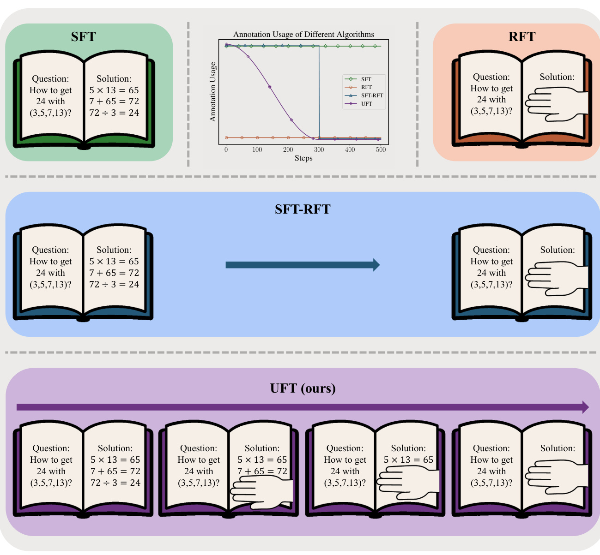
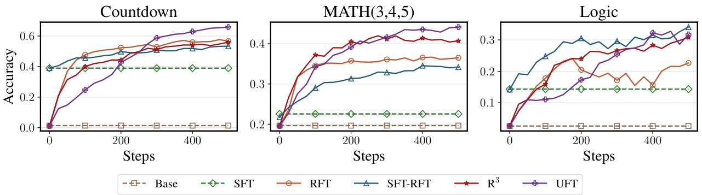
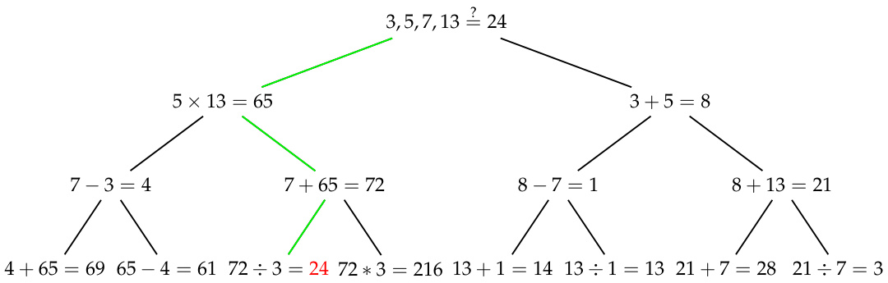
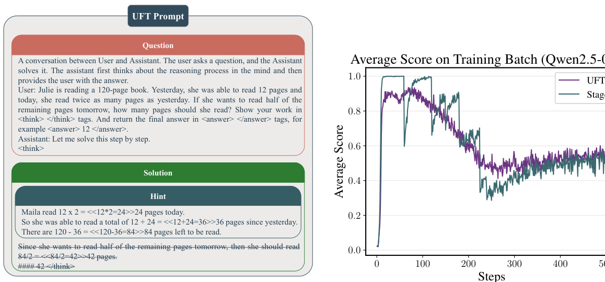
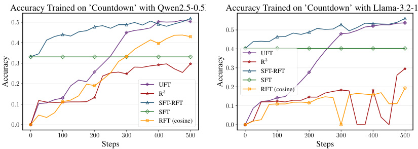
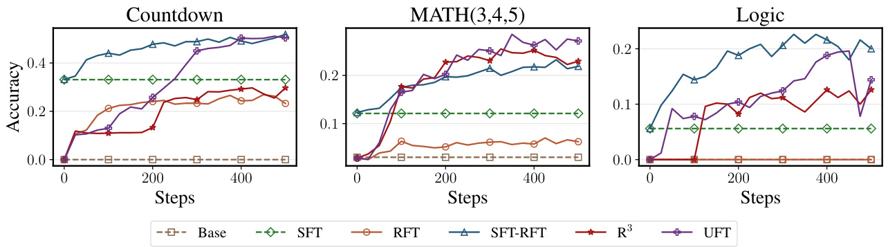
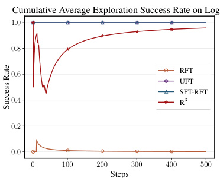
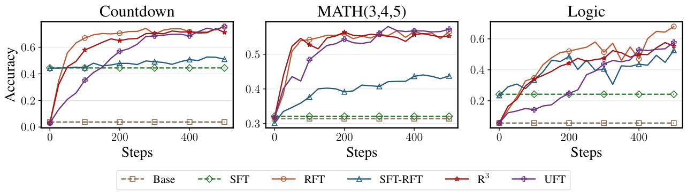
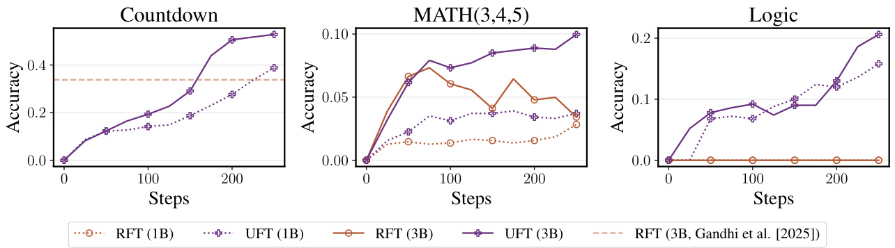
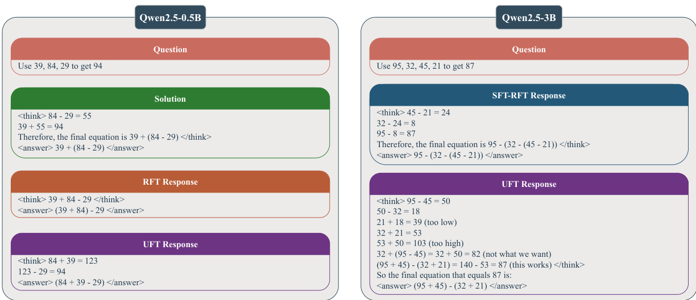

# UFT: Unifying Supervised and Reinforcement Fine-Tuning  

Mingyang Liu 1, Gabriele Farina', Asuman Ozdaglar 1 1 LIDS, EECS, Massachusetts Institute of Technology 1 {1iumy19,gfarina,asuman}@mit. edu  

# Abstract  

Post-training has demonstrated its importance in enhancing the reasoning capabilities of large language models (LLMs). The primary post-training methods can be categorized into supervised fine-tuning (SFT) and reinforcement fine-tuning (RFT). SFT is efficient and wellsuited for small language models, but it may lead to overfitting and limit the reasoning abilities of larger models. In contrast, RFT generally yields better generalization but depends heavily on the strength of the base model. To address the limitations of SFT and RFT, we propose Unified Fine-Tuning (UFT), a novel post-training paradigm that unifies SFT and RFT into a single, integrated process. UFT enables the model to effectively explore solutions while incorporating informative supervision signals, bridging the gap between memorizing and thinking underlying existing methods. Notably, UFT outperforms both SFT and RFT in general, regardless of model sizes. Furthermore, we theoretically prove that UFT breaks RFT's inherent exponential sample complexity bottleneck, showing for the first time that unified training can exponentially accelerate convergence on long-horizon reasoning tasks.  

"mTEJWF,BMT?WF6" "Learning without thinking leads to confusion; thinking without learning is perilous." - FLF(Confucius)  

# 1 Introduction  

When humans learn a new subject, we typically practice with problem sets (thinking) and try to understand the solutions when we encounter difficulties (memorizing). There are also counterparts in fine-tuning LLMs, which is  

: Supervised Fine-Tuning (SFT). Memorizing the collected reasoning trace (solution) by maximizing the log-likelihood of it. : Reinforcement Fine-Tuning (RFT). Exploring the reasoning space of LLM and improving the performance according to the signal from a verifier of the final answer (thinking).  

However, unlike humans, learning and thinking are disentangled during the training of language models. Specifically, prior work (DeepSeek-AI et al., 2025; Zhou et al., 2023; Muennighoff et al., 2025; Liu et al., 2025; Zeng et al., 2025) typically applies either SFT or RFT throughout the fine-tuning phase, or applies RFT only after SFT completes (cf. Figure 1). The choice of the proper fine-tuning algorithm depends on the LLM's capacity and the task's complexity. Specifically, when the LLM is weak, SFT typically works better since the LLM cannot explore the correct answer during reinforcement learning (Pan et al., 2025) due to the sparse reward caused by the verifier-based reward model. On the other hand, when the LLM is strong, RFT generalizes better (Xie et al., 2025; Chu et al., 2025).  

  
Figure 1: (top left, top right, middle, bottom). The illustration of SFT, RFT, SFT-RFT, and UFT, respectively. SFT-RFT refers to applying RFT after an initial SFT stage (DeepSeek-AI et al., 2025; Zeng et al., 2025). (Top, center). shows the annotation usage of different algorithms over training. Curves are slightly shifted for better visibility.  

To get the best of both worlds, we propose Unified Fine-Tuning (UFT), which unifies SFT and RFT and enriches the reinforcement learning signal with supervised feedback, enabling the model to acquire new knowledge during fine-tuning more efficiently. In Figure 1, SFT-RFT refers to the common practice of initiating reinforcement learning from a supervised fine-tuned model, as widely adopted in the literature (DeepSeek-AI et al., 2025; Zeng et al., 2025). As shown in Figure 1 (top left), SFT uses full annotations (solutions) throughout training, whereas RFT does not use any annotations at all (Figure 1, top right). Similarly, SFT-RFT begins with SFT using full annotations, but once the RFT phase starts, it discards all annotations and relies entirely on exploration. In contrast, our method, UFT, offers a smooth transition from SFT to RFT, preserving the annotation signal early on and gradually reducing it as the model becomes capable of self-guided reasoning.  

  
Figure 2: Presentation for different algorithms' accuracy when trained on Countdown (Wikipedia contributors, 2025), MATH(3,4,5) (level 3-5 only) (Hendrycks et al., 2021; Zeng et al., 2025), and the Knights and Knaves logic puzzle (Logic) (Xie et al., 2025). Accuracy is averaged over Qwen2.5 models of sizes 0.5B, 1.5B, and 3B (Qwen et al., 2025). Base refers to the model without fine-tuning, and $R ^ { 3 }$ is the curriculum reinforcement learning baseline (Xi et al., 2024). The figure shows that UFT outperforms both SFT and RFT, while the relative performance of SFT and RFT varies depending on task complexity.  

The most relevant work to UFT is Learning Reasoning through Reverse Curriculum Reinforcement Learning $( \mathbb { R } ^ { 3 } )$ (Xi et al., 2024), which proposes a curriculum learning method that concatenates the problem with a slice of the solution (hint, cf. Figure 4 left). While ${ \mathrm { R } } ^ { 3 }$ treats hints primarily as exploration aids, UFT further integrates them as part of the supervision signal. This unification enables reinforcement learning not just to search, but to learn from existing solutions, effectively raising the performance ceiling imposed by the model's pretraining capacity (cf. Figure 2). A detailed comparison with related work is postponed to Appendix A.  

Figure 2 shows the accuracy of different algorithms over time, while the training set is Countdown (Wikipedia contributors, 2025; Pan et al., 2025), MATH(3,4,5) (levels 3-5 only) (Hendrycks et al., 2021; Zeng et al., 2025), and the Knights and Knaves logic puzzle (Logic) (Xie et al., 2025). Base refers to the model before fine-tuning, and $\cdot ^ { - 3 }$ represents the curriculum reinforcement learning baseline (Xi et al., 2024). As shown in the figure, UFT generally outperforms all other algorithms. Furthermore, we provide the evaluation on various benchmarks, and the results are shown in Table 2.  

Moreover, we theoretically prove that RFT (DeepSeek-AI et al., 2025; Zeng et al., 2025; Liu et al., 2025) suffers from an inherent sample complexity bottleneck, which is exponential in the length of the reasoning. In contrast, the unified training paradigm in UFT can improve the sample complexity to a polynomial dependence on the reasoning length, which is an exponential improvement over RFT.  

# 1.1 Contribution  

We state the contribution of this paper in the following.  

1. Integration of Supervision and Reward Signal. UFT provides a general framework that integrates the supervision from SFT and reward from RFT into a single training paradigm. UFT blends reward optimization with log-likelihood maximization on hints (partial solution), and smoothly transitions from fully supervised to fully reinforcement learning. Such integration allows models to explore and learn simultaneously, addressing the trade-off between memorization (SFT) and generalization (RFT) in a principled way.  

2. Theoretical Justification. We provide a theoretical analysis of UFT, proving it achieves polynomial sample complexity dependence on reasoning length, compared to the exponential complexity required by standard RFT. This result formally establishes the efficiency gains from unifying learning (cf. Section 4).  

3. Empirical Validation Across Model Scales and Tasks. We evaluate the algorithms by training Qwen2.5-0.5/1.5/3B (Qwen et al., 2025) and Llama3.2-1/3B (Grattafiori et al., 2024) on Countdown (Wikipedia contributors, 2025; Pan et al., 2025), MATH (Hendrycks et al., 2021), and the Knights and Knaves logic puzzle (Logic) (Xie et al., 2025). UFT consistently outperforms previous methods, showing robustness across domains and models (cf. Section 5).  

# 2 Preliminaries  

Notation. For any integer $n > 0$ let $[ n ] : = \{ 1 , 2 , \cdots , n \}$ and $\Delta ^ { n } : = \left\{ x \in [ 0 , 1 ] ^ { n } \colon \textstyle \sum _ { i = 1 } ^ { n } x _ { i } = 1 \right\}$ be the $n - 1$ dimenional probabilit simplex. For any two distribution $x , y \in \Delta ^ { n }$ let $\begin{array} { r } { \mathrm { K L } \left( \pmb { x } \| \pmb { y } \right) : = \sum _ { i = 1 } ^ { n } x _ { i } \log \frac { x _ { i } } { y _ { i } } } \end{array}$ denote the KL-divergence between $x$ and $y$ . For any discrete set $s$ , let $| { \cal S } |$ be its cardinality.  

  
Figure 3: An illustration of the Countdown game, where the goal is to obtain 24 by applying basic arithmetic operations $( + , - , \times , \div )$ to the numbers (3,5,7,13). The green path represents the correct solution.  

Search Tree. The problem-solving process can be represented as a search tree, as illustrated in Figure 3. Except for the leaf nodes, each node (also referred to as a state--we use the terms node and state interchangeably) in the search tree has $B$ children, where $B$ is the branching factor. Each child represents a different next token (or next sentence) to be generated, so a path from the root to a leaf node corresponds to a complete solution to the problem. The tree has a height of $H _ { \cdot }$ with the root at height 0, and each node's height equal to its parent's height plus one.  

Let $\boldsymbol { \mathcal { S } } _ { h }$ denote the set of nodes with height $h \in \{ 0 , 1 , \cdots , H \}$ and $\textstyle S : = \bigcup _ { h = 0 } ^ { H } S _ { h }$ . Note that $\left. \boldsymbol { S } _ { 0 } \right. = 1$ since it only contains the root $s _ { \mathrm { r o o t } } ,$ and $| S _ { h + 1 } | = B \cdot | S _ { h } |$ . Therefore, there are $\begin{array} { r } { \sum _ { h = 0 } ^ { H } B ^ { h } = \frac { B ^ { H + 1 } - 1 } { B - 1 } } \end{array}$ nodes in total. Once reaching a leaf node $s \in { \cal S } _ { H } ,$ the model will receive reward $\mathcal { R } ( s ) \in [ 0 , 1 ]$ . A policy can be written as $\pi \colon \bigcup _ { h = 0 } ^ { H - 1 } S _ { h }  \Delta ^ { B } .$ where $\pi ( a \mid s )$ is the probability of selecting the $a ^ { t h }$ child of s. For any state-action pairs $( { \check { s } } , a ) \in { \mathcal { S } } \times [ B ] ,$ let $\mathcal { T } \left( s , a \right) \in \mathcal { S }$ be the child at the branch $a$ of state $s ,$ and $\mathcal { T } \left( s , a \right) = \emptyset$ for $s \in { \mathcal { S } } _ { H }$ . The value function of policy $\pi$ is written as $V ^ { \pi } \colon S  [ 0 , 1 ]$ . We write $s _ { h _ { 0 } } = s , ( s _ { h } ) _ { h = h _ { 0 } } ^ { H } \sim \pi$ as the trajectory starting from $s$ and sampled according to $\pi$ i.e., $a _ { h } \sim \pi ( \cdot \mid s _ { h } ) , s _ { h + 1 } = \mathcal { T } ( s _ { h } , a _ { h } )$ . For any $h _ { 0 } \in \{ 0 , 1 , \cdots , H \}$ and $s \in  { \mathcal { S } } _ { h _ { 0 } }$ we define $V ^ { \pi } ( s ) : = \mathbb { E } _ { s _ { h _ { 0 } } = s , ( s _ { h } ) _ { h = h _ { 0 } } ^ { H } \sim \pi } \left[ \mathcal { R } \left( s _ { H } \right) \right] .$ Which is th expected reward obtained by following policy $\pi$ Starting from node s.  

Let $\pi ^ { * } \in \mathrm { a r g m a x } _ { \pi } V ^ { \pi } \big ( s _ { \mathrm { r o o t } } \big )$ denote the optimal (deterministic) policy that achieves the highest expected rewardl. Let $V ^ { * } : \stackrel { \cdot \cdot } { = } V ^ { \pi ^ { * } } ( s _ { \mathrm { r o o t } } )$ be the expected reward of the optimal policy $\pi ^ { * }$ . Since $\pi ^ { * }$ is deterministic, let $\left( s _ { 0 } ^ { * } , a _ { 0 } ^ { * } , s _ { 1 } ^ { * } , a _ { 1 } ^ { * } , \cdot \cdot \cdot , s _ { H } ^ { * } \right)$ represent the path from the root to a leaf node by following $\pi ^ { * }$ , where $s _ { 0 } ^ { * } = s _ { \mathrm { r o o t } }$  

# 3 Unified Fine-Tuning (UFT)  

In this section, we introduce the two key features of UFT: (i) an exploration mechanism guided by hint, which improves sample eficiency by mitigating the sparse reward problem common in rule-based reinforcement learning (DeepSeek-AI et al., 2025); and (ii) a hybrid training objective that combines reinforcement learning with a log-likelihood term on hints, which provides a more informative learning signal and enables the model to acquire knowledge more effectively during fine-tuning.  

# 3.1 Exploration with Hint  

Although RFT is beneficial for training large models (DeepSeek-AI et al., 2025), several recent studies (Pan et al., 2025) report that small models often fail to reason effectively, as they may never explore the correct answer even once due to the sparse reward. Additionally, other work has found that RFT's final performance is constrained by base models' capabilities (Gandhi et al., 2025).  

To address the sparse reward issue, UFT guides exploration using a hint, that is, trajectory sampling starts from the concatenation of the problem description and a hint, which is a partial solution to the problem (cf. Figure 4). In this way, models will explore the correct answer more frequently.  

RFT can be modeled as the task of finding a path from the root of the problem-solving tree to a leaf node that represents the correct answer. As shown in Figure 3, RFT needs to identify the green path. However, the problem-solving tree for real-world tasks, such as math problems, typically contains an enormous number of nodes, making it difficult for an LLM to discover the correct path through exploration alone. To make matters worse, under the rule-based reward model proposed in DeepSeek-AI et al. (2025), only a small fraction of the leaf nodes correspond to correct answers, resulting in the well-known sparse reward problem (Ladosz et al., 2022).  

We address this challenge by concatenating the problem with a partial solution, referred to as the hint, to guide the model towards the correct answer. Figure 4 (left) provides an example of UFT's prompt.  

# 3.1.1 Hint Length Sampling  

Since we are ultimately interested in the LLM's performance when the hint length is zero, the hint must be gradually shortened during training. A natural idea is to subtract the hint length by a constant amount regularly, which is referred to as the staged reinforcement learning (Xi et al., 2024). However, because solutions typically consist of no more than 10 sentences, changes in hint length can cause a significant distribution shift, leading to unstable training (cf. Figure 4, right).  

To avoid distribution shift during training, Xi et al. (2024) samples the hint length uniformly from all possible values throughout the training. However, relying on hints throughout training introduces a significant distribution mismatch between training and evaluation. This often leads to performance collapse at test time, where no hints are available. To address this, UFT employs a smoothed reduction of hint length to zero, which (i) avoids drastic distribution shifts and (ii) better aligns the training distribution with the evaluation distribution.  

  
Figure 4: (left). An illustration of the UFT prompt. We adopt the prompting template from TinyZero (Pan et al., 2025), which is similar to that used in Deepseek-R1 (DeepSeek-AI et al., 2025). The hint consists of a slice of the fullsolution. During training, the question prompt and the hint are concatenated and fed to the model. (right). An llustration of the training curve of Qwen2.5-0.5B. Stage and UFT keep zero hint since step 300.  

Specifically, we maintain a variable $p \in \mathsf {  { \left[ 0 , 1 \right] } } .$ representing the proportion of the solution revealed to the LLM as a hint. The value of $p$ gradually descends during training according to cosine annealing (cf.(B.1)) (Loshchilov and Hutter, 2017). Let 1 be the random variable indicating the hint length, and let $L$ be the total length of the solution (e.g., number of sentences). By definition, we require $l \in \{ 0 , 1 , \cdots , L \}$ and $\mathbb { E } \left[ l \right] = p \cdot L ,$ so that the expected hint length matches the proportion $p$ . To achieve this, we sample $l \sim \mathrm { B i n o m i a l } ( L , p )$ from a Bi  

  
Figure 5: An ablation study of different hint length schedulers. RFT (cosine) refers to reinforcement learning with our cosine annealing hint length scheduler proposed in this section.  

nomial distribution?. It is straightforward to verify that $\mathbb { E } [ l ] = L \cdot \mathbb { E } \left[ c _ { 1 } \right] = p \cdot L$  

Compared to stage-wise hint length reduction, UFT provides a smoother transition from long to short hints. The training curves of these algorithms are shown in Figure 4 (right). We can see that the training curve of UFT is smoother and converges faster than that of the staged reinforcement learning. Note that staged reinforcement learning and UFT do not use any hint since step 300.  

As shown in Figure 5, although RFT (cosine), which is RFT equipped with the cosine annealing hint length scheduler, outperforms ${ \mathrm { R } } ^ { 3 }$ (uniform sampling), it is still worse than SFT-RFT. Furthermore, for Llama-3.2-1B, RFT (cosine) is even worse than SFT alone. This implies that the model's performance is hindered by its knowledge gained through pretraining (Gandhi et al., 2025), which motivates the second modification of UFT introduced in Section 3.2, an additional log-likelihood term in the objective function.  

# 3.2 Objective Function Modification  

The hinted RFT only enables LLMs to explore the correct solution more frequently, but remains inefficient at injecting new knowledge into the LLMs. This inefficiency arises because each sampled trajectory provides limited information, essentially a signal (correct/incorrect), which provides far less information than the supervision signal in SFT. In contrast, SFT enables more efficient knowledge acquisition, but suffers from poor generalization (Xie et al., 2025; Zeng et al., 2025). To get the best of both worlds, UFT introduces an additional log-likelihood term to the objective function of RFT, allowing the model to learn from the informative supervision signal and still benefit from the generalization of RFT.  

For notational simplicity, let $s _ { 0 } = s _ { \mathrm { r o o t } } , ( s _ { h } , a _ { h } ) _ { h = 0 } ^ { H - 1 } \sim \pi$ denote the shorthand for $a _ { h } \sim \pi ( \cdot | s _ { h } )$ and $s _ { h + 1 } = \mathcal { T } ( s _ { h } , a _ { h } )$ , i.e., $( s _ { h } , a _ { h } ) _ { h = 0 } ^ { H - 1 }$ represents a trajectory sampled according to $\pi$ starting at $s _ { \mathrm { r o o t } }$ . Formally, let $\mathcal { I }$ value $\left( ( s _ { h } , a _ { h } ) _ { h = 0 } ^ { H - 1 } \right)$ denote the ojectiv unction assciated with the expected reward. Then, let $\beta > 0$ be the hyperparameter controlling the KL divergence, we have  

$$
\begin{array} { r l } & { \mathcal { I } ^ { \mathrm { R F T } } = \underset { s _ { 0 } = s _ { \mathrm { r o o t } } , ( s _ { h } , a _ { h } ) } { \mathbb { E } } { \mathbb { E } } \bigg [ \mathcal { I } ^ { \mathrm { v a l u e } } \left( \left( s _ { h } , a _ { h } \right) _ { h = 0 } ^ { H - 1 } \right) - \underset { h = 0 } { \overset { H - 1 } { \sum } } \mathrm { K L } \left( \pi ( \cdot \vert s _ { h } ) \vert \vert \pi ^ { \mathrm { r e f } } ( \cdot \vert s _ { h } ) \right) \bigg ] } \\ & { \mathcal { I } ^ { \mathrm { U F T } } = \underset { s _ { h } = 0 } { \mathbb { E } } \underset { | \lambda _ { h } = 0 } { \mathbb { E } } = \underset { - \tau } { \sum } \bigg [ \mathcal { I } ^ { \mathrm { v a l u e } } \left( \left( s _ { h } , a _ { h } \right) _ { h = l } ^ { H - 1 } \right) - \underset { h = l } { \overset { H - 1 } { \sum } } \mathrm { K L } \left( \pi ( \cdot \vert s _ { h } ) \vert \vert \pi ^ { \mathrm { r e f } } ( \cdot \vert s _ { h } ) \right) - \underset { h = 0 } { \overset { l - 1 } { \sum } } \mathrm { K L } \left( \pi ^ { * } ( \cdot \vert s _ { h } ) \vert \vert \pi ( \cdot \vert s _ { h } ) \right) \bigg ] } \\ & { \quad \quad \quad \quad \left( s _ { h } , a _ { h } \right) _ { h = 0 } ^ { L - 1 } \sim \pi ^ { * } , } \\ & { \quad \quad \quad \quad \left( s _ { h } , a _ { h } \right) _ { h = l } ^ { H - 1 } \sim \pi } \end{array}
$$  

Compared to the objective function of GRPO, UFT adds an additional term $\cdot$ the KL divergence between the optimal policy and the current policy. Compared to $\mathcal { I } ^ { \mathrm { v a l u e } }$ this term explicitly guides the policy towards optimality, and thus results in a faster convergence rate.  

We remark that the optimal policy $\pi ^ { * }$ is unknown and we cannot compute $\begin{array} { r } { \beta \sum _ { h = 0 } ^ { l - 1 } \mathrm { K L } \left( \pi ^ { * } ( \cdot \mid s _ { h } ) \Vert \pi ( \cdot \mid s _ { h } ) \right) } \end{array}$ directly. However, thanks to the annotations contained in the dataset, we have acess to a trajectory sampled acording to $\pi ^ { * }$ i.e. $( s _ { h } ^ { * } , a _ { h } ^ { * } ) _ { h = 0 } ^ { H - 1 } \sim \pi ^ { * } .$ Which can be used otite the KL-dive According to the definition of KL-divergence, minimizing $\operatorname { K L } ( \pi ^ { * } ( \cdot \mid s _ { h } ^ { * } )  \pi ( \cdot \mid s _ { h } ^ { * } ) )$ is equivalent to minimizing $\begin{array} { r } { \sum _ { a _ { h } = 1 } ^ { B } \pi ^ { * } ( a _ { h } \mid s _ { h } ^ { * } ) \log { \frac { 1 } { \pi ( a _ { h } \mid s _ { h } ^ { * } ) } } } \end{array}$ (omit terms irelvant to $\pi$ , and $\log \frac { 1 } { \pi ( a _ { h } ^ { * } | s _ { h } ^ { * } ) }$ is an ubiased estimator of it, since $a _ { h } ^ { * } \sim \pi ^ { * } ( \cdot | s _ { h } ^ { * } )$ . Therefore, (3.2) can be equivalently written as  

$$
\mathcal { I } ^ { \mathrm { U F T } } = \mathbb { E } \underbrace { l , s _ { l } = s _ { l } ^ { * } } _ { \left( s _ { h } , a _ { h } \right) _ { h = l } ^ { H - 1 } \sim \pi } \left[ \mathcal { I } ^ { \mathrm { v a l u e } } \left( \left( s _ { h } , a _ { h } \right) _ { h = l } ^ { H - 1 } \right) - \beta \sum _ { h = l } ^ { H - 1 } \mathbb { K } \left( \pi ( \cdot | s _ { h } ) \| \pi ^ { \mathrm { r e f } } ( \cdot | s _ { h } ) \right) + \beta \sum _ { h = 0 } ^ { l - 1 } \log \pi ( a _ { h } ^ { * } | s _ { h } ^ { * } ) \right] .
$$  

Therefore, the UFT objective (3.3) can be interpreted as (i) maximizing the expected reward while (ii) staying close to the reference policy and (ii) memorizing the hint by maximizing the log-likelihood of producing the hint.  

Remark 3.1. The name of Unified Fine-Tuning (UFT) comes from the fact that when $p \equiv 0$ for all steps during training, (3.3) is equivalent to RFT, since $\begin{array} { r } { \beta \sum _ { h = 0 } ^ { l - 1 } \log \pi ( \boldsymbol { a } _ { h } ^ { * } \mid \boldsymbol { s } _ { h } ^ { * } ) = 0 } \end{array}$ .When $p \equiv 1$ , then $\mathcal { I }$ value $\begin{array} { r } { \binom { \theta } { h } ( s _ { h } , a _ { h } ) _ { h = l } ^ { H - 1 } \Big ) - \beta \sum _ { h = l } ^ { H - 1 } \operatorname { K L } \Big ( \pi ( \cdot \vert s _ { h } ) \vert \vert \pi ^ { \mathrm { r e f } } ( \cdot \vert s _ { h } ) \Big ) = 0 , } \end{array}$ So that (3.3) degenerates to SFT. An illustration can be found in Figure 1 (top middle).  

It is noteworthy that after adopting the additional log-likelihood term, UFT's performance matches that of SFT-RFT for small models (cf. Figure 5). This suggests that UFT improves the ceiling of RFT by enabling the model to acquire new knowledge during post-training.  

# 4 Theoretical Justification  

In this section, we provide a theoretical justification for UFT. First, we show that the lower bound of RFT's sample complexity grows exponentially $( \mathcal { O } ( B ^ { H } ) )$ as the tree height (reasoning length) increases. Second, we show that UFT may find the solution within a polynomial number of samples ( $\mathcal { O } \left( B H ^ { 5 } \log B \right) )$ representing an exponential improvement of tree height $H$ in sample complexity.  

Next, we define the sub-optimality gap in reward, which is the difference between the rewards for correct and incorrect solutions.  

Definition 4.1 (Sub-Optimality Gap). There is a sub-optimality gap $\Delta > 0$ between the reward of optimal and suboptimal nodes. Formally, for any leaf node $s \in { \cal S } _ { H }$ with reward $\begin{array} { r } { \mathcal { R } ( s ) < \operatorname* { m a x } _ { s ^ { \prime } \in \mathcal { S } _ { H } } \mathcal { R } ( s ^ { \prime } ) , } \end{array}$ we have  

$$
\mathcal { R } ( s ) \leq \operatorname* { m a x } _ { s ^ { \prime } \in S _ { H } } \mathcal { R } ( s ^ { \prime } ) - \Delta .
$$  

n this paper, there are only three possible outcomes for $\mathcal { R } ( s )$ , i.e., no reward (incorrect format), format eward, and accuracy reward. Therefore, the sub-optimality gap  

$$
\Delta = ( { \mathrm { a c c u r a c y ~ r e w a r d } } ) - ( { \mathrm { f o r m a t ~ r e w a r d } } ) = 1 . 0 - 0 . 1 = 0 . 9 .
$$  

Jext, we will give the lower bound on the RFT's sample complexity to achieve $5 0 \%$ pass $@ 1$ success rate4  

Theorem 4.2 (Lowerbound). For any integers $H \geq 1 , B \geq 2 .$ and any RFT algorithm, there exists a problem with height $H$ and branching factor $B$ , that satisfies the following: to achieve a $5 0 \%$ pass $@ 1$ success rate, the algorithm needs to explore at least  

$$
\frac { B ^ { H } } { 4 }
$$  

nodes in $s _ { H }$ . Moreover, when there are multiple nodes in $\scriptstyle { \mathcal { S } } _ { H }$ representing the correct solutions, e.g., $K \geq 1 ,$ any algorithm needs to explore at least $\frac { \bar { B } ^ { H } } { 4 K }$ nodes in $ { \boldsymbol { S } } _ { H }$  

The proof constructs a set of problems with different correct solutions, which cannot be distinguished before exploring sufficient nodes in $s _ { H }$ . The details can be found in Appendix C. Furthermore, the traditional lower bounds in reinforcement learning Jin et al., 2018; Domingues et al., 2021) are built on the stochastic transitions of the Markov decision process, but the search tree's transition is deterministic, which requires a different construction.  

Theorem 4.2 implies that when the reward is sparse, such as when $K$ is a constant, learning the optimal policy takes a number of iterations exponential in the height of the tree. This also justifies why long reasoning is generally difficult (Chai et al., 2025; Chen et al., 2025). In the following, we will show that UFT exponentially improves the sample complexity. The full algorithm can be found in Algorithm 2.  

Theorem 4.3 (Informal). When $\beta$ is small enough, Algorithm 2 obtains a $5 0 \%$ pass $@ 1$ success rate when the algorithm explores  

$$
\mathcal { O } \left( B \frac { H ^ { 5 } \left( \log B \right) ^ { 2 } } { \Delta ^ { 2 } } \right)
$$  

nodes in $\scriptstyle { \mathcal { S } } _ { H }$  

  
Figure 7: An illustration of the accuracy on the test dataset of Qwen2.5-0.5B. Base is the base model without fine-tuning. ${ \mathbb R } ^ { 3 }$ (Xi et al., 2024) trained the model with RFT and a uniform distribution over all hint lengths. SFT-RFT refers to training a supervised fine-tuned model with RFT, and UFT is our algorithm.  

The formal version is deferred to Appendix E. Note that the $5 0 \%$ pass $@ 1$ in both Theorem 4.2 and Theorem 4.3 can be arbitrarily adjusted, and it only affects the sample complexity by a constant factor. From Theorem 4.3, we observe that the dependence on $H$ is reduced from $B ^ { H }$ to $\dot { H ^ { 5 } }$ , representing an exponential improvement enabled by the use of hints. Moreover, $\Delta ^ { 2 }$ in the denominator implies that the difference between accuracy reward and format reward should be large for fast convergence, which is also supported by empirical studies (Shao et al., 2024; Pan et al., 2025; Zeng et al., 2025).  

# 5 Experiments  

In this section, we present the experimental results of UFT. We demonstrate several key properties of UFT: (i) When the model is small $( \leq 1 B )$ and SFT outperforms RFT, UFT's performance matches that of SFT. (ii) When the model is large $( \sim 3 B )$ and RFT outperforms SFT due to better generalization, UFT's performance matches that of RFT (and sometimes even outperforms it, cf. Table 2).  

In experiments, we train Qwen2.5-0.5B, Qwen2.5-1.5B, Qwen2.5-3B (Qwen et al., 2025), Llama-3.2-1B, and Llama-3.2-3B (Grattafiori et al., 2024) on Countdown (Wikipedia contributors, 2025; Pan et al., 2025), MATH(3,4,5) (only level 3-5 included) (Hendrycks et al., 2021; Zeng et al., 2025), and the Knights and Knaves logic puzzle (Logic) (Xie et al., 2025).  

# 5.1 The Memorization of UFT  

As shown in Figure 7, we can see that when the model is small, the improvement from RFT is marginal, since the model rarely explores the correct answer. As shown in Figure 6, when training Qwen2.5-0.5B on Logic, RFT rarely explores the correct answer, while UFT finds it at every single timestep.  

  
Figure 6: Qwen2.5-0.5B's cumulative average success rate for exploring the correct answer at each step when trained on Logic.  

Compared to $\mathbb { R } ^ { 3 }$ , where hints are also applied, UFT outperforms it since UFT (i) gradually shifts the distribution toward a hint length of zero, and (ii) maximizes the log-likelihood on hints to encode information about the solution in gradients. The proximity between the performance of UFT and SFT-RFT also supports the conclusion that UFT helps the model to memorize the solution when the model's initial capacity is not enough to solve it.  

  
Figure 8: An illustration of the accuracy on test dataset of Qwen2.5-3B. Base refers to the base model without fine-tuning.  

# 5.2 The Generalization of UFT  

As shown in Figure 8, when the model is larger and its prior knowledge gained from pertaining is enough for reasoning, UFT generalizes well as RFT. In contrast, SFT and SFT-RFT are worse, since SFT leads to overfitting. These experiments show that UFT will automatically adapt to model size and enjoy the advantage of both SFT and RFT.  

As shown in Figure 8, when the model is larger and its prior knowledge gained from pretraining is sufficient for reasoning, UFT generalizes well as RFT. In contrast, SFT and SFT-RFT perform worse, since SFT leads to overfitting. These experiments show that UFT automatically adapts to model size and benefits from the advantages of both SFT and RFT.  

# 5.3 UFT Helps LLMs Learn New Knowledge  

In Gandhi et al. (2025), it was found that Llama-3.2-3B's improvement through RFT is marginal compared to that of Qwen2.5-3B. This is because Llama gains less reasoning-related knowledge from pertaining, e.g., backtracking and subgoal setting. In Figure 9, we can see that UFT significantly improves the performance of Llama-3.2. In Countdown, even Llama-3.2-1B outperforms Llama-3.2-3B fine-tuned by RFT after the same number of steps (250 steps). This supports the claim that UFT introduces new knowledge to the model, whereas RFT only helps the model utilize its existing knowledge (Yue et al., 2025).  

# 6 Conclusion and Limitations  

This paper proposes a novel fine-tuning framework, UFT, which unifies SFT and RFT. Empirically, we show that UFT outperforms both SFT and RFT in general. Specifically, by adopting UFT, small models tend to memorize while large models generalize. Theoretically, we prove that UFT achieves exponential speed-up compared to RFT. However, throughout the paper, we use only the human-annotated solutions in the dataset and GRPO as the reinforcement learning algorithm. In the future, it would be interesting to explore the incorporation of advanced SFT and RFT techniques into UFT. For instance, using long chain-of-thoughts generated by large models (Muennighoff et al., 2025; Gandhi et al., 2025) for SFT, and choosing other reinforcement learning algorithms such as REINFORCE $^ { + + }$ (Hu, 2025) and DAPO (Yu et al., 2025) as the reinforcement learning algorithm for UFT.  

  
Figure 9: The comparison of Llama-3.2-1B/3B's behavior in Countdown/MATH/Logic when applying RFT/UFT. In Countdown, the dotted line is the accuracy of Llama-3.2-3B after 250 steps RFT reported in Gandhi et al. (2025) .  

# 7 Acknowledgement  

The authors would like to thank Jacob Andreas, Chanwoo Park, and Kaiqing Zhang for their valuable discussions. The authors would also like to thank the support of Siebel Scholarship and NSF Award CCF-2443068.  

# References  

Alekh Agarwal, Sham M Kakade, Jason D Lee, and Gaurav Mahajan. On the theory of policy gradient methods: Optimality, approximation, and distribution shift. Journal of Machine Learning Research, 22(98): 1-76, 2021.   
Yekun Chai, Haoran Sun, Huang Fang, Shuohuan Wang, Yu Sun, and Hua Wu. Ma-rlhf: Reinforcement learning from human feedback with macro actions. International Conference on Learning Representations (ICLR), 2025.   
Qiguang Chen, Libo Qin, Jinhao Liu, Dengyun Peng, Jiannan Guan, Peng Wang, Mengkang Hu, Yuhang Zhou, Te Gao, and Wanxiang Che. Towards reasoning era: A survey of long chain-of-thought for reasoning large language models. arXiv preprint arXiv:2503.09567, 2025.   
Tianzhe Chu, Yuexiang Zhai, Jihan Yang, Shengbang Tong, Saining Xie, Dale Schuurmans, Quoc V Le, Sergey Levine, and Yi Ma. Sft memorizes, rl generalizes: A comparative study of foundation model post-training. arXiv preprint arXiv:2501.17161, 2025.   
DeepSeek-AI, Daya Guo, Dejian Yang, Haowei Zhang, Junxiao Song, Ruoyu Zhang, Runxin Xu, Qihao Zhu, Shirong Ma, Peiyi Wang, Xiao Bi, Xiaokang Zhang, Xingkai Yu, Yu Wu, Z. F. Wu, Zhibin Gou,  

Zhihong Shao, Zhuoshu Li, Ziyi Gao, and Aixin Liu et al. Deepseek-r1: Incentivizing reasoning capability in llms via reinforcement learning. arXiv preprint arXio:2501.12948, 2025.  

Dongsheng Ding, Kaiqing Zhang, Tamer Basar, and Mihailo Jovanovic. Natural policy gradient primal. dual method for constrained markov decision processes. Annual Conference on Neural Information Processing Systems (NeurIPS), 2020.  

Omar Darwiche Domingues, Pierre Menard, Emilie Kaufmann, and Michal Valko. Episodic reinforcement learning in finite mdps: Minimax lower bounds revisited. 2021.  

Kanishk Gandhi, Ayush Chakravarthy, Anikait Singh, Nathan Lile, and Noah D Goodman. Cognitive behaviors that enable self-improving reasoners, or, four habits of highly effective stars. arXio preprint arXiv:2503.01307, 2025.  

Aaron Grattfiori, Abhimanyu Dubey, Abhinav Jauhri, Abhinav Pandey, Abhishek Kadian, Ahmad AlDahle, Aiesha Letman, Akhil Mathur, Alan Schelten, Alex Vaughan, Amy Yang, Angela Fan, Anirudh Goyal, Anthony Hartshorn, Aobo Yang, Archi Mitra, Archie Sravankumar, Artem Korenev, Arthur Hinsvark, and Arun Rao et al. The llama 3 herd of models. arXiv preprint arXiv:2407.21783, 2024.  

Dan Hendrycks, Collin Burns, Saurav Kadavath, Akul Arora, Steven Basart, Eric Tang, Dawn Song, and Jacob Steinhardt. Measuring mathematical problem solving with the math dataset. Annual Conference on Neural Information Processing Systems (NeurIPS), 2021.  

Jian Hu. Reinforce++: A simple and eficient approach for aligning large language models. arXio preprint arXiv:2501.03262, 2025.  

Chi Jin, Zeyuan Allen-Zhu, Sebastien Bubeck, and Michael I Jordan. Is q-learning provably efficient? Annual Conference on Neural Information Processing Systems (NeurIPs), 2018.  

Sham Kakade and John Langford. Approximately optimal approximate reinforcement learning. Interna tional Conference on Machine Learning (ICML), 2002.  

Pawel Ladosz, Lilian Weng, Minwoo Kim, and Hyondong Oh. Exploration in deep reinforcement learning A survey. Information Fusion, 85:1-22, 2022.  

Hunter Lightman, Vineet Kosaraju, Yuri Burda, Harrison Edwards, Bowen Baker, Teddy Lee, Jan Leike, John Schulman, Ilya Sutskever, and Karl Cobbe. Let's verify step by step. International Conference on Learning Representations (ICLR), 2024.  

Mingyang Liu. On solving larger games: Designing new algorithms adaptable to deep reinforcement learning. Master's thesis, Massachusetts Institute of Technology, 2025.  

Mingyang Liu, Asuman E. Ozdaglar, Tiancheng Yu, and Kaiqing Zhang. The power of regularization in solving extensive-form games. International Conference on Learning Representations (ICLR), 2023.  

Mingyang Liu, Gabriele Farina, and Asuman Ozdaglar. A policy-gradient approach to solving imperfect information games with iterate convergence. arXiv preprint arXiv:2408.00751, 2024.  

Zichen Liu, Changyu Chen, Wenjun Li, Tianyu Pang, Chao Du, and Min Lin. There may not be aha moment in r1-zero-like training -- a pilot study. https: //oat11m. notion. site/oat-zero, 2025. Notion Blog.  

Ilya Loshchilov and Frank Hutter. Sgdr: Stochastic gradient descent with warm restarts. International Conference on Learning Representations (ICLR), 2017.  

Liangchen Luo, Yinxiao Liu, Rosanne Liu, Samrat Phatale, Meiqi Guo, Harsh Lara, Yunxuan Li, Lei Shu Yun Zhu, Lei Meng, et al. Improve mathematical reasoning in language models by automated process supervision. arXiv preprint arXiv:2406.06592, 2024.   
Jincheng Mei, Chenjun Xiao, Csaba Szepesvari, and Dale Schuurmans. On the global convergence rates of softmax policy gradient methods. International Conference on Machine Learning (ICML), 2020.   
Niklas Muennighoff, Zitong Yang, Weijia Shi, Xiang Lisa Li, Li Fei-Fei, Hannaneh Hajishirzi, Luke Zettlemoyer, Percy Liang, Emmanuel Candes, and Tatsunori Hashimoto. s1: Simple test-time scaling. arXiv preprint arXiv:2501.19393, 2025.   
Jiayi Pan, Junjie Zhang, Xingyao Wang, Lifan Yuan, Hao Peng, and Alane Suhr. Tinyzero. https:/ /github.com/Jiayi-Pan/TinyZero, 2025. Accessed: 2025-01-24.   
An Yang Qwen, Baosong Yang, Beichen Zhang, Binyuan Hui, Bo Zheng, Bowen Yu, Chengyuan Li, Dayiheng Liu, Fei Huang, Haoran Wei, Huan Lin, Jian Yang, Jianhong Tu, Jianwei Zhang, Jianxin Yang, Jiaxi Yang, Jingren Zhou, Junyang Lin, Kai Dang, and Keming Lu et al. Qwen2.5 technical report. arXiv preprint arXiv:2412.15115, 2025.   
Amrith Setlur, Chirag Nagpal, Adam Fisch, Xinyang Geng, Jacob Eisenstein, Rishabh Agarwal, Alekh Agarwal, Jonathan Berant, and Aviral Kumar. Rewarding progress: Scaling automated process verifiers for llm reasoning. International Conference on Learning Representations (ICLR), 2025.   
Zhihong Shao, Peiyi Wang, Qihao Zhu, Runxin Xu, Junxiao Song, Xiao Bi, Haowei Zhang, Mingchuan Zhang, YK Li, Y Wu, et al. Deepseekmath: Pushing the limits of mathematical reasoning in open language models. arXiv preprint arXiv:2402.03300, 2024.   
Guangming Sheng, Chi Zhang, Zilingfeng Ye, Xibin Wu, Wang Zhang, Ru Zhang, Yanghua Peng, Haibin Lin, and Chuan Wu. Hybridflow: A flexible and efficient rlhf framework. arXio preprint arXiv: 2409.19256, 2024.   
Taiwei Shi, Yiyang Wu, Linxin Song, Tianyi Zhou, and Jieyu Zhao. Efficient reinforcement finetuning via adaptive curriculum learning. arXiv preprint arXiv:2504.05520, 2025.   
Mingyang Song, Mao Zheng, Zheng Li, Wenjie Yang, Xuan Luo, Yue Pan, and Feng Zhang. Fastcurl: Curriculum reinforcement learning with progressive context extension for efficient training r1-like reasoning models. arXiv preprint arXiv:2503.17287, 2025.   
Peiyi Wang, Lei Li, Zhihong Shao, RX Xu, Damai Dai, Yifei Li, Deli Chen, $\mathrm { Y u \ : W u , }$ and Zhifang Sui. Math-shepherd: Verify and reinforce llms step-by-step without human annotations. arXiv preprint arXiv:2312.08935, 2023.   
Liang Wen, Yunke Cai, Fenrui Xiao, Xin He, Qi An, Zhenyu Duan, Yimin Du, Junchen Liu, Lifu Tang, Xiaowei Lv, et al. Light-r1: Curriculum sft, dpo and rl for long cot from scratch and beyond. arXiv preprint arXiv:2503.10460, 2025.   
Wikipedia contributors. Countdown (game show). https: //en.wikipedia.org/wiki/Countdown_(game show), 2025.   
Zhiheng Xi, Wenxiang Chen, Boyang Hong, Senjie Jin, Rui Zheng, Wei He, Yiwen Ding, Shichun Liu, Xin Guo, Junzhe Wang, et al. Training large language models for reasoning through reverse curriculum reinforcement learning. International Conference on Machine Learning (ICML), 2024.   
Tian Xie, Zitian Gao, Qingnan Ren, Haoming Luo, Yuqian Hong, Bryan Dai, Joey Zhou, Kai Qiu, Zhirong Wu, and Chong Luo. Logic-rl: Unleashing lm reasoning with rule-based reinforcement learning. arXiv preprint arXiv:2502.14768, 2025.   
Qiying Yu, Zheng Zhang, Ruofei Zhu, Yufeng Yuan, Xiaochen Zuo, Yu Yue, Tiantian Fan, Gaohong Liu, Lingjun Liu, Xin Liu, et al. Dapo: An open-source llm reinforcement learning system at scale. arXiv preprint arXiv:2503.14476, 2025.   
Lifan Yuan, Wendi Li, Huayu Chen, Ganqu Cui, Ning Ding, Kaiyan Zhang, Bowen Zhou, Zhiyuan Liu, and Hao Peng. Free process rewards without process labels. arXio preprint arXio:2412.01981, 2024.   
Zheng Yuan, Hongyi Yuan, Chengpeng Li, Guanting Dong, Keming Lu, Chuanqi Tan, Chang Zhou, and Jingren Zhou. Scaling relationship on learning mathematical reasoning with large language models. arXiv preprint arXiv:2308.01825, 2023.   
Yang Yue, Zhiqi Chen, Rui Lu, Andrew Zhao, Zhaokai Wang, Shiji Song, and Gao Huang. Does reinforcement learning really incentivize reasoning capacity in llms beyond the base model? arXiv preprint arXiv:2504.13837, 2025.   
Weihao Zeng, Yuzhen Huang, Qian Liu, Wei Liu, Keqing He, Zejun Ma, and Junxian He. Simplerl-zoo: Investigating and taming zero reinforcement learning for open base models in the wild. arXiv preprint arXiv:2503.18892, 2025.   
Han Zhong, Zikang Shan, Guhao Feng, Wei Xiong, Xinle Cheng, Li Zhao, Di He, Jiang Bian, and Liwei Wang. Dpo meets ppo: Reinforced token optimization for rlhf. arXiv preprint arXiv:2404.18922, 2024.   
Chunting Zhou, Pengfei Liu, Puxin Xu, Srinivasan Iyer, Jiao Sun, Yuning Mao, Xuezhe Ma, Avia Efrat, Ping Yu, Lili Yu, et al. Lima: Less is more for alignment. Annual Conference on Neural Information Processing Systems (NeurIPS), 2023.  

# A Related Work  

In this section, we introduce related work about SFT, RFT, and curriculum learning for reasoning.  

Supervised Fine-Tuning (SFT) for Reasoning.Different SFT methods for enhancing reasoning capability usually differ in the source of the collected reasoning trace. Zeng et al. (2025) uses traditional SFT, . learning from the human-annotated problem solutions. In contrast, Gandhi et al. (2025); Muennighoff et al. (2025) utilize long chain-of-thoughts solutions generated by some large models, such as Claude and Deepseek-R1 (DeepSeek-AI et al., 2025). On the other hand, Yuan et al. (2023); Xie et al. (2025) utilizes rejection sampling fine-tuning. Specifically, the model will generate multiple reasoning traces, and the one that leads to the correct answer is selected for further fine-tuning. In this paper, we use human annotations as the SFT data (traditional SFT), as it is sufficient for our purpose and keeps the focus on our main contribution (unifying SFT and RFT).  

Reinforcement Fine-Tuning (RFT) for Reasoning. RFT for reasoning can be categorized into process supervision and outcome supervision. Process supervision assigns a reward to each step of a long reasoning trace (Lightman et al., 2024), which evaluates whether each step is correct or not. The main drawback of process supervision is that it is costly to prepare step-by-step feedback data. On the other hand, outcome supervision assigns a single reward to the entire trace (DeepSeek-AI et al., 2025; Zeng et al. 2025; Yu et al., 2025), e.g., whether the trace yields the correct answer to a math problem. Furthermore, Wang et al. (2023); Yuan et al. (2024); Zhong et al. (2024); Luo et al. (2024); Setlur et al. (2025) learn a step-by-step reward model from a collection of reasoning traces with outcome rewards, which avoids the cost of preparing step-by-step data. In this paper, due to the efficiency and simplicity of outcome supervision, we focus on the comparison with RFT using outcome supervision.  

Curriculum Learning for Reasoning. Existing curriculum reinforcement learning for reasoning mainly focuses on utilizing a collection of problems with varying difficulties (Wen et al., 2025; Shi et al., 2025; Song et al., 2025). These methods train the model with problems of gradually increasing difficulty, where the difficulty is determined by predefined criteria, such as the length of the successful reasoning trace (Song et al., 2025) or the success rate of baseline models (Shi et al., 2025; Wen et al., 2025). However, such methods fail when the problems in the dataset are homogeneous in difficulty. In contrast, Xi et al. (2024) proposes a curriculum learning method that concatenates the problem with a slice of the solution (hint). The difficulty is determined by the hint length. However, Xi et al. (2024) uses a uniform distribution over all possible hint lengths, which misaligns with the distribution of interest (zero hint length). On the other hand, UFT designs a hint length scheduler that smoothly reduces the hint length to zero. Furthermore, UFT adds an additional log-likelihood term for the hint in the objective function, which helps the model to acquire new knowledge more eficiently and increases the ceiling of reinforcement learning (cf. Figure 5).  

# BExperiment Details  

In this section, we introduce the details of the experiments, including the pseudo-code of UFT (Appendix B.1), the hyperparameters used (Appendix B.2), and additional experiment results (Appendix B.3.  

Hyperparameters: KL-penalty coefficient $\beta ,$ total number of steps $T _ { \cdot }$ number of steps with hint $T _ { \mathrm { h i n t } } ,$ low/high probability $p ^ { \mathrm { { l o w } } } / p ^ { \mathrm { { h i g h } } }$ for hint sampling, and hint length L Input: Reference policy parameter oref Initialization: ${ \pmb \theta } ^ { ( 0 ) }  \dot { { \pmb \theta } } ^ { \mathrm { r e f } }$ 1 for $t = 0 , 1 , \cdots , T - 1$ do 2 Sample a batch of problems $\boldsymbol { B }$ 3 $\mathcal { D }  \{ \}$ 4 for $( Q , S , A ) \in B$ do // For each (question, solution, answer) pair 5 i $t < T _ { \mathrm { h i n t } }$ then 6 $p ^ { ( t ) } \gets p ^ { \mathrm { l o w } } + \frac { 1 } { 2 } \left( p ^ { \mathrm { h i g h } } - p ^ { \mathrm { l o w } } \right) \left( 1 + \cos \left( \frac { t + 1 } { T _ { \mathrm { h i n t } } } \pi \right) \right)$ (B.1) // Cosine annealing, $\pi \approx 3 . 1 4 1 5 9$ is the Pi constant 7 Sample $l ^ { ( t ) } \sim$ Binomial (min{L,len(S)} , p(t)) 8 else 9 $\begin{array} { r l } { | } & { { } l ^ { ( t ) } = 0 } \end{array}$ 10 end 11 $\mathcal { D }  \mathcal { D } \cup \Big \{ Q + S [ : l ^ { ( t ) } ] \Big \} / /$ Concatenate the question with the partial solution (hint) and add to $\mathcal { D }$ 12 end 13 Run reinforcement learning algorithm on $\mathcal { D }$ with the objective function (3.3) 14 end  

# B.1 Algorithm  

This section presents the pseudo-code of UFT in Algorithm 1. In lines 4-9: we sample the hint length for each (question, solution, answer) pair in the sampled data batch $\boldsymbol { B }$ . In lines 11-13, we concatenate the question with the partial solution of length $l ( t )$ and feed it into a reinforcement learning algorithm (such as GRPO), with the objective function (3.3).  

# B.2 Cost and Implementation Details  

The project costs roughly $\$ 10,000$ GPU hours. The experiment is based on VERL (Sheng et al., 2024) and TinyZero (Pan et al., 2025). The hyperparameters for training on different datasets are listed in Table 1. The omitted hyperparameters follow the default values of VERL (Sheng et al., 2024).  

# B.3 Additional Results  

Figure 10 shows the response of the model trained via different algorithms. For Qwen2.5-0.5B, UFT's response aligns with the solution better than RFT's. For Qwen2.5-3B, UFT generates a longer reasoning trace and presents skills such as verification (Gandhi et al., 2025), while SFT-RFT does not.  

<html><body><table><tr><td colspan="2">Data</td></tr><tr><td>Training Batch Size</td><td>256</td></tr><tr><td>Validation Batch Size Mini-batch Size</td><td>1312 64</td></tr><tr><td>Hint Length</td><td>5</td></tr><tr><td>Training</td><td></td></tr><tr><td colspan="2"></td></tr><tr><td>T</td><td>0.001 500 300</td></tr><tr><td>Number of Rollouts. Thint</td><td>4</td></tr><tr><td>Context Window (Prompt)</td><td>Countdown: 256 MATH(3,4,5): 1024</td></tr><tr><td>Context Window (Response)</td><td>Logic: 1024 1024</td></tr><tr><td>low</td><td>0.05</td></tr><tr><td>phigh</td><td>0.95</td></tr><tr><td>SFT Epochs</td><td>5</td></tr><tr><td>Reward</td><td></td></tr><tr><td colspan="2">1.0</td></tr><tr><td colspan="2">Accuracy Reward Format Correctness Reward</td></tr><tr><td colspan="2">Incorrect Reward.</td></tr></table></body></html>  

Table 1: The hyperparameters for training on different datasets. The other parameters follow the default parameters of VERL (Sheng et al., 2024).  

Table 2 shows the accuracy results across different datasets. For clarity, we report the average accuracy over models trained on three datasets: Countdown, MATH(3,4,5), and Logic.  

For smaller models such as Qwen2.5-0.5B, SFT-RFT achieves an accuracy of $7 . 2 8 \%$ , compared to only $3 . 2 5 \%$ for RFT. In contrast, UFT achieves $9 . 4 5 \%$ accuracy, outperforming both.  

For larger models such as Qwen2.5-3B, SFT-RFT achieves $1 7 . 3 4 \%$ accuracy, which is significantly lower than RFT's $3 2 . 1 5 \%$ . However, UFT still performs competitively, reaching $3 0 . 9 3 \%$ and closely matching RFT.  

In summary, UFT combines the strengths of both SFT and RFT. When the model is small and memorization plays a key role, UFT matches or exceeds SFT's performance. When the model is large and generalization becomes more important, UFT benefits similarly to RFT, achieving comparable accuracy.  

# C  Proof of Theorem 4.2  

Theorem 4.2 (Lowerbound). For any integers $H \geq 1 , B \geq 2$ and any RFT algorithm, there exists a problem with height $H$ and branching factor $B$ , that satisfies the following: to achieve a $5 0 \%$ pass $\ @ 1$  

  
Figure 10: Responses of Qwen2.5-0.5/3B trained by different algorithms.  

success rate, the algorithm needs to explore at least  

$$
\frac { B ^ { H } } { 4 }
$$  

nodes in $s _ { H }$ . Moreover, when there are multiple nodes in $s _ { H }$ representing the correct solutions, e.g., $K \geq 1 .$ y  t $\frac { \bar { B } ^ { H } } { 4 K }$ nodes in $s _ { H }$ C  

Proof. Proving the lower bound of exploration is equivalent to the following. Find the maximum $T > 0$ such that any algorithm will fail to learn the optimal policy with probability at least 0.5 within $T$ explorations. Consider the $\binom { B ^ { H } } { K }$ possible trees, each associated with a distinct subset of $s _ { H }$ of size $K _ { \cdot }$ where that subset represents the correct solution for that specific tree. At the beginning, we pick an instance from all those possible trees uniformly at random.  

During each exploration, the algorithm requests the reward at a node in $s _ { H }$ . Let $s ^ { ( 1 ) } , s ^ { ( 2 ) } , \ldots , s ^ { ( T ) }$ be the leaf node reached at timestep $1 , 2 , \ldots T ,$ which are random variables depending on the randomness of the algorithm. Let $\begin{array} { r } { S _ { H } ^ { * } : = \left\{ s \in S _ { H } \colon \mathcal { R } ( s ) = \operatorname* { m a x } _ { s ^ { \prime } \in S _ { H } } \mathcal { R } ( s ^ { \prime } ) \right\} } \end{array}$ be the set of nodes representing correct solutions. Note that given the construction of the instances, $| { \cal S } _ { H } ^ { * } | = K$ . Then, the probability of reaching one of the correct solutions in $S _ { H } ^ { * }$ is  

$$
\begin{array} { r l } { \mathrm { \mathrm { \mathrm { \Large ~ \mathfrak ~ 2 r } } } ( \{ s ^ { ( t ) } \} _ { t = 1 } ^ { T } \cap S _ { H } ^ { * } \neq \mathcal { O } ) = \displaystyle \sum _ { t = 1 } ^ { T } \operatorname* { P r } ( s ^ { ( t ) } \in S _ { H } ^ { * } \mid \{ s ^ { ( s ) } \} _ { s = 1 } ^ { t - 1 } \cap S _ { H } ^ { * } = \mathcal { O } ) \operatorname* { P r } ( \{ s ^ { ( s ) } \} _ { s = 1 } ^ { t - 1 } \cap S _ { H } ^ { * } =  } & { } \\ { \quad  \leq \displaystyle \sum _ { t = 1 } ^ { T } \operatorname* { P r } ( s ^ { ( t ) } \in S _ { H } ^ { * } \mid \{ s ^ { ( s ) } \} _ { s = 1 } ^ { t - 1 } \cap S _ { H } ^ { * } = \mathcal { O } ) . } & { } \end{array}
$$  

Given that we pick $S _ { H } ^ { * }$ uniformly at random, $\begin{array} { r } { \operatorname* { P r } \bigg ( s ^ { ( t ) } \in \mathcal { S } _ { H } ^ { * } \mid \Big \{ s ^ { ( s ) } \Big \} _ { s = 1 } ^ { t - 1 } \cap \mathcal { S } _ { H } ^ { * } = \mathcal { D } \bigg ) = \frac { \left| \mathcal { S } _ { H } ^ { * } \right| } { B ^ { H } - t + 1 } } \end{array}$ . Therefore,  

$$
\operatorname* { P r } \left( \left\{ s ^ { ( t ) } \right\} _ { t = 1 } ^ { T } \cap { \mathcal { S } _ { H } ^ { \ast } } \neq \emptyset \right) \leq \sum _ { t = 1 } ^ { T } \frac { \left| \mathcal { S } _ { H } ^ { \ast } \right| } { B ^ { H } - t + 1 } .
$$  

<html><body><table><tr><td>Model</td><td>Algorithm</td><td>MATH(3,4,5)</td><td>AIME24</td><td>AMC</td><td>Countdown</td><td>Logic</td><td> MATH500</td><td> Minerva</td><td>Olympiad</td><td>GSM8k</td><td>Avg.</td></tr><tr><td></td><td>Base</td><td>3.03</td><td>0.00</td><td>0.00</td><td>0.00</td><td>0.00</td><td>1.73</td><td>0.74</td><td>0.30</td><td>7.66</td><td>1.55</td></tr><tr><td></td><td>SFT</td><td>4.92</td><td>0.00</td><td>1.61</td><td>11.20</td><td>1.87</td><td>2.13</td><td>2.08</td><td>1.33</td><td>13.07</td><td>4.46</td></tr><tr><td></td><td>RFT</td><td>3.78</td><td>0.00</td><td>3.21</td><td>8.30</td><td>0.00</td><td>2.47</td><td>3.80</td><td>2.57</td><td>3.87</td><td>3.25</td></tr><tr><td>Qwen2.5-0.5B</td><td>SFT-RFT</td><td>8.69</td><td>0.00</td><td>3.61</td><td>17.45</td><td>7.07</td><td>2.07</td><td>4.41</td><td>2.12</td><td>16.45</td><td>7.28</td></tr><tr><td></td><td>R3</td><td>9.86</td><td>0.00</td><td>6.43</td><td>9.99</td><td>4.20</td><td>3.33</td><td>5.02</td><td>3.11</td><td>20.09</td><td>7.36</td></tr><tr><td></td><td>UFT</td><td>13.18</td><td>0.00</td><td>6.83</td><td>17.15</td><td>4.87</td><td>5.40</td><td>5.76</td><td>2.77</td><td>24.59</td><td>9.45</td></tr><tr><td></td><td>Base</td><td>24.51</td><td>3.33</td><td>4.82</td><td>0.20</td><td>2.20</td><td>18.27</td><td>4.41</td><td>5.48</td><td>60.96</td><td>14.29</td></tr><tr><td></td><td>SFT</td><td>12.47</td><td>0.00</td><td>5.62</td><td>13.48</td><td>5.33</td><td>6.40</td><td>4.53</td><td>2.62</td><td>29.74</td><td>9.36</td></tr><tr><td></td><td>RFT</td><td>24.77</td><td>2.22</td><td>9.24</td><td>27.86</td><td>3.00</td><td>10.53</td><td>6.86</td><td>6.47</td><td>45.69</td><td>16.08</td></tr><tr><td>Qwen2.5-1.5B</td><td>SFT-RFT</td><td>15.72</td><td>1.11</td><td>6.83</td><td>20.51</td><td>11.13</td><td>5.00</td><td>4.41</td><td>4.59</td><td>30.02</td><td>11.70</td></tr><tr><td></td><td>R3</td><td>28.12</td><td>2.22</td><td>13.65</td><td>23.57</td><td>11.47</td><td>14.93</td><td>7.48</td><td>9.43</td><td>49.79</td><td>18.65</td></tr><tr><td></td><td>UFT</td><td>34.08</td><td>3.33</td><td>14.86</td><td>24.54</td><td>10.07</td><td>20.87</td><td>8.33</td><td>9.68</td><td>66.46</td><td>22.23</td></tr><tr><td></td><td>Base</td><td>31.45</td><td>0.00</td><td>13.25</td><td>3.81</td><td>5.60</td><td>24.53</td><td>4.78</td><td>7.70</td><td>57.85</td><td>17.13</td></tr><tr><td></td><td>SFT</td><td>24.32</td><td>0.00</td><td>10.04</td><td>15.07</td><td>10.20</td><td>16.80</td><td>5.27</td><td>5.19</td><td>45.54</td><td>15.25</td></tr><tr><td>Qwen2.5-3B</td><td>RFT</td><td>45.74</td><td>4.44</td><td>24.90</td><td>34.08</td><td>30.33</td><td>31.27</td><td>12.25</td><td>15.65</td><td>80.84</td><td>32.15</td></tr><tr><td></td><td>SFT-RFT</td><td>26.50</td><td>1.11</td><td>9.64</td><td>17.61</td><td>19.60</td><td>14.07</td><td>5.76</td><td>6.77</td><td>48.22</td><td>17.34</td></tr><tr><td></td><td>R3</td><td>44.01</td><td>2.22</td><td>21.29</td><td>27.12</td><td>24.80</td><td>28.00</td><td>10.91</td><td>14.57</td><td>70.20</td><td>28.02</td></tr><tr><td></td><td>UFT</td><td>47.04</td><td>3.33</td><td>29.32</td><td>31.38</td><td>26.07</td><td>29.73</td><td>12.99</td><td>14.17</td><td>74.63</td><td>30.93</td></tr><tr><td></td><td>Base</td><td>0.00</td><td>0.00</td><td>0.00</td><td>0.00</td><td>0.00</td><td>0.00</td><td>0.00</td><td>0.00</td><td>0.08</td><td>0.01</td></tr><tr><td></td><td>SFT</td><td>1.07</td><td>0.00</td><td>0.80</td><td>13.41</td><td>3.67</td><td>0.00</td><td>0.74</td><td>0.25</td><td>1.87</td><td>2.49</td></tr><tr><td>Llama-3.2-1B</td><td>RFT</td><td>0.94</td><td>0.00</td><td>2.41</td><td>0.00</td><td>0.00</td><td>0.47</td><td>0.49</td><td>0.84</td><td>1.42</td><td>0.80</td></tr><tr><td></td><td>SFT-RFT</td><td>0.42</td><td>0.00</td><td>0.00</td><td>18.68</td><td>8.33</td><td>0.00</td><td>1.23</td><td>0.20</td><td>0.48</td><td>3.29</td></tr><tr><td></td><td>R3</td><td>1.53</td><td>0.00</td><td>1.61</td><td>9.90</td><td>0.13</td><td>0.33</td><td>2.94</td><td>0.99</td><td>1.49</td><td>2.20</td></tr><tr><td></td><td>UFT</td><td>1.17</td><td>0.00</td><td>0.00</td><td>17.87</td><td>7.40</td><td>0.07</td><td>2.82</td><td>0.74</td><td>1.14</td><td>3.52</td></tr><tr><td></td><td>Base</td><td>0.00</td><td>0.00</td><td>0.00</td><td>0.00</td><td>0.00</td><td>0.00</td><td>0.00</td><td>0.00</td><td>0.00</td><td>0.00</td></tr><tr><td></td><td>SFT</td><td>2.54</td><td>0.00</td><td>0.40</td><td>14.68</td><td>6.13</td><td>0.00</td><td>1.72</td><td>0.54</td><td>7.08</td><td>3.85</td></tr><tr><td></td><td>RFT</td><td>0.00</td><td>0.00</td><td>0.00</td><td>0.00</td><td>0.00</td><td>0.00</td><td>0.00</td><td>0.05</td><td>0.00</td><td>0.01</td></tr><tr><td>Llama-3.2-3B</td><td>SFT-RFT</td><td>3.16</td><td>0.00</td><td>2.41</td><td>16.05</td><td>8.87</td><td>0.07</td><td>3.92</td><td>0.89</td><td>5.76</td><td>4.79</td></tr><tr><td></td><td>R3</td><td>2.93</td><td>0.00</td><td>3.21</td><td>17.55</td><td>9.93</td><td>0.87</td><td>3.06</td><td>1.04</td><td>5.16</td><td>5.03</td></tr><tr><td></td><td>UFT</td><td>1.24</td><td>0.00</td><td>1.20</td><td>17.64</td><td>6.60</td><td>1.13</td><td>1.10</td><td>0.30</td><td>4.12</td><td>3.72</td></tr></table></body></html>  

Table 2: Average performance of Qwen2.5-0.5/1.5/33 and Llama-3.2-1/3B across all three training datasets, Countdown, MATH(3,4,5), and Logic.  

When $\begin{array} { r } { T \leq \frac { B ^ { H } } { 4 \left| S _ { H } ^ { * } \right| } , } \end{array}$ 4|SiT, we have  

$$
\operatorname* { P r } \left( \Big \{ s ^ { ( t ) } \Big \} _ { t = 1 } ^ { T } \cap \cal S _ { H } ^ { * } \not = \emptyset \right) \leq \sum _ { t = 1 } ^ { T } \frac { | \cal S _ { H } ^ { * } | } { B ^ { H } - t + 1 } \overset { ( i ) } { \leq } \sum _ { t = 1 } ^ { T } \frac { 2 \left| \cal S _ { H } ^ { * } \right| } { B ^ { H } } = \frac { 2 \left| \cal S _ { H } ^ { * } \right| T } { B ^ { H } } \leq \frac { 1 } { 2 } .
$$  

() uses the fact that t  T " Theefore within exration, the algorith will ail to find the correct answer with probability at least 0.5. 0  

# D Extended Theoretical Justifications  

In this section, we introduce some additional notations in Appendix D.1 and then present the theoretically sound UFT in Appendix D.2.  

# D.1 Extended Preliminaries  

Notation. For any vector $\boldsymbol { x } \in \mathbb { R } ^ { n }$ let $x _ { i }$ be its $i ^ { t h }$ element and $\left\| { \boldsymbol { x } } \right\| _ { p }$ be the $L _ { p }$ norm, where $\| { \boldsymbol x } \|$ denotes the $L _ { 2 }$ -norm by default. For any two vectors $\ b x , \ b y \in \mathbb { R } ^ { n }$ , let $\langle x , y \rangle : = \sum _ { i = 1 } ^ { n } x _ { i } \cdot y _ { i }$ denote their inner product.  

Softmax Parameterized Policy. Algorithm 2 assumes the policy follows softmax parameterization Formally, the policy $\pi ^ { \pmb { \theta } }$ is controlled by $\pmb \theta \in \mathbb R ^ { | \mathcal S | \times B }$ such that for any $s \in \mathcal S$ and $a \in [ B ]$  

$$
\pi ^ { \pmb \theta } ( a | s ) : = \frac { \exp ( \theta ( s , a ) ) } { \sum _ { a ^ { \prime } = 1 } ^ { B } \exp ( \theta ( s , a ^ { \prime } ) ) } .
$$  

The softmax-parameterized policy is also widely adopted in the literature (Mei et al., 2020; Agarwal et al. 2021; Ding et al., 2020) to sidestep the complexities of analyzing non-convex neural networks and to keep the focus on the learning algorithm itself.  

# D.2 Theoretically Sound UFT  

The full algorithm is shown in Algorithm 2. In lines 2-3: we sample the hint length and a trajectory starting from the hint. In lines 6-10, we estimate Q-values by sampling an additional trajectory for each state-action pair, which can greatly reduce the variance of sampling. In lines 13-14, we compute the objective function and update the parameters by gradient ascent. In lines 16-17, we estimate the expected reward of each intermediate policy and return the best one.  

Note that Algorithm 2 differs slightly from the UFT shown in Algorithm 1. While Algorithm 1 leaves the choice of the reinforcement learning algorithm unspecified, Algorithm 2 explicitly defines the trajectory rolling mechanism and update rule for concrete theoretical analysis. Further, Algorithm 2 assumes a softmax-parameterized policy, whereas Algorithm 1 imposes no constraints on the policy network architecture.  

# E Proof of Theorem 4.3  

I m $\pi ^ { ( t ) }$ on $\pi ^ { \pmb { \theta } ^ { ( t ) } }$ o1 % $t \in \{ 0 , 1 , \cdot \cdot \cdot , T \}$ : $t \in [ T ]$ $\widetilde { A } ^ { ( t - 1 ) } ( s , a ) = \widetilde { Q } ^ { ( t - 1 ) } ( s , a ) = 0$ $s$ $\left( s _ { h } ^ { ( t ) } \right) _ { h = l ^ { ( t ) } } ^ { H }$ timestep $t$  

Theore 1 (ml). Conider rtm2. hen $\begin{array} { r } { \beta \leq \frac { \Delta } { 1 2 \left( H + 1 \right) ^ { 2 } \left( \log B + 2 \left. \theta ^ { \mathrm { r e f } } \right. _ { \infty } \right) } , } \end{array}$ the pass $@ 1$ accuracy $\operatorname* { P r } _ { \pi ^ { \pmb { \theta } ^ { ( \tilde { t } ^ { * } ) } } }$ (pass $@ 1$ ) of policy $\pi ^ { \pmb { \theta } ^ { ( \tilde { t } ^ { * } ) } }$ satisfies  

$$
\operatorname* { P r } _ { \pi ^ { \theta ^ { ( \widetilde { t } ^ { * } ) } } } \left( \operatorname { p a s s } \ @ 1 \right) \ge 0 . 5 ,
$$  

when  

$$
T = \left( \frac { ( H + 1 ) ^ { 2 } \left( \log { B } + 2 \left\| \theta ^ { \mathrm { r e f } } \right\| _ { \infty } + 7 \right) } { \Delta / 1 2 } \right) ^ { 2 }
$$  

and explores no more than $( B H + N ) T$ leaf nodes in $s _ { H }$  

Proof. The update rule can be divided into two steps: (i) Use the concentration bound to get a high. probability bound on $\Big \langle Q ^ { \pi ^ { ( t - 1 ) } } ( s , \cdot ) , \pi ^ { * } ( \cdot \mid s ) - \pi ^ { ( t - 1 ) } ( \cdot \mid s ) \Big \rangle$ (cf. Appendix E.1); (ii) Convert the difference in each node to the $V ^ { * } - V ^ { \pi ^ { ( t - 1 ) } } \left( s _ { \mathrm { r o o t } } \right)$ by the re deomsition emma (f. Aendi .) ii) onvert the bound on expected reward to success rate (cf. Appendix E.3).  

Hyperparameters: Learning rate $\eta$ KL-penalty coefficient $\beta ,$ and total number of steps $T$   
Input: Reference policy parameter oref   
Initialization: ${ \pmb \theta } ^ { ( 0 ) }  \dot { { \pmb \theta } } ^ { \mathrm { r e f } }$  

1 for $t = 0 , 1 , \cdots , T - 1$ do  

2 Sample $l ^ { ( t ) } \sim \operatorname { U n i f o r m } ( 0 , 1 , 2 , \cdot \cdot \cdot , H - 1 , H )$ // In fact, any distribution with full support on $\{ 0 , 1 , 2 , \cdot \cdot \cdot , H - 1 , H \}$ is fine. We choose the uniform distribution for simplicity   
3 Sample trajectory $\left( s _ { h } ^ { ( t ) } \right) _ { h = l ^ { ( t ) } } ^ { H } \sim \pi ^ { \pmb { \theta } ^ { ( t ) } } .$ where $s _ { l ^ { ( t ) } } ^ { ( t ) } = s _ { l ^ { ( t ) } } ^ { * }$   
4 for $h = l ^ { ( t ) } , l ^ { ( t ) } + 1 , \cdot \cdot \cdot \ddot { H } - 1$ do   
5 for $a = 1 , 2 , \cdots , B$ do // Group sampling   
6 Sample trajectory $\left( s _ { h ^ { \prime } } ^ { ( t ) , a } \right) _ { h ^ { \prime } = h + 1 } ^ { H } \sim \pi ^ { \pmb { \theta } ^ { ( t ) } }$ starting rom $s _ { h + 1 } ^ { ( t ) , a } = \mathcal { T } ( s _ { h } ^ { ( t ) } , a )$   
7 $\widetilde { Q } ^ { ( t ) } \left( s _ { h } ^ { ( t ) } , a \right) \gets \mathcal { R } \left( s _ { H } ^ { ( t ) , a } \right) ^ { \cdot }$   
8 end   
9 for $a = 1 , 2 , \cdots , B$ do   
10 $\begin{array} { r } { \widetilde { A } ^ { ( t ) } \left( s _ { h } ^ { ( t ) } , a \right) \gets \widetilde { Q } ^ { ( t ) } \left( s _ { h } ^ { ( t ) } , a \right) - \sum _ { a = 1 } ^ { B } \pi ^ { \theta ^ { ( t ) } } \left( a \vert s _ { h } ^ { ( t ) } \right) \widetilde { Q } ^ { ( t ) } \left( s _ { h } ^ { ( t ) } , a \right) } \end{array}$   
11 end   
12 end // $\widetilde { A } ^ { ( t ) } ( s , \cdot ) \equiv 0$ for any $s$ off the trajectory $\left( s _ { h } ^ { ( t ) } \right) _ { h = l ^ { ( t ) } } ^ { H }$  

13  

$$
\begin{array} { r l } & { \mathcal { T } ^ { ( t ) } \gets \displaystyle \sum _ { h = l ^ { ( t ) } } ^ { H - 1 } \displaystyle \sum _ { a = 1 } ^ { B } \pi ^ { \pmb { \theta } ^ { ( t ) } } ( a | s _ { h } ^ { ( t ) }  ) \widetilde { A } ^ { ( t ) } ( s _ { h } ^ { ( t ) } , a ) } \\ & { \qquad - \displaystyle \beta \displaystyle \sum _ { h = l ^ { ( t ) } } ^ { H - 1 } \mathrm { K L } ( \pi ^ { \pmb { \theta } ^ { ( t ) } } ( \cdot | s _ { h } ^ { ( t ) }  ) \| \pi ^ { \pmb { \theta } ^ { \mathrm { r e f } } } ( \cdot | s _ { h } ^ { ( t ) }  ) ) + \displaystyle \beta \displaystyle \sum _ { h = 0 } ^ { l ^ { ( t ) } - 1 } \log \pi ^ { \pmb { \theta } ^ { ( t ) } } ( a _ { h } ^ { * } | s _ { h } ^ { * }  ) } \end{array}
$$  

14  

$$
\pmb \theta ^ { ( t + 1 ) } \gets \pmb \theta ^ { ( t ) } + \eta \nabla _ { \pi } \mathcal { T } ^ { ( t ) }
$$  

15 end  

16 Estimate Vno? $\begin{array} { r } { \widetilde { V } ^ { \pi ^ { \theta ^ { ( t ) } } } \left( s _ { \mathrm { r o o t } } \right) = \frac { 1 } { N } \sum _ { n = 1 } ^ { N } \mathcal { R } \left( \widetilde { s } _ { H } ^ { ( t ) , n } \right) } \end{array}$ by sampling trajectories $\widetilde { s } _ { 0 } ^ { ( t ) , n } = s _ { \mathrm { r o o t } }$ and $\left( \widetilde { s } _ { h } ^ { ( t ) , n } \right) _ { h = 0 } ^ { H } \sim \pi ^ { \pmb { \theta } ^ { ( t ) } } ,$ where $\begin{array} { r } { N = \frac { 7 2 \log ( 1 4 ( T + 1 ) ) } { \Delta ^ { 2 } } } \end{array}$   
$\widetilde { t } ^ { * } = \mathrm { a r g m a x } _ { t \in \{ 0 , 1 , \cdots , T \} } \widetilde { V } ^ { \pi ^ { \theta ^ { ( t ) } } } \left( s _ { \mathrm { r o o t } } \right)$   
Return: ne(\*)  

# E.1 Concentration Bound  

For any height $h \in \{ 0 \} \cup [ H - 1 ] ,$ state $s \in S _ { h } ,$ and action $a \in [ B ] .$ we can define the $\mathrm { \Delta Q }$ -value of the state-action pair $( s , a ) \in \mathcal { S } \times [ B ]$ when following policy $\pi$ as  

$$
\begin{array} { r } { Q ^ { \pi } ( s , a ) : = \operatorname { \mathbb { E } } _ { s _ { h } = s , \left( s _ { h ^ { \prime } } \right) _ { h ^ { \prime } = h } ^ { H } \sim \pi } \left[ \mathcal { R } \left( s _ { H } \right) \right] . } \end{array}
$$  

Then, for any $s \in \mathcal { S } \backslash \mathcal { S } _ { H }$ and $t \in [ T ] .$ we have  

$$
\begin{array} { r } { \mathbb { E } \left[ \widetilde { Q } ^ { ( t - 1 ) } ( s , a ) \right] = \operatorname* { P r } \left( s \in \left\{ s _ { h } ^ { ( t ) } \right\} _ { h = l ^ { ( t ) } } ^ { H } \right) \cdot Q ^ { \pi ^ { ( t - 1 ) } } ( s , a ) , } \end{array}
$$  

where the expectation is taken over the probability of sampling trajectories in Algorithm 2. Next, we will introduce Lemma 5.3 in Liu et al. (2024).  

Proposition E.2. Let $M , \tilde { M } \geq 0$ be the constants such that $\left| f ^ { ( t ) } ( { \pmb x } ) - f ^ { ( t ) } ( { \pmb x } ^ { \prime } ) \right| \leq M$ and $\begin{array} { r } { \left| \widetilde { f } ^ { ( t ) } ( { \pmb x } ) - \widetilde { f } ^ { ( t ) } ( { \pmb x } ^ { \prime } ) \right| \le } \end{array}$ $\tilde { M }$ for any $t \in [ T ]$ and $\qquad x , x ^ { \prime } \in { \mathcal { C } } .$ where $\mathcal { C }$ is a convex set. If for any $\qquad x \in { \mathcal { C } } .$ we have  

$$
\mathbb { E } \left[ \widetilde { f } ^ { ( t ) } ( \boldsymbol { x } ) \vert \widetilde { f } ^ { ( 1 ) } , \widetilde { f } ^ { ( 2 ) } , \cdot \cdot \cdot , \widetilde { f } ^ { ( t - 1 ) } \right] = f ^ { ( t ) } ( \boldsymbol { x } ) ,
$$  

and $x ^ { ( t ) }$ is deterministically influenced by $\widetilde { f } ^ { ( 1 ) } , \widetilde { f } ^ { ( 2 ) } , \cdots , \widetilde { f } ^ { ( t - 1 ) } ,$ then for any $\delta \in ( 0 , 1 )$ and $\qquad x \in { \mathcal { C } } ,$ we have  

$$
\operatorname* { P r } \left( \sum _ { t = 1 } ^ { T } \left( f ^ { ( t ) } ( \pmb { x } ) - f ^ { ( t ) } ( \pmb { x } ^ { ( t ) } ) \right) \leq \sum _ { t = 1 } ^ { T } \left( \widetilde { f } ^ { ( t ) } ( \pmb { x } ) - \widetilde { f } ^ { ( t ) } ( \pmb { x } ^ { ( t ) } ) \right) + \left( M + \widetilde { M } \right) \sqrt { 2 T \log \frac { 1 } { \delta } } \right) \geq 1 - \delta .
$$  

For any $h < H$ and $s \in \mathcal S _ { h } ,$ let $f ^ { ( t ) } ( \boldsymbol { x } ) = \mathrm { P r } \left( s \in \left\{ s _ { h } ^ { ( t - 1 ) } \right\} _ { h = l ^ { ( t - 1 ) } } ^ { H } \right) \Big \langle Q ^ { \pi ^ { ( t - 1 ) } } ( s , \cdot ) , \boldsymbol { x } \Big \rangle ,$ where $f ^ { ( t ) } \colon \Delta ^ { B } $ [0, 1] since each element of $Q ^ { ( t - 1 ) } ( s , \cdot )$ is bounded by [0, 1] by definition. Therefore, $M$ in Proposition E.2 is 1. Similarly, let $\widetilde { f } ^ { ( t ) } ( { \pmb x } ) = \left. \widetilde { Q } ^ { ( t - 1 ) } ( { s } , { \cdot } ) , { \pmb x } \right.$ and we have $\overset { \sim } { M } = 1$ . Therefore, by (E.4), Proposition E.2, and Lemma E.3, for any $\delta \in ( 0 , 1 )$ , with probability at least $1 - \delta ,$ we have  

$$
\begin{array} { r l } & { \quad \displaystyle \sum _ { t = 1 } ^ { T } \operatorname* { P r } \left( s \in \left\{ s _ { h } ^ { ( t ) } \right\} _ { h = l ^ { ( t ) } } ^ { H } \right) \left. Q ^ { \pi ^ { ( t - 1 ) } } ( s , \cdot ) , \pi ^ { * } ( \cdot | s ) - \pi ^ { ( t - 1 ) } ( \cdot | s ) \right. } \\ & { \le \displaystyle \sum _ { t = 1 } ^ { T } \left. \widetilde { Q } ^ { ( t - 1 ) } ( s , \cdot ) , \pi ^ { * } ( \cdot | s ) - \pi ^ { ( t - 1 ) } ( \cdot | s ) \right. + 2 \sqrt { 2 T \log \frac { 1 } { \delta } } } \\ & { \displaystyle \overset { ( i ) } { = } \displaystyle \sum _ { t = 1 } ^ { T } \left. \widetilde { A } ^ { ( t - 1 ) } ( s , \cdot ) , \pi ^ { * } ( \cdot | s ) - \pi ^ { ( t - 1 ) } ( \cdot | s ) \right. + 2 \sqrt { 2 T \log \frac { 1 } { \delta } } . } \end{array}
$$  

$( i )$ is because  

$$
\begin{array} { r l } & { \quad \left. \widetilde { A } ^ { ( t - 1 ) } ( s , \cdot ) , \pi ^ { * } ( \cdot \vert s ) - \pi ^ { ( t - 1 ) } ( \cdot \vert s ) \right. } \\ & { = \left. \widetilde { Q } ^ { ( t - 1 ) } ( s , \cdot ) , \pi ^ { * } ( \cdot \vert s ) - \pi ^ { ( t - 1 ) } ( \cdot \vert s ) \right. } \\ & { \quad + \displaystyle \sum _ { a = 1 } ^ { B } \pi ^ { ( t - 1 ) } ( a \vert s ) \widetilde { Q } ^ { ( t - 1 ) } ( s , a ) \displaystyle \sum _ { a = 1 } ^ { B } \left( \pi ^ { * } ( a \vert s ) - \pi ^ { ( t - 1 ) } ( a \vert s ) \right) } \\ & { = \left. \widetilde { Q } ^ { ( t - 1 ) } ( s , \cdot ) , \pi ^ { * } ( \cdot \vert s ) - \pi ^ { ( t - 1 ) } ( \cdot \vert s ) \right. . } \end{array}
$$  

By the update rule of Algorithm 2, we have the following lemma.  

Lemma E.3. Consider Algorithm 2. For any node $s \in \mathcal { S } \backslash \mathcal { S } _ { H } ,$ we have  

$$
\begin{array} { r l } & { \displaystyle \sum _ { t = 1 } ^ { T } \Big \langle \widetilde { A } ^ { ( t - 1 ) } ( s , \cdot ) , \pi ^ { * } ( \cdot \vert s ) - \pi ^ { ( t - 1 ) } ( \cdot \vert s ) \Big \rangle } \\ & { \le \displaystyle \left( \frac { 1 } { \eta } + \beta T \right) \mathrm { K L } \left( \pi ^ { * } ( \cdot \vert s ) \Vert \pi ^ { \theta ^ { \mathrm { r e f } } } ( \cdot \vert s ) \right) + 2 \eta T . } \end{array}
$$  

The proof is postponed to Appendix E.4. Lemma E.3 gives us an upper bound on the accumulated difference between our policy $\dot { \pi } ^ { ( t - 1 ) }$ and the optimal policy $\pi ^ { * }$ . Therefore,  

$$
\begin{array} { r l } & { \displaystyle \sum _ { t = 1 } ^ { T } \operatorname* { P r } \left( s \in \left\{ s _ { h } ^ { \left( t \right) } \right\} _ { h = l ^ { \left( t \right) } } ^ { H } \right) \left. Q ^ { \pi ^ { \left( t - 1 \right) } } ( s , \cdot ) , \pi ^ { * } ( \cdot | s ) - \pi ^ { \left( t - 1 \right) } ( \cdot | s ) \right. } \\ & { \le \displaystyle \sum _ { t = 1 } ^ { T } \left. \widetilde { A } ^ { \left( t - 1 \right) } ( s , \cdot ) , \pi ^ { * } ( \cdot | s ) - \pi ^ { \left( t - 1 \right) } ( \cdot | s ) \right. + 2 \sqrt { 2 T \log \frac { 1 } { \delta } } } \\ & { \le \left( \displaystyle \frac { 1 } { \eta } + \beta T \right) \mathrm { K L } \left( \pi ^ { * } ( \cdot | s ) \| \pi ^ { \theta ^ { \mathrm { r e f } } } ( \cdot | s ) \right) + 2 \eta T + 2 \sqrt { 2 T \log \frac { 1 } { \delta } } . } \end{array}
$$  

# E.2 Difference Decomposition  

Let $\mu ^ { \pi } ( s )$ be the probability of reaching state $s$ from the root by following policy $\pi$ . Hence, $\mu ^ { \pi } ( s _ { \mathrm { r o o t } } ) = 1$ For any $s \in \mathcal { S } \backslash \mathcal { S } _ { H }$ and action $a \in [ B ] , \mu ^ { \pi } \left( { \mathcal { T } } ( s , a ) \right)$ can be recursively defined as  

$$
\mu ^ { \pi } \left( { \mathcal { T } } ( s , a ) \right) = \mu ^ { \pi } ( s ) \cdot \pi ( s , a ) .
$$  

In the following, we will introduce Lemma E.4, which is a special case of the regret decomposition lemma (Lemma 5.1) in Liu et al. (2023). Specificall, it is the regret decomposition lemma for a two-player zero-sum extensive-form game without chance nodes, and the second player's action sets at all nodes are of size 1.  

Lemma E.4. For any sequence of policies $\pi ^ { ( 1 ) } , \pi ^ { ( 2 ) } , \cdot \cdot \cdot , \pi ^ { ( T ) }$ and policy $\pi _ { \cdot }$ we have  

$$
\sum _ { t = 1 } ^ { T } \Big ( V ^ { \pi } \big ( s _ { \mathrm { r o o t } } \big ) - V ^ { \pi ^ { ( t ) } } \big ( s _ { \mathrm { r o o t } } \big ) \Big ) = \sum _ { s \in \mathcal { S } \backslash S _ { H } } \mu ^ { \pi } \big ( s \big ) \sum _ { t = 1 } ^ { T } \Big \langle Q ^ { \pi ^ { ( t ) } } ( s , \cdot ) , \pi ( \cdot | s ) - \pi ^ { ( t ) } ( \cdot | s ) \Big \rangle .
$$  

Lemma E.4 can also be viewed as the performance difference lemma in reinforcement learning (Kakade and Langford, 2002) for a tree-shape Markov decision process. For completeness, we also provide the proof at the end of this section.  

By letting $\pi ^ { ( t ) } = \pi ^ { ( t - 1 ) }$ for any $t \in [ T ]$ and $\pi = \pi ^ { * }$ , we have  

$$
\begin{array} { r l } & { \quad \displaystyle \sum _ { k = 1 } ^ { T } \Big ( V ^ { \alpha } - V ^ { \pi ^ { ( k - 1 ) } ( s _ { \alpha ( 0 ) 1 } ) } \Big ) } \\ & { = \displaystyle \sum _ { s \in S ^ { ( k ) } ( s _ { \alpha } ) } \mu ^ { \pi ^ { ( 2 ) } } ( s ) \displaystyle \sum _ { l = 1 } ^ { T } \Big \langle Q ^ { \pi ^ { ( l - 1 ) } ( s , \cdot ) , \pi ^ { ( s + } \cdot \vert s ) - \pi ^ { ( l - 1 ) } ( \cdot \vert s ) } \Big \rangle } \\ & { \stackrel { \mathrm { ( i i ) } } { = } \displaystyle \sum _ { s \in \{ s _ { 0 } ^ { ( k ) } \times \dots , s _ { k - 1 } ^ { ( k ) } \} } \mu ^ { \pi ^ { ( * ) } } ( s ) \displaystyle \sum _ { l = 1 } ^ { T } \Big \langle Q ^ { \pi ^ { ( l - 1 ) } ( s , \cdot ) , \pi ^ { ( s + } \cdot \vert s ) - \pi ^ { ( l - 1 ) } ( \cdot \vert s ) } \Big \rangle } \\ & { = \displaystyle \sum _ { s \in \{ s _ { 0 } ^ { ( k ) } , \dots , s _ { k - 1 } ^ { ( k ) } \} } \displaystyle \sum _ { l = 1 } ^ { T } \frac { \mu ^ { \alpha ^ { ( k ) } } ( s ) } { \Gamma ( s ) \leqslant \{ s _ { k } ^ { ( k ) } \} _ { k = \vert \theta \vert \theta \vert } ^ { k } } \mathrm { P r } ( s \in \{ s _ { k } ^ { ( l ) } \} _ { k = \vert \theta \vert } ^ { \pi } ) } \\ &  \quad \quad \cdot ( Q ^ { \pi ^ { ( s - 1 ) } ( s , \cdot ) , \pi ^ { ( s + } \vert s ) - \pi ^ { ( l - 1 ) } ( s ) - \pi ^ { ( l - 1 ) } ( \cdot \vert s ) ) . } \end{array}
$$  

$( i )$ uses the fact that $\pi ^ { * }$ is deterministi such that $\mu ^ { \pi ^ { * } } ( s ) > 0$ only when $s \in \left\{ s _ { 0 } ^ { * } , s _ { 1 } ^ { * } , \cdot \cdot \cdot , s _ { H } ^ { * } \right\}$ Since $s _ { l ^ { ( t ) } } ^ { ( t ) }$ . sampled from $\left\{ s _ { 0 } ^ { \ast } , s _ { 1 } ^ { \ast } , \cdots , s _ { H } ^ { \ast } \right\}$ uniformly, for any $s \in \big \{ s _ { 0 } ^ { * } , s _ { 1 } ^ { * } , \cdot \cdot \cdot , s _ { H } ^ { * } \big \} _ { \cdot }$ we have  

$$
\operatorname* { P r } \left( s \in \left\{ s _ { h } ^ { \left( t \right) } \right\} _ { h = l ^ { \left( t \right) } } ^ { H } \right) \geq \operatorname* { P r } \left( s = s _ { l ^ { \left( t \right) } } ^ { \left( t \right) } \right) = \frac { 1 } { H + 1 } .
$$  

Therefore, $\begin{array} { r } { \frac { \mu ^ { \pi ^ { * } } ( s ) } { \operatorname* { P r } \Big ( s \in \big \{ s _ { h } ^ { ( t ) } \big \} _ { h = l ^ { ( t ) } } ^ { H } \Big ) } \leq H + 1 } \end{array}$ and we have  

$$
\begin{array} { r l } & { \displaystyle \sum _ { t = 1 } ^ { T } \left( V ^ { * } - V ^ { \pi ^ { ( t - 1 ) } } ( s _ { \mathrm { r o o t } } ) \right) } \\ & { \le \displaystyle \sum _ { h = 0 } ^ { H - 1 } \frac { \mu ^ { \pi ^ { * } } \left( s _ { h } ^ { * } \right) } { \operatorname* { P r } \left( s _ { h } ^ { * } \in \left\{ s _ { h } ^ { ( t ) } \right\} _ { h = l ^ { ( t ) } } ^ { H } \right) } \left( \left( \frac { 1 } { \eta } + \beta T \right) \mathrm { K L } \left( \pi ^ { * } ( \cdot | s _ { h } ^ { * } ) \| \pi ^ { \theta ^ { \mathrm { r e f } } } ( \cdot | s _ { h } ^ { * } ) \right) + 2 \eta T + 2 \sqrt { 2 T \log \frac { 1 } { \delta } } \right) } \\ & { \le ( H + 1 ) \displaystyle \sum _ { h = 0 } ^ { H - 1 } \left( \left( \frac { 1 } { \eta } + \beta T \right) \mathrm { K L } \left( \pi ^ { * } ( \cdot | s _ { h } ^ { * } ) \| \pi ^ { \theta ^ { \mathrm { r e f } } } ( \cdot | s _ { h } ^ { * } ) \right) + 2 \eta T + 2 \sqrt { 2 T \log \frac { 1 } { \delta } } \right) . } \end{array}
$$  

Next, we can bound $\operatorname { K L } \left( \pi ^ { * } ( \cdot \mid s _ { h } ^ { * } ) \Vdash ^ { \pmb { \theta } ^ { \mathrm { r e f } } } ( \cdot \mid s _ { h } ^ { * } ) \right)$ by the following lemma.  

Lemma E.5. For any $h \in \{ 0 , 1 , \cdot \cdot \cdot , H - 1 \} .$ we have  

$$
\begin{array} { r } { \mathrm { K L } \left( \pi ^ { * } ( \cdot \vert s _ { h } ^ { * } ) \Vert \pi ^ { \pmb { \theta } ^ { \mathrm { r e f } } } ( \cdot \vert s _ { h } ^ { * } ) \right) \leq \log B + 2 \left. \pmb { \theta } ^ { \mathrm { r e f } } \right. _ { \infty } . } \end{array}
$$  

The proof is postponed to Appendix E.4.  

Therefore, by taking $\begin{array} { r } { \eta = \frac { 1 } { \sqrt { T } } . } \end{array}$ T, we have  

$$
\begin{array} { r l } & { \displaystyle \sum _ { t = 1 } ^ { T } \left( V ^ { * } - V ^ { \pi ^ { ( t - 1 ) } } ( s _ { \mathrm { r o o t } } ) \right) } \\ & { \le \left( H + 1 \right) ^ { 2 } \left( \left( \log B + 2 \left\| \pmb { \theta } ^ { \mathrm { r e f } } \right\| _ { \infty } \right) \sqrt { T } + 2 \sqrt { T } + 2 \sqrt { 2 T \log \frac 1 \delta } \right) } \\ & { \quad + \beta T ( H + 1 ) \displaystyle \sum _ { h = 0 } ^ { H - 1 } \mathrm { K L } \left( \pi ^ { * } ( \cdot | s _ { h } ^ { * } ) \| \pi ^ { \theta ^ { \mathrm { r e f } } } ( \cdot | s _ { h } ^ { * } ) \right) . } \end{array}
$$  

Because $V ^ { * } - V ^ { \pi ^ { ( t - 1 ) } } ( s _ { \mathrm { r o o t } } ) \geq 0$ for any $t \in [ T ] ,$ according to pigeon hole principl, there must exist $t ^ { * } \in \{ 0 , 1 , \ldots , T \}$ such that  

$$
\begin{array}{c} \leq \frac { \displaystyle V ^ { * } - V ^ { \pi ^ { ( t ^ { * } ) } } \left( s _ { \mathrm { r o o t } } \right) } { \displaystyle + \beta ( H + 1 ) ^ { 2 } \left( \left( \log B + 2 \left\| \pmb { \theta ^ { \mathrm { r e f } } } \right\| _ { \infty } \right) + 2 + 2 \sqrt { 2 \log \frac 1 \delta } \right) }  \\ { + \left. \beta ( H + 1 ) \sum _ { h = 0 } ^ { H - 1 } \mathrm { K L } \left( \pi ^ { * } ( \cdot | s _ { h } ^ { * } ) \| \pi ^ { \theta ^ { \mathrm { r e f } } } ( \cdot | s _ { h } ^ { * } ) \right) . \right. } \end{array}
$$  

For any $\begin{array} { r } { \epsilon > \beta ( H + 1 ) \sum _ { h = 0 } ^ { H - 1 } \mathrm { K L } \left( \pi ^ { * } ( \cdot \vert s _ { h } ^ { * } ) \Vert \pi ^ { \pmb { \theta } ^ { \mathrm { r e f } } } ( \cdot \vert s _ { h } ^ { * } ) \right) . } \end{array}$ it takes  

$$
\begin{array} { r } { \left( \frac { \left( H + 1 \right) ^ { 2 } \left( \log { B } + 2 \left\| \pmb { \theta } ^ { \mathrm { r e f } } \right\| _ { \infty } + 2 + 2 \sqrt { 2 \log { \frac { 1 } { \delta } } } \right) } { \epsilon - \beta ( H + 1 ) \sum _ { h = 0 } ^ { H - 1 } \mathrm { K L } \left( \pi ^ { * } ( \cdot \vert s _ { h } ^ { * } ) \vert \vert \pi ^ { \theta ^ { \mathrm { r e f } } } ( \cdot \vert s _ { h } ^ { * } ) \right) } \right) ^ { 2 } } \end{array}
$$  

iterations to satisfy $V ^ { * } - V ^ { \pi ^ { ( t ^ { * } ) } } ( s _ { \mathrm { r o o t } } ) \leq \epsilon$  

Recal hat $\Delta > 0$ i he ub optimait ap y pikinn $\begin{array} { r } { \epsilon = \frac { \Delta } { 6 } , \delta = \frac { 1 } { 8 } , } \end{array}$ : $\begin{array} { r } { \beta \leq \frac { \Delta } { 1 2 \left( H + 1 \right) ^ { 2 } \left( \log B + 2 \left. \theta ^ { \mathrm { r e f } } \right. _ { \infty } \right) } , } \end{array}$ : get $\epsilon$ accuracy with probability $1 - \delta ,$ we need  

$$
T = \left( \frac { ( H + 1 ) ^ { 2 } \left( \log { B } + 2 \left\| \theta ^ { \mathrm { r e f } } \right\| _ { \infty } + 7 \right) } { \Delta / 1 2 } \right) ^ { 2 }
$$  

iterations, which implies $\begin{array} { r } { T \leq \mathcal { O } \left( \frac { H ^ { 4 } ( \log B ) ^ { 2 } } { \Delta ^ { 2 } } \right) } \end{array}$ . Since $\mathcal { O } ( B \cdot H )$ leaf nodes are explored at each iteration, the number of leaf nodes explored during training is $\begin{array} { r } { \mathcal { O } ( B \cdot H \cdot T ) \leq \mathcal { O } \left( B \frac { H ^ { 5 } ( \log B ) ^ { 2 } } { \Delta ^ { 2 } } \right) . } \end{array}$  

# E.3 Compute Probability  

To find t\*, we need to estimate Vno() for all $t \in \{ 0 , 1 , \cdots , T \}$ by sampling trajectories. By sampling a trajecoy rom $\pi ^ { \pmb { \theta } ^ { ( t ) } }$ we   a $\left( \operatorname { P r } _ { \pi ^ { ( t ) } } ^ { \operatorname { c o n d } } \left( \operatorname { p a s s } \otimes 1 \right) \right)$ repreenting whether the trajectory reaches the correct solution. Then, by Hoeffding's inequality, by sampling $N$ trajectories, we have  

$$
\operatorname* { P r } \left( \Big | \widetilde { V } ^ { \pi ^ { \theta ^ { ( t ) } } } \left( s _ { \mathrm { r o o t } } \right) - V ^ { \pi ^ { \theta ^ { ( t ) } } } \left( s _ { \mathrm { r o o t } } \right) \Big | \leq \frac { \Delta } { 1 2 } \right) \leq 2 \exp \left( - \frac { N \Delta ^ { 2 } } { 7 2 } \right) \overset { ( i ) } { = } \frac { 1 } { 7 ( T + 1 ) } .
$$  

$( i )$ is by definition of $N$ in Algorithm 2. By union bound, for any $t \in \{ 0 , 1 , \cdots , T \} , \left| \widetilde { V } ^ { \pi ^ { \theta ^ { ( t ) } } } \left( s _ { \mathrm { r o o t } } \right) - V ^ { \pi ^ { \theta ^ { ( t ) } } } \left( s _ { \mathrm { r o o t } } \right) \right| \leq$ $\scriptstyle { \frac { \Delta } { 1 2 } }$ holds with probability at least $\begin{array} { r } { 1 - \frac { T + 1 } { 7 ( T + 1 ) } = \frac { 6 } { 7 } } \end{array}$ . Therefore,  

$$
\begin{array} { r l r } {  { V ^ { \pi ^ { \theta ^ { ( \ell ^ { * } } ) } } ( s _ { \mathrm { r o o t } } ) \geq \widetilde { V } ^ { \pi ^ { \theta ^ { ( \ell ^ { * } ) } } } ( s _ { \mathrm { r o o t } } ) - \displaystyle \frac { \Delta } { 1 2 } \geq \widetilde { V } ^ { \pi ^ { \theta ^ { ( \ell ^ { * } ) } } } ( s _ { \mathrm { r o o t } } ) - \displaystyle \frac { \Delta } { 1 2 } } } \\ & { } & { \geq V ^ { \pi ^ { \theta ^ { ( \ell ^ { * } ) } } } ( s _ { \mathrm { r o o t } } ) - \displaystyle \frac { \Delta } { 6 } \geq V ^ { * } - \epsilon - \displaystyle \frac { \Delta } { 6 } = V ^ { * } - \displaystyle \frac { \Delta } { 3 } . } \end{array}
$$  

Recall that $\mathrm { P r } _ { \pi ^ { ( \tilde { t } ^ { * } ) } }$ (pass $@ 1$ ) is the pass $@ 1$ accuracy of policy $\pi ^ { ( \widetilde { t } ^ { * } ) }$ . In the following, we will use $\mathrm { P r } ^ { \mathrm { c o n d } }$ as a shorthand of $\begin{array} { r } { \operatorname* { P r } \left( \cdot \mid V ^ { \pi ^ { ( \widetilde { t } ^ { * } ) } } ( s _ { \mathrm { r o o t } } ) \ge V ^ { * } - \frac { \Delta } { 3 } \right) } \end{array}$  

$$
\begin{array} { r l } & { \mathrm { P r } _ { \pi ^ { ( \tilde { t } ^ { * } ) } } ^ { \mathrm { c o n d } } \left( \mathrm { p a s s } \ @ 1 \right) = \mathrm { P r } _ { s _ { 0 } = s _ { \mathrm { r o o t } } , ( s _ { h } ) } ^ { \mathrm { c o n d } } \Pi _ { h = 0 } ^ { H } \sim \pi ^ { ( \tilde { t } ^ { * } ) } \left( \mathcal { R } ( s _ { H } ) = \underset { s _ { H } ^ { \prime } \in S _ { H } } { \operatorname* { m a x } } \mathcal { R } ( s _ { H } ^ { \prime } ) \right) } \\ & { \qquad = \mathrm { P r } _ { s _ { 0 } = s _ { \mathrm { r o o t } } , ( s _ { h } ) } ^ { \mathrm { c o n d } } \Pi _ { h = 0 } ^ { H } \sim \pi ^ { ( \tilde { t } ^ { * } ) } \left( \mathcal { R } ( s _ { H } ) = V ^ { * } \right) . } \end{array}
$$  

Furthermore,  

$$
\begin{array} { r l } { \displaystyle V ^ { * } - \frac { \Delta } { 3 } \le V ^ { \pi ^ { ( \tilde { \imath } ^ { * } ) } } \left( s _ { \mathrm { r o o t } } \right) = } & { \mathbb { E } _ { s _ { 0 } = s _ { \mathrm { r o o t } } , ( s _ { h } ) _ { h = 0 } ^ { H } \sim \pi ^ { ( \tilde { \imath } ^ { * } ) } } \left[ \mathcal { R } ( s _ { H } ) \right] } \\ & { \le \mathrm { P r } _ { s _ { 0 } = s _ { \mathrm { r o o t } } , ( s _ { h } ) _ { h = 0 } ^ { H } \sim \pi ^ { ( \tilde { \imath } ^ { * } ) } } ^ { \mathrm { c o n d } } \left( \mathcal { R } ( s _ { H } ) = V ^ { * } \right) V ^ { * } } \\ &  \phantom { \quad \quad \quad \quad \quad \quad \quad \quad \quad \quad \quad \quad \quad \quad \quad \quad \quad \quad \quad + \left( 1 - \mathrm { P r } _ { s _ { 0 } = s _ { \mathrm { r o o t } } , ( s _ { h } ) _ { h = 0 } ^ { H } \sim \pi ^ { ( \tilde { \imath } ^ { * } ) } } ^ { \mathrm { c o n d } } \left( \mathcal { R } ( s _ { H } ) = V ^ { * } \right) \right) \left( V ^ { * } - \Delta \right) . } \end{array}
$$  

By combining all pieces together, we have  

$$
\begin{array} { r l } & { \quad \operatorname* { P r } _ { \pi ^ { ( \widetilde { t } ^ { * } ) } } ^ { \mathrm { c o n d } } \left( \mathrm { p a s s } \ @ 1 \right) V ^ { * } + \left( 1 - \operatorname* { P r } _ { \pi ^ { ( \widetilde { t } ^ { * } ) } } ^ { \mathrm { c o n d } } \left( \mathrm { p a s s } \ @ 1 \right) \right) \left( V ^ { * } - \Delta \right) } \\ & { \ge V ^ { * } - \displaystyle \frac { \Delta } { 3 } , } \end{array}
$$  

which implies that Prcond $\begin{array} { r } { \operatorname* { P r } _ { \pi ^ { ( \tilde { t } ^ { * } ) } } ^ { \mathrm { c o n d } } \left( \operatorname { p a s s } \circledast 1 \right) \geq \frac { 2 } { 3 } } \end{array}$  

Finally,  

$$
\begin{array} { r l } & { \quad \operatorname* { P r } _ { \pi ^ { ( i ^ { * } ) } } \left( \mathrm { p a s s } \ @ 1 \right) } \\ & { \ge \operatorname* { P r } _ { \pi ^ { ( i ^ { * } ) } } ^ { \mathrm { c o n d } } \left( \mathrm { p a s s } \ @ 1 \right) \operatorname* { P r } \left( V ^ { \pi ^ { ( t ^ { * } ) } } ( s _ { \mathrm { r o o t } } ) \ge V ^ { * } - \epsilon \right) \operatorname* { P r } \left( V ^ { \pi ^ { ( i ^ { * } ) } } ( s _ { \mathrm { r o o t } } ) \ge V ^ { \pi ^ { ( t ^ { * } ) } } ( s _ { \mathrm { r o o t } } ) - \frac { \Delta } { 6 } \right) } \\ & { \ge \frac { 2 } { 3 } ( 1 - \delta ) \frac { 6 } { 7 } = \frac { 1 } { 2 } . } \end{array}
$$  

# E.4 Omitted Proofs  

Lemma E.3. Consider Algorithm 2. For any node $s \in \mathcal { S } \backslash \mathcal { S } _ { H } ,$ we have  

$$
\begin{array} { r l } & { \displaystyle \sum _ { t = 1 } ^ { T } \Big \langle \widetilde { A } ^ { ( t - 1 ) } ( s , \cdot ) , \pi ^ { * } ( \cdot \vert s ) - \pi ^ { ( t - 1 ) } ( \cdot \vert s ) \Big \rangle } \\ & { \le \left( \displaystyle \frac { 1 } { \eta } + \beta T \right) \mathrm { K L } \left( \pi ^ { * } ( \cdot \vert s ) \Vert \pi ^ { \theta ^ { \mathrm { r e f } } } ( \cdot \vert s ) \right) + 2 \eta T . } \end{array}
$$  

Proof. We will introduce the following one-step analysis of the update rule first.  

Lemma E.6. For any node $s \in \mathcal { S } \backslash \mathcal { S } _ { H }$ and $t \in [ T ] ,$ we have  

$$
\begin{array} { r l } & { \quad \eta \left. \widetilde { A } ^ { ( t - 1 ) } ( s , \cdot ) , \pi ^ { * } ( \cdot \vert s ) - \pi ^ { ( t ) } ( \cdot \vert s ) \right. } \\ & { \le \mathrm { K L } \left( \pi ^ { * } ( \cdot \vert s ) \| \pi ^ { ( t - 1 ) } ( \cdot \vert s ) \right) - \mathrm { K L } \left( \pi ^ { * } ( \cdot \vert s ) \| \pi ^ { ( t ) } ( \cdot \vert s ) \right) - \mathrm { K L } \left( \pi ^ { ( t ) } ( \cdot \vert s ) \| \pi ^ { ( t - 1 ) } ( \cdot \vert s ) \right) } \\ & { \quad + \eta \beta \mathrm { K L } \left( \pi ^ { * } ( \cdot \vert s ) \| \pi ^ { \theta ^ { \mathrm { e f } } } ( \cdot \vert s ) \right) . } \end{array}
$$  

The proof is presented later in this section. Therefore,  

$$
\begin{array} { r l } & { \quad \eta \left. \widetilde { A } ^ { ( t - 1 ) } ( s , \cdot ) , \pi ^ { * } ( \cdot \vert s ) - \pi ^ { ( t ) } ( \cdot \vert s ) \right. } \\ & { \le \mathrm { K L } \left( \pi ^ { * } ( \cdot \vert s ) \| \pi ^ { ( t - 1 ) } ( \cdot \vert s ) \right) - \mathrm { K L } \left( \pi ^ { * } ( \cdot \vert s ) \| \pi ^ { ( t ) } ( \cdot \vert s ) \right) - \mathrm { K L } \left( \pi ^ { ( t ) } ( \cdot \vert s ) \| \pi ^ { ( t - 1 ) } ( \cdot \vert s ) \right) } \\ & { \quad + \eta \beta \mathrm { K L } \left( \pi ^ { * } ( \cdot \vert s ) \| \pi ^ { \theta ^ { \mathrm { r e f } } } ( \cdot \vert s ) \right) . } \end{array}
$$  

By adding $\eta \left. \widetilde { A } ^ { { ( t - 1 ) } } ( s , \cdot ) , \pi ^ { ( t ) } ( \cdot  { | } s ) - \pi ^ { ( t - 1 ) } ( \cdot  { | } s ) \right.$ on both sides, we have  

$$
\begin{array} { r l } & { \quad \eta \left. \widetilde { A } ^ { ( t - 1 ) } ( s , \cdot ) , \pi ^ { * } ( \cdot \vert s ) - \pi ^ { ( t - 1 ) } ( \cdot \vert s ) \right. } \\ & { \stackrel { ( i ) } { \le \mathrm { K L } } \left( \pi ^ { * } ( \cdot \vert s ) \Vert \pi ^ { ( t - 1 ) } ( \cdot \vert s ) \right) - \mathrm { K L } \left( \pi ^ { * } ( \cdot \vert s ) \Vert \pi ^ { ( t ) } ( \cdot \vert s ) \right) - \mathrm { K L } \left( \pi ^ { ( t ) } ( \cdot \vert s ) \Vert \pi ^ { ( t - 1 ) } ( \cdot \vert s ) \right) } \\ & { \quad + \eta \left. \widetilde { A } ^ { ( t - 1 ) } ( s , \cdot ) , \pi ^ { ( t ) } ( \cdot \vert s ) - \pi ^ { ( t - 1 ) } ( \cdot \vert s ) \right. + \eta \beta \mathrm { K L } \left( \pi ^ { * } ( \cdot \vert s ) \Vert \pi ^ { \theta ^ { \mathrm { r e f } } } ( \cdot \vert s ) \right) . } \end{array}
$$  

By Holder's inequality, we have  

$$
\begin{array} { r l } & { \quad  \widetilde { A } ^ { ( t - 1 ) } ( s , \cdot ) , \pi ^ { ( t ) } ( \cdot \vert s ) - \pi ^ { ( t - 1 ) } ( \cdot \vert s )  } \\ & { \le \| \widetilde { A } ^ { ( t - 1 ) } ( s , \cdot ) \| _ { \infty } \cdot \| \pi ^ { ( t ) } ( \cdot \vert s ) - \pi ^ { ( t - 1 ) } ( \cdot \vert s ) \| _ { 1 } } \\ & { \le 2 \eta \| \widetilde { A } ^ { ( t - 1 ) } ( s , \cdot ) \| _ { \infty } ^ { 2 } + \frac { 1 } { 8 \eta } \| \pi ^ { ( t ) } ( \cdot \vert s ) - \pi ^ { ( t - 1 ) } ( \cdot \vert s ) \| _ { 1 } ^ { 2 } } \\ & { \overset { ( i ) } { \le 2 \eta } + \frac { 1 } { 4 \eta } \mathrm { K L } ( \pi ^ { ( t ) } ( \cdot \vert s ) \| \pi ^ { ( t - 1 ) } ( \cdot \vert s ) ) . } \end{array}
$$  

$( i )$ uses $\left\| \widetilde { A } ^ { ( t - 1 ) } ( s , \cdot ) \right\| _ { \infty } \leq 1$ and Pinsker's inequality. Therefore,  

$$
\begin{array} { r l } & { \quad \eta \left. \widetilde { A } ^ { ( t - 1 ) } ( s , \cdot ) , \pi ^ { * } ( \cdot | s ) - \pi ^ { ( t - 1 ) } ( \cdot | s ) \right. } \\ & { \le \mathrm { K L } \left( \pi ^ { * } ( \cdot | s ) \| \pi ^ { ( t - 1 ) } ( \cdot | s ) \right) - \mathrm { K L } \left( \pi ^ { * } ( \cdot | s ) \| \pi ^ { ( t ) } ( \cdot | s ) \right) + 2 \eta ^ { 2 } + \eta \beta \mathrm { K L } \left( \pi ^ { * } ( \cdot | s ) \| \pi ^ { \theta \mathrm { e r f } } ( \cdot | s ) \right) } \end{array}
$$  

By telescoping, we have  

$$
\begin{array} { r l } & { \underset { t = 1 } { \overset { T } { \eta } \sum } \left. \widetilde { A } ^ { ( t - 1 ) } ( s , \cdot ) , \pi ^ { * } ( \cdot | s ) - \pi ^ { ( t - 1 ) } ( \cdot | s ) \right. } \\ & { { \le \mathrm { K L } } \left( \pi ^ { * } ( \cdot | s ) \| \pi ^ { ( 0 ) } ( \cdot | s ) \right) - { \mathrm { K L } } \left( \pi ^ { * } ( \cdot | s ) \| \pi ^ { ( T ) } ( \cdot | s ) \right) + 2 \eta ^ { 2 } T + \eta \beta \mathrm { K L } \left( \pi ^ { * } ( \cdot | s ) \| \pi ^ { \theta ^ { \mathrm { r e f } } } ( \cdot | s ) \right) } \\ & { \overset { ( i ) } { \le \mathrm { K L } } \left( \pi ^ { * } ( \cdot | s ) \| \pi ^ { ( 0 ) } ( \cdot | s ) \right) + 2 \eta ^ { 2 } T + \eta \beta \mathrm { K L } \left( \pi ^ { * } ( \cdot | s ) \| \pi ^ { \theta ^ { \mathrm { r e f } } } ( \cdot | s ) \right) T . } \end{array}
$$  

$( i )$ uses the non-negativity of KL-divergence. By dividing $\eta$ on both sides, we have  

$$
\begin{array} { r l } & { \quad \displaystyle \sum _ { t = 1 } ^ { T } \left. \widetilde { A } ^ { ( t - 1 ) } ( s , \cdot ) , \pi ^ { * } ( \cdot \vert s ) - \pi ^ { ( t - 1 ) } ( \cdot \vert s ) \right. } \\ & { \le \displaystyle \frac { 1 } { \eta } \mathrm { K L } \left( \pi ^ { * } ( \cdot \vert s ) \| \pi ^ { ( 0 ) } ( \cdot \vert s ) \right) + 2 \eta T + \beta \mathrm { K L } \left( \pi ^ { * } ( \cdot \vert s ) \| \pi ^ { \theta ^ { \mathrm { r e f } } } ( \cdot \vert s ) \right) T } \\ & { \displaystyle \stackrel { ( i ) } { = } \frac { 1 } { \eta } \mathrm { K L } \left( \pi ^ { * } ( \cdot \vert s ) \| \pi ^ { \theta ^ { \mathrm { r e f } } } ( \cdot \vert s ) \right) + 2 \eta T + \beta \mathrm { K L } \left( \pi ^ { * } ( \cdot \vert s ) \| \pi ^ { \theta ^ { \mathrm { r e f } } } ( \cdot \vert s ) \right) T . } \end{array}
$$  

(i) is because $\pi ^ { ( 0 ) } ( \cdot \mid s ) = \pi ^ { \theta ^ { \mathrm { r e f } } } ( \cdot \mid s )$ by the initialization of Algorithm 2.  

Lemma E.4. For any sequence of policies $\pi ^ { ( 1 ) } , \pi ^ { ( 2 ) } , \cdot \cdot \cdot , \pi ^ { ( T ) }$ and policy $\pi _ { \cdot }$ we have  

$$
\sum _ { t = 1 } ^ { T } \Big ( V ^ { \pi } ( s _ { \mathrm { r o o t } } ) - V ^ { \pi ^ { ( t ) } } ( s _ { \mathrm { r o o t } } ) \Big ) = \sum _ { s \in \mathcal { S } \backslash S _ { H } } \mu ^ { \pi } ( s ) \sum _ { t = 1 } ^ { T } \Big \langle Q ^ { \pi ^ { ( t ) } } ( s , \cdot ) , \pi ( \cdot | s ) - \pi ^ { ( t ) } ( \cdot | s ) \Big \rangle .
$$  

Proof. The lemma can be proved by induction. When $H = 1$ Lemma E.4 holds since $Q ^ { \pi ^ { ( t ) } } ( s _ { \mathrm { r o o t } } , a ) =$ $\mathcal { R } \left( \mathcal { T } \left( s _ { \mathrm { r o o t } } , a \right) \right) = Q ^ { \pi } ( s _ { \mathrm { r o o t } } , a )$ for any action $a \in [ B ]$ and $t \in [ T ]$ . Therefore,  

$$
\begin{array} { r l } & { \quad \displaystyle \sum _ { s \in S \backslash S _ { H } } \sum _ { t = 1 } ^ { T } \mu ^ { \pi } ( s ) \left. Q ^ { \pi ^ { ( t ) } } ( s , \cdot ) , \pi ( \cdot | s ) - \pi ^ { ( t ) } ( \cdot | s ) \right. } \\ & { = \displaystyle \sum _ { t = 1 } ^ { T } \mu ^ { \pi } ( s _ { \mathrm { r o o t } } ) \left( \langle Q ^ { \pi } ( s _ { \mathrm { r o o t } } , \cdot ) , \pi ( \cdot | s _ { \mathrm { r o o t } } ) \rangle - \left. Q ^ { \pi ^ { ( t ) } } ( s _ { \mathrm { r o o t } } , \cdot ) , \pi ^ { ( t ) } ( \cdot | s _ { \mathrm { r o o t } } ) \right. \right) } \\ & { = \displaystyle \sum _ { t = 1 } ^ { T } \left( V ^ { \pi } ( s _ { \mathrm { r o o t } } ) - V ^ { \pi ^ { ( t ) } } ( s _ { \mathrm { r o o t } } ) \right) . } \end{array}
$$  

For any two nodes $s , s ^ { \prime } ,$ we write $\boldsymbol { s } \subseteq s ^ { \prime }$ if $s$ is an ancestor of $s ^ { \prime }$ in the search tree. Consider when Lemma E.4 holds for any search tree of height $H \leq H _ { 0 }$ . Then, for $H = H _ { 0 } + 1 _ { \cdot }$ we have  

$$
\begin{array} { r l } & { \quad \displaystyle \sum _ { s \in \mathcal { S } \backslash S _ { H } } \displaystyle \sum _ { t = 1 } ^ { T } \mu ^ { \pi } ( s ) \left. Q ^ { \pi ^ { ( t ) } } ( s , \cdot ) , \pi ( \cdot \vert s ) - \pi ^ { ( t ) } ( \cdot \vert s ) \right. } \\ & { = \displaystyle \sum _ { t = 1 } ^ { T } \mu ^ { \pi } ( s _ { \mathrm { r o o t } } ) \left. Q ^ { \pi ^ { ( t ) } } ( s _ { \mathrm { r o o t } } , \cdot ) , \pi ( \cdot \vert s _ { \mathrm { r o o t } } ) - \pi ^ { ( t ) } ( \cdot \vert s _ { \mathrm { r o o t } } ) \right. } \\ & { \quad + \displaystyle \sum _ { a = 1 } ^ { B } \displaystyle \sum _ { s \in \mathcal { S } \backslash S _ { H } \backslash \Sigma } \displaystyle \sum _ { t = 1 } ^ { T } \mu ^ { \pi } ( s ) \left. Q ^ { \pi ^ { ( t ) } } ( s , \cdot ) , \pi ( \cdot \vert s ) - \pi ^ { ( t ) } ( \cdot \vert s ) \right. . } \end{array}
$$  

Then, according to the induction hypothesis, for any $a \in [ B ]$ , since the subtree rooted at ${ \mathcal { T } } ( s _ { \mathrm { r o o t } } , a )$ is a tree of height $H _ { 0 } ,$ we have  

$$
\begin{array} { r l } & { \displaystyle \sum _ { \boldsymbol { s } \in S \backslash S _ { H } : \atop S ( s _ { \mathrm { r o o t } } , a ) \mathop { \sum } _ { i = 1 } ^ { T } } \mu ^ { \pi } ( \boldsymbol { s } ) \left. Q ^ { \pi ^ { ( t ) } } ( \boldsymbol { s } , \cdot ) , \pi ( \cdot | \boldsymbol { s } ) - \pi ^ { ( t ) } ( \cdot | \boldsymbol { s } ) \right. } \\ & { \mathrm { ~ } } \\ & { \mathrm { ~ } = \pi ( a | s _ { \mathrm { r o o t } } ) \displaystyle \sum _ { t = 1 } ^ { T } \left( V ^ { \pi } ( \mathcal { T } ( s _ { \mathrm { r o o t } } , a ) ) - V ^ { \pi ^ { ( t ) } } ( \mathcal { T } ( s _ { \mathrm { r o o t } } , a ) ) \right) . } \end{array}
$$  

Moreover, by definition, we have $Q ^ { \pi ^ { ( t ) } } ( s _ { \mathrm { r o o t } } , a ) = V ^ { \pi ^ { ( t ) } } ( \mathcal { T } ( s _ { \mathrm { r o o t } } , a ) )$ . Therefore,  

$$
\begin{array} { r l } &  \quad \displaystyle \sum _ { s \in \mathcal { S } _ { \Phi } ( S , n ) \setminus \{ \begin{array} { c } { \mathcal { T } _ { \Phi } ^ { \prime \prime } ( s ) \{ Q ( s , s ) , \mathcal { T } ( s ^ { \prime } , | s ) + \mathcal { T } ^ { ( i ) } ( s , s ) \} } \\ { s , } \\ { \in S _ { \Phi } ( S , n ) \setminus \{ \begin{array} { c } { \mathcal { T } _ { \Phi } ^ { \prime \prime } ( s ) \{ Q ( s , s ) , \mathcal { T } ( s ^ { \prime } , | s ) + \mathcal { T } ^ { ( i ) } ( s , s ) \} } \\ { s , } \\ { \in S _ { \Phi } ( S , n ) \biggr \} } \end{array}  } } \\ & { = \displaystyle \sum _ { s = 1 } ^ { N } \mathcal { T } ^ { ( s ) } ( s _ { \mathrm { e n d } } ) \{ \begin{array} { c } { Q ^ { \mathrm { e T } } ( s _ { \mathrm { e n d } } , \frac { 1 } { \sqrt { s } } \mathcal { T } ^ { ( s ) } ( s _ { \mathrm { e n d } } , s ) - \mathcal { T } ^ { ( s ) } ( s , s ) \} } \\ { s , } \\ { \in S , n } \end{array}  } \\ & { \quad + \displaystyle \sum _ { s = 1 } ^ { N } \mathcal { T } ( s | s _ { \mathrm { e n d } } ) \displaystyle \sum _ { s = 1 } ^ { N } ( \mathcal { T } ^ { ( s ) } ( \mathcal { T } ( s _ { \mathrm { e n d } } , s ) ) - V ^ { \mathrm { e T } } ( \mathcal { T } ^ { ( s ) } \mathrm { e n d } , s ) ) \} } \\ & { = \displaystyle \sum _ { s = 1 } ^ { N } \displaystyle \sum _ { s = 1 } ^ { N } ( \mathcal { T } ( s | ( s _ { \mathrm { e n d } } ) - \mathcal { T } ^ { ( s ) } ( s _ { \mathrm { e n d } } ) \{ \begin{array} { c } { \mathcal { T } ^ { ( s ) } ( \mathcal { T } ( s _ { \mathrm { e n d } } , s ) ) } \\ { s , } \\ { \in S ^ { \prime } ( s _ { \mathrm { e n d } } , s ) \mathcal { T } ^ { ( s ) } ( \mathcal { T } ( s _ { \mathrm { e n d } } , s ) ) } \end{array}  } \\ & { \quad + \mathcal { T } ^ { ( s ) } ( s _ { \mathrm { e n d } } ) \mathcal { T } - \displaystyle \sum _ { s = 1 } ^ { N } \mathcal { T } ( s | ( s _ { \mathrm { e n d } } ) \displaystyle \sum _ { s = 1 } ^ { N } \mathcal { T } ^ { ( s ) } ( \mathcal { T } ( s _ { \mathrm { e n d } } , s ) ) } \\ &  = \displaystyle \sum _ { s = 1 } ^ { N } ( \mathcal { T } ^ { ( s ) } ( s _ { \mathrm { e n d } } ) - V ^ { \mathrm { e T } } ( s ) \{ \begin{array}  \end{array} \end{array} \end{array}
$$  

Therefore, Lemma E.4 also holds when $H = H _ { 0 } + 1$ and thus we can conclude the proof.  

Lemma E.6. For any node $s \in \mathcal { S } \backslash \mathcal { S } _ { H }$ and $t \in [ T ] ,$ we have  

$$
\begin{array} { r l } & { \quad \eta \left. \widetilde { A } ^ { ( t - 1 ) } ( s , \cdot ) , \pi ^ { * } ( \cdot \vert s ) - \pi ^ { ( t ) } ( \cdot \vert s ) \right. } \\ & { \le \mathrm { K L } \left( \pi ^ { * } ( \cdot \vert s ) \| \pi ^ { ( t - 1 ) } ( \cdot \vert s ) \right) - \mathrm { K L } \left( \pi ^ { * } ( \cdot \vert s ) \| \pi ^ { ( t ) } ( \cdot \vert s ) \right) - \mathrm { K L } \left( \pi ^ { ( t ) } ( \cdot \vert s ) \| \pi ^ { ( t - 1 ) } ( \cdot \vert s ) \right) } \\ & { \quad + \eta \beta \mathrm { K L } \left( \pi ^ { * } ( \cdot \vert s ) \| \pi ^ { \theta ^ { \mathrm { r e f } } } ( \cdot \vert s ) \right) . } \end{array}
$$  

Proof. Let $h$ be the height of $s$ . There are three possibilities on $\nabla _ { \pi ( \cdot \mid s ) } \mathcal { I } ^ { ( t - 1 ) }$ : (I $) \widetilde { A } ^ { ( t - 1 ) } ( s , \cdot ) + \beta \log \pi ^ { ( t - 1 ) } ( \cdot \mid s ) -$ $\beta \log \pi ^ { \theta ^ { \mathrm { r e f } } } ( \cdot \mid s ) + \beta \mathbf { 1 } _ { \cdot }$ (I) onehot vecor with only index $a _ { h } ^ { * }$ o ${ \frac { \beta } { \pi ^ { ( t - 1 ) } ( \cdot \mid s ) } } ,$ () .  

Then, we will show that (D.2) is equivalent to the following in different cases.  

Lemma E.7. For any $t \in \{ 1 , 2 , \cdot \cdot \cdot , T \} , h \in \{ 0 , 1 , \cdot \cdot \cdot , H - 1 \} ,$ and node $s \in  { S } _ { h } ,$ (D.2) is equivalent to the following,  

$$
\begin{array} { l } { { \pi ^ { ( t ) } ( \cdot \vert s ) = \displaystyle \operatorname * { a r g m i n } _ { \pi ( \cdot \vert s ) \in \Delta ^ { B } } \left. - \widetilde { A } ^ { ( t - 1 ) } ( s , \cdot ) , \pi ( \cdot \vert s ) \right. + \beta \mathrm { K L } \left( \pi ( \cdot \vert s ) \Vert \pi ^ { \theta ^ { \mathrm { r e f } } } ( \cdot \vert s ) \right) } } \\ { { \displaystyle \qquad + \frac { 1 } { \eta } \mathrm { K L } \left( \pi ( \cdot \vert s ) \Vert \pi ^ { ( t - 1 ) } ( \cdot \vert s ) \right) } } \\ { { \displaystyle \pi ^ { ( t ) } ( \cdot \vert s ) = \operatorname * { a r g m i n } _ { \pi ( \cdot \vert s ) \in \Delta ^ { B } } \left. - \nabla _ { \pi ( \cdot \vert s ) } \mathcal { I } ^ { ( t - 1 ) } , \pi ( \cdot \vert s ) \right. + \displaystyle \frac { 1 } { \eta } \mathrm { K L } \left( \pi ( \cdot \vert s ) \Vert \pi ^ { ( t - 1 ) } ( \cdot \vert s ) \right) , } } \end{array}
$$  

where (I), (II), (III) stand for the cases when  

$$
\begin{array} { r } { \nabla _ { \pi ( \cdot \vert s ) } \mathcal { I } ^ { ( t - 1 ) } = \left\{ \begin{array} { l l } { \widetilde { A } ^ { ( t - 1 ) } ( s , \cdot ) + \beta \log \pi ^ { ( t - 1 ) } ( \cdot \vert s ) - \beta \log \pi ^ { \theta ^ { \mathrm { r e f } } } ( \cdot \vert s ) + \beta \mathbf { 1 } } \\ { \mathrm { A ~ o n e - h o t ~ v e c t o r ~ w i t h ~ o n l y ~ i n d e x ~ } a _ { h } ^ { \ast } \mathrm { ~ b e ~ } \frac { \beta } { \pi ^ { ( t - 1 ) } ( \cdot \vert s ) } } \\ { 0 . } \end{array} \right. } \end{array}
$$  

Then, we will introduce a special case of Lemma 3.0.3 from Liu (2025).  

Lemma E.8. For any node $s _ { . }$ vector $g \in \mathbb { R } ^ { B } , \eta > 0 , \beta _ { 0 } \geq 0 ,$ policy $\boldsymbol { x } ^ { ( 0 ) } \in \Delta ^ { B }$ and reference policy $x ^ { \mathrm { r e f } } \in \Delta ^ { B }$ , let  

$$
x ^ { ( 1 ) } = \underset { x \in \Delta ^ { B } } { \mathrm { a r g m i n } } \left. \langle g , x \rangle + \beta _ { 0 } \mathrm { K L } \left( x \| x ^ { \mathrm { r e f } } \right) + \frac { 1 } { \eta } \mathrm { K L } \left( x \| x ^ { ( 0 ) } \right) \right. .
$$  

Then, for any $\pmb { x } ^ { ( 2 ) } \in \Delta ^ { B }$ , we have  

$$
\begin{array} { r l } & { \eta \beta _ { 0 } \mathrm { K L } \left( { { x } ^ { ( 1 ) } } \| { { x } ^ { \mathrm { { r e f } } } } \right) - \eta \beta _ { 0 } \mathrm { K L } \left( { { x } ^ { ( 2 ) } } \| { { x } ^ { \mathrm { { r e f } } } } \right) + \eta \left. g , { { x } ^ { ( 1 ) } } - { { x } ^ { ( 2 ) } } \right. } \\ & { \le \mathrm { K L } \left( { { x } ^ { ( 2 ) } } \| { { x } ^ { ( 0 ) } } \right) - ( 1 + \eta \beta _ { 0 } ) \mathrm { K L } \left( { { x } ^ { ( 2 ) } } \| { { x } ^ { ( 1 ) } } \right) - \mathrm { K L } \left( { { x } ^ { ( 1 ) } } \| { { x } ^ { ( 0 ) } } \right) . } \end{array}
$$  

Consider (I) first. For any node $s \in \mathcal { S } \backslash \mathcal { S } _ { H }$ and $t \in [ T ] ,$ by taking $\pmb { x } ^ { ( 2 ) } = \pi ^ { * } ( \cdot \mid s ) , \pmb { x } ^ { ( 1 ) } = \pi ^ { ( t ) } ( \cdot \mid s ) , \pmb { x } ^ { ( 0 ) } =$ $\pi ^ { ( t - 1 ) } ( \cdot \vert s ) , x ^ { \mathrm { r e f } } = \pi ^ { \theta ^ { \mathrm { r e f } } } ( \cdot \vert s ) , g = - \widetilde A ^ { ( t - 1 ) } ( s , \cdot )$ and $\beta _ { 0 } = \beta ,$ we have  

$$
\begin{array} { r l } & { \eta \beta \mathrm { K L } \left( \pi ^ { ( t ) } ( \cdot \vert s ) \Vert \pi ^ { \theta ^ { \mathrm { r e f } } } ( \cdot \vert s ) \right) - \eta \beta \mathrm { K L } \left( \pi ^ { \ast } ( \cdot \vert s ) \Vert \pi ^ { \theta ^ { \mathrm { r e f } } } ( \cdot \vert s ) \right) } \\ & { \quad + \eta \left. \widetilde { A } ^ { ( t - 1 ) } ( s , \cdot ) , \pi ^ { \ast } ( \cdot \vert s ) - \pi ^ { ( t ) } ( \cdot \vert s ) \right. } \\ & { \le \mathrm { K L } \left( \pi ^ { \ast } ( \cdot \vert s ) \Vert \pi ^ { ( t - 1 ) } ( \cdot \vert s ) \right) - ( 1 + \eta \beta ) \mathrm { K L } \left( \pi ^ { \ast } ( \cdot \vert s ) \Vert \pi ^ { ( t ) } ( \cdot \vert s ) \right) - \mathrm { K L } \left( \pi ^ { ( t ) } ( \cdot \vert s ) \Vert \pi ^ { ( t - 1 ) } ( \cdot \vert s ) \right) } \end{array}
$$  

Further, by the non-negativity of KL-divergence, we have  

$$
\begin{array} { r l } & { \quad \eta \left. \widetilde { A } ^ { ( t - 1 ) } ( s , \cdot ) , \pi ^ { * } ( \cdot \vert s ) - \pi ^ { ( t ) } ( \cdot \vert s ) \right. } \\ & { \le \mathrm { K L } \left( \pi ^ { * } ( \cdot \vert s ) \| \pi ^ { ( t - 1 ) } ( \cdot \vert s ) \right) - \mathrm { K L } \left( \pi ^ { * } ( \cdot \vert s ) \| \pi ^ { ( t ) } ( \cdot \vert s ) \right) - \mathrm { K L } \left( \pi ^ { ( t ) } ( \cdot \vert s ) \| \pi ^ { ( t - 1 ) } ( \cdot \vert s ) \right) } \\ & { \quad + \eta \beta \mathrm { K L } \left( \pi ^ { * } ( \cdot \vert s ) \| \pi ^ { \theta ^ { \mathrm { r e f } } } ( \cdot \vert s ) \right) . } \end{array}
$$  

Consider (II). For any node $s \in \mathcal { S } \backslash \mathcal { S } _ { H }$ and $t \in [ T ] ,$ by taking $\pmb { x } ^ { ( 2 ) } = \pi ^ { * } ( \cdot \mid s ) , \pmb { x } ^ { ( 1 ) } = \pi ^ { ( t ) } ( \cdot \mid s ) , \pmb { x } ^ { ( 0 ) } =$ $\pi ^ { ( t - 1 ) } ( \cdot \vert s ) , x ^ { \mathrm { r e f } } = \pi ^ { \theta ^ { \mathrm { r e f } } } ( \cdot \vert s ) , g = - \nabla _ { \pi ( \cdot \vert s ) } \mathcal { I } ^ { ( t - 1 ) }$ and $\beta _ { 0 } = 0$ in Lemma E.8, we have  

$$
\begin{array} { r l } & { \quad \eta \left. \nabla _ { \pi ( \cdot \vert s ) } \mathcal { I } ^ { ( t - 1 ) } , \pi ^ { * } ( \cdot \vert s ) - \pi ^ { ( t ) } ( \cdot \vert s ) \right. } \\ & { \le \mathrm { K L } \left( \pi ^ { * } ( \cdot \vert s ) \| \pi ^ { ( t - 1 ) } ( \cdot \vert s ) \right) - \mathrm { K L } \left( \pi ^ { * } ( \cdot \vert s ) \| \pi ^ { ( t ) } ( \cdot \vert s ) \right) - \mathrm { K L } \left( \pi ^ { ( t ) } ( \cdot \vert s ) \| \pi ^ { ( t - 1 ) } ( \cdot \vert s ) \right) . } \end{array}
$$  

Moreover,  

$$
\begin{array} { r l } { \left. \nabla _ { \pi ( \cdot \cdot \vert s ) } \mathcal { I } ^ { ( t - 1 ) } , \pi ^ { * } ( \cdot \vert s ) - \pi ^ { ( t ) } ( \cdot \vert s ) \right. = \beta \frac { \pi ^ { * } ( a _ { h } ^ { * } \vert s _ { h } ^ { * } ) - \pi ^ { ( t ) } ( a _ { h } ^ { * } \vert s _ { h } ^ { * } ) } { \pi ^ { ( t - 1 ) } ( a _ { h } ^ { * } \vert s _ { h } ^ { * } ) } } & { } \\ { \overset { ( i ) } { \geq } 0 } & { } \\ { \overset { ( i i ) } { = } \left. \widetilde { A } ^ { ( t - 1 ) } ( s , \cdot ) , \pi ^ { * } ( \cdot \vert s ) - \pi ^ { ( t ) } ( \cdot \vert s ) \right. . } \end{array}
$$  

$( i )$ uses the fact that $\pi ^ { * } ( a _ { h } ^ { * } \vert s _ { h } ^ { * } ) = 1$ and (ii) uses $\widetilde { A } ^ { ( t - 1 ) } ( s , \cdot ) = \mathbf { 0 }$ by definition. Therefore,  

$$
\begin{array} { r l } & { \quad \Big \langle \widetilde { A } ^ { ( t - 1 ) } ( s , \cdot ) , \pi ^ { * } ( \cdot | s ) - \pi ^ { ( t ) } ( \cdot | s ) \Big \rangle } \\ & { \le \mathrm { K L } \left( \pi ^ { * } ( \cdot | s ) \| \pi ^ { ( t - 1 ) } ( \cdot | s ) \right) - \mathrm { K L } \left( \pi ^ { * } ( \cdot | s ) \| \pi ^ { ( t ) } ( \cdot | s ) \right) - \mathrm { K L } \left( \pi ^ { ( t ) } ( \cdot | s ) \| \pi ^ { ( t - 1 ) } ( \cdot | s ) \right) . } \end{array}
$$  

For (III, which is $s$ off the sampled trajectory at step $t - 1$ by definition we have $\widetilde { A } ^ { ( t - 1 ) } ( s , \cdot ) = \mathbf { 0 }$ . Then,  

$$
\left. \nabla _ { \pi ( \cdot \cdot \vert s ) } \mathcal { T } ^ { ( t - 1 ) } , \pi ^ { * } ( \cdot \vert s ) - \pi ^ { ( t ) } ( \cdot \vert s ) \right. = 0 = \left. \widetilde { A } ^ { ( t - 1 ) } ( s , \cdot ) , \pi ^ { * } ( \cdot \vert s ) - \pi ^ { ( t ) } ( \cdot \vert s ) \right. ,
$$  

and (E.8) also holds.  

Lemma E.5. For any $h \in \{ 0 , 1 , \cdot \cdot \cdot , H - 1 \} ,$ we have  

$$
\begin{array} { r } { \mathrm { K L } \left( \pi ^ { * } ( \cdot \vert s _ { h } ^ { * } ) \Vert \pi ^ { \pmb { \theta } ^ { \mathrm { r e f } } } ( \cdot \vert s _ { h } ^ { * } ) \right) \leq \log B + 2 \left. \pmb { \theta } ^ { \mathrm { r e f } } \right. _ { \infty } . } \end{array}
$$  

Proof. For any $h \in \{ 0 \} \cup [ H - 1 ] ,$ since $\pi ^ { * }$ is deterministic, let $a _ { h } ^ { * }$ be the action such that $\pi ^ { * } ( a _ { h } ^ { * } \vert s _ { h } ^ { * } ) = 1$ Then,  

$$
\mathrm { K L } ( \pi ^ { * } ( \cdot  s _ { h } ^ { * } )   \pi ^ { \theta ^ { \mathrm { r e f } } } ( \cdot  s _ { h } ^ { * } ) ) = \sum _ { a = 1 } ^ { B } \pi ^ { * } ( a  s _ { h } ^ { * } ) \log \frac { \pi ^ { * } ( a  s _ { h } ^ { * }  ) } { \pi ^ { \theta ^ { \mathrm { r e f } } } ( a  s _ { h } ^ { * } ) } = \log \frac { 1 } { \pi ^ { \theta ^ { \mathrm { r e f } } } ( a _ { h } ^ { * }  s _ { h } ^ { * }  ) } .
$$  

By definition, we have  

$$
\pi ^ { \theta ^ { \mathrm { r e f } } } ( a _ { h } ^ { * } | s _ { h } ^ { * } ) = \frac { \exp \left( \theta ^ { \mathrm { r e f } } \left( s _ { h } ^ { * } , a _ { h } ^ { * } \right) \right) } { \sum _ { a = 1 } ^ { B } \exp \left( \theta ^ { \mathrm { r e f } } \left( s _ { h } ^ { * } , a \right) \right) } \geq \frac { \exp \left( - \left\| \theta ^ { \mathrm { r e f } } \right\| _ { \infty } \right) } { B \exp \left( \left\| \theta ^ { \mathrm { r e f } } \right\| _ { \infty } \right) } = \frac { \exp \left( - 2 \left\| \theta ^ { \mathrm { r e f } } \right\| _ { \infty } \right) } { B } .
$$  

Therefore,  

$$
\begin{array} { r } { \mathrm { K L } ( \pi ^ { * } ( \cdot  s _ { h } ^ { * } )   \pi ^ { \theta ^ { \mathrm { r e f } } } ( \cdot  s _ { h } ^ { * } ) ) \leq \log ( B \cdot \exp ( 2   \theta ^ { \mathrm { r e f } }   _ { \infty } ) ) = \log B + 2   \theta ^ { \mathrm { r e f } }   _ { \infty } . } \end{array}
$$  

Lemma E.7. For any $t \in \{ 1 , 2 , \cdot \cdot \cdot , T \} , h \in \{ 0 , 1 , \cdot \cdot \cdot , H - 1 \} ,$ and node $s \in { \mathcal { S } } _ { h } ,$ (D.2) is equivalent to the following,  

$$
\begin{array} { l } { { \pi ^ { ( t ) } ( \cdot \vert s ) = \displaystyle \operatorname * { a r g m i n } _ { \pi ( \cdot \vert s ) \in \Delta ^ { B } } \left. - \widetilde { A } ^ { ( t - 1 ) } ( s , \cdot ) , \pi ( \cdot \vert s ) \right. + \beta \mathrm { K L } \left( \pi ( \cdot \vert s ) \Vert \pi ^ { \theta ^ { \mathrm { r e f } } } ( \cdot \vert s ) \right) } } \\ { { \displaystyle \qquad + \frac { 1 } { \eta } \mathrm { K L } \left( \pi ( \cdot \vert s ) \Vert \pi ^ { ( t - 1 ) } ( \cdot \vert s ) \right) } } \\ { { \pi ^ { ( t ) } ( \cdot \vert s ) = \displaystyle \operatorname * { a r g m i n } _ { \pi ( \cdot \vert s ) \in \Delta ^ { B } } \left. - \nabla _ { \pi ( \cdot \vert s ) } \mathcal { T } ^ { ( t - 1 ) } , \pi ( \cdot \vert s ) \right. + \displaystyle \frac { 1 } { \eta } \mathrm { K L } \left( \pi ( \cdot \vert s ) \Vert \pi ^ { ( t - 1 ) } ( \cdot \vert s ) \right) , } } \end{array}
$$  

where (I), (II), (III) stand for the cases when  

$$
\begin{array} { r } { \nabla _ { \pi ( \cdot \vert s ) } \mathcal { I } ^ { ( t - 1 ) } = \left\{ \begin{array} { l l } { \widetilde { A } ^ { ( t - 1 ) } ( s , \cdot ) + \beta \log \pi ^ { ( t - 1 ) } ( \cdot \vert s ) - \beta \log \pi ^ { \theta ^ { \mathrm { r e f } } } ( \cdot \vert s ) + \beta \mathbf { 1 } } \\ { \mathrm { A ~ o n e - h o t ~ v e c t o r ~ w i t h ~ o n l y ~ i n d e x ~ } a _ { h } ^ { \ast } \mathrm { ~ b e ~ } \frac { \beta } { \pi ^ { ( t - 1 ) } ( \cdot \vert s ) } } \\ { 0 . } \end{array} \right. } \end{array}
$$  

$$
\begin{array} { r l } & { \mathrm { r a n g i a n ~ o f } \left. - \widetilde { A } ^ { ( t - 1 ) } ( s , \cdot ) , \pi ( \cdot \vert s ) \right. + \beta \mathrm { K L } \left( x \Vert x ^ { \mathrm { r e f } } \right) + \frac { 1 } { \eta } \mathrm { K L } \left( \pi ( \cdot \vert s ) \Vert \pi ^ { ( t - 1 ) } ( \cdot \vert s ) \right) } \\ & { \begin{array} { r l } { \mathcal { L } \left( \pi ^ { ( t ) } ( \cdot \vert s ) \right) : = \left. - \widetilde { A } ^ { ( t - 1 ) } ( s , \cdot ) , \pi ^ { ( t ) } ( \cdot \vert s ) \right. + \beta \mathrm { K L } \left( \pi ^ { ( t ) } ( \cdot \vert s ) \Vert \pi ^ { \theta ^ { \mathrm { r e f } } } ( \cdot \vert s ) \right) } & \\ { + \displaystyle \frac { 1 } { \eta } \mathrm { K L } \left( \pi ^ { ( t ) } ( \cdot \vert s ) \Vert \pi ^ { ( t - 1 ) } ( \cdot \vert s ) \right) + \lambda \left( \displaystyle \sum _ { a = 1 } ^ { B } \pi ^ { ( t ) } ( a \vert s ) - 1 \right) . } \end{array} } \end{array}
$$  

For any action $a \in [ B ]$ , by setting a(n@(1s)) = 0, we have dn(t)(a|s)  

$$
- \widetilde { A } ^ { ( t - 1 ) } ( s , \cdot ) + \beta \log \left( \frac { \pi ^ { ( t ) } ( a \vert s ) } { \pi ^ { \theta ^ { \mathrm { r e f } } } ( a \vert s ) } \right) + \beta + \frac { 1 } { \eta } \log \left( \frac { \pi ^ { ( t ) } ( a \vert s ) } { \pi ^ { ( t - 1 ) } ( a \vert s ) } \right) + \frac { 1 } { \eta } + \lambda = 0 ,
$$  

which implies that $\pi ^ { ( t ) } ( a \mid s ) = \exp \left( \frac { - \eta \beta - 1 - \eta \lambda + \eta \widetilde { A } ^ { ( t - 1 ) } ( s , \cdot ) + \eta \beta \log \left( \pi ^ { \theta ^ { \mathrm { r e f } } } ( a \mid s ) \right) + \log \left( \pi ^ { ( t - 1 ) } ( a \mid s ) \right) } { 1 + \eta \beta } \right)$  

By further setting aL(n@((s) = 0, we have  

$$
\sum _ { a = 1 } ^ { B } \pi ^ { ( t ) } ( a \mid s ) = 1 .
$$  

Therefore, by combining all pieces together, we have  

$$
\begin{array} { r l } & { \pi ^ { ( t ) } ( a \left. s \right. ) \overset { ( i ) } { = } \exp \Bigg ( \frac { \eta \widetilde { A } ^ { ( t - 1 ) } ( s , \cdot ) + \eta \beta \log \Big ( \pi ^ { \theta r ^ { \prime } } ( a \left. s \right. \Big ) + \log \Big ( \pi ^ { ( t - 1 ) } ( a \left. s \right. \Big ) \Bigg ) } { 1 + \eta \beta } \Bigg ) / Z } \\ & { \qquad \quad \times \exp \Bigg ( \frac { \eta \widetilde { A } ^ { ( t - 1 ) } ( s , \cdot ) + \eta \beta \log \Big ( \pi ^ { \theta r ^ { \prime } } ( a \left. s \right. \Big ) + \log \Big ( \pi ^ { ( t - 1 ) } ( a \left. s \right. \Big ) \Big ) } { 1 + \eta \beta } \Bigg ) } \\ & { \qquad \quad \times \exp \Bigg ( \frac { \eta } { 1 + \eta \beta } \widetilde { A } ^ { ( t - 1 ) } ( s , \cdot ) + \frac { \eta \beta } { 1 + \eta \beta } \theta ^ { \mathrm { r e f } } ( s , a ) + \frac { 1 } { 1 + \eta \beta } \theta ^ { ( t - 1 ) } ( s , a ) \Bigg ) . } \\ & { \qquad \quad \times \exp \Bigg ( \frac { \eta \widetilde { A } ^ { ( t - 1 ) } ( s , \cdot ) + \eta \beta \log \Big ( \pi ^ { \theta r ^ { \prime } } ( a \left. s \right. \Big ) + \log \big ( \pi ^ { ( t - 1 ) } ( a \left. s \right. \Big ) \Big ) } { 1 + \eta \beta } \Bigg ) . } \\ & { \qquad \quad : = \sum _ { a = 1 } ^ { B } \exp \Bigg ( \frac { \eta \widetilde { A } ^ { ( t - 1 ) } ( s , \cdot ) + \eta \beta \log \big ( \pi ^ { \theta r ^ { \prime } } ( a \left. s \right. \big ) + \log \big ( \pi ^ { ( t - 1 ) } ( a \left. s \right. \big ) \Big ) } { 1 + \eta \beta } \Bigg ) . } \end{array}
$$  

For (II) III) the prof can be concluded by setting $\beta = 0$ and changing $\widetilde A ^ { ( t - 1 ) } ( s , \cdot )$ o $\nabla _ { \pi ( \cdot \mid s ) } \mathcal { I } ^ { ( t - 1 ) }$  